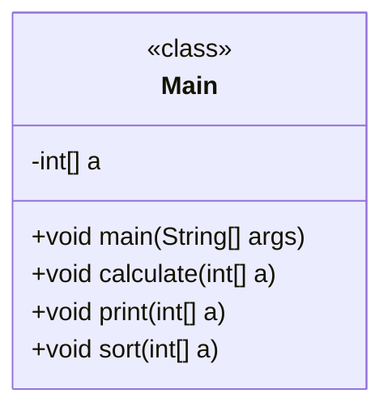
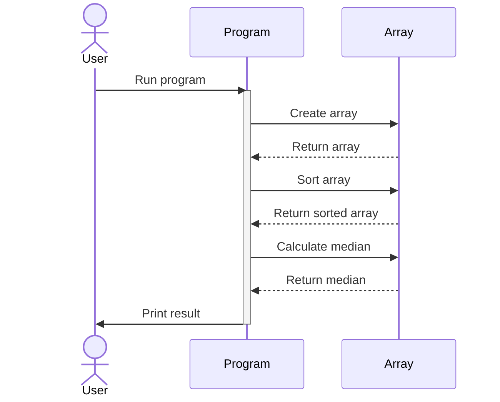

# Granite Code Prompt Cookbook

this repo target to share potential use case and prompt on granite-code models.

## prerequisite

- get an API KEY for watsonx.ai or watsonx Code Assistant

## tips

### tips for WCA

- simple instruction works fine, hence make it simple
- the output is quite consistent

### tips for watsonx.ai

- Need to follow “Question:Answer:” prompt format
For Code Generative topic, target to have more consistent output => set decoding method as greedy,
- Sensitive to the main instruction. (e.g. Generate, Explain, Review), not quite good on complex instruction sentence.
- Sensitive on the end of prompt. (easily generate very different with different end word) => Leave “Answer:” at the end for your first few attempt.
- Prevent repeatition => set repetition penalty as 1.1, and explicit state “don’t repeating”

## environment for watsonx.ai

- call watsonx.ai api thru python
- decoding_method: greedy
- Repetition_penalty: 1.1
- each use case will test against granite-8b-code-instruct 128k context
- the test against java in first batch, more language example upcoming

- select the model (e.g. GRANITE_8B_CODE_INSTRUCT)
- select the language (e.g. java)
- select the testframework (e.g. junit)
- select the documentframework (e.g. javadoc)

## use cases

### 1. Generate Documentation

- chat input in WCA

```text
generate javadoc document for the java provided. java: @filename
```

- prompt in watsonx.ai

```text
Question:
generate {documentframework} document for the {language} provided.
{language}: `{sample_code}`
Answer:
```

- sample output

```java
Here is the Javadoc documentation for the given Java code:

```java
/**
 * This program reads an integer N from stdin, followed by N integers A1,A2,...,AN. It then prints the sum of all elements in the array A, and the median of the array.
 */
package com.test;

import java.util.Arrays;
import java.util.Scanner;

public class Main {

    /**
     * This method reads an integer N from stdin, followed by N integers A1,A2,...,AN. It then prints the sum of all elements in the array A, and the median of the array.
     * @param args Unused command line arguments.
     */
    public static void main(String[] args) {
        try (Scanner in = new Scanner(System.in)) {
            int n = in.nextInt();
            int[] a = new int[n];
            for(int a_i=0; a_i < n; a_i++){
                a[a_i] = in.nextInt();
            }
        }
    }

    /**
     * This method calculates the sum of all elements in the array A.
     * @param a The input array.
     */
    public void calculate(int[] a) {
        int sum = 0;
        for (int i = 0; i < a.length; i++) {
            sum += a[i];
        }
        System.out.println(sum);
    }

    /**
     * This method prints each element in the array A on a separate line.
     * @param a The input array.
     */
    public void print(int[] a) {
        for (int i = 0; i < a.length; i++) {
            System.out.println(a[i]);
        }
    }

    /**
     * This method sorts the array A in ascending order, and then calculates the median. If the length of the array is even, it takes the average of the two middle elements.
     * @param a The input array.
     */
    public void sort(int[] a) {
        Arrays.sort(a);
        double median;
        if (a.length % 2 == 0) {
            median = (a[a.length / 2 - 1] + a[a.length / 2]) / 2.0;
        } else {
            median = a[a.length / 2];
        }
    }
}
```

### 2. Review and Scoring

- chat input in WCA

```text
Review the code @filename
```

- sample output

```
Answer: Sure, I can review your code. Here's what I found:

Line 3: The package declaration is incorrect. It should be package com.example; instead of package com.ibm.j9ddr.vm29.pointer.generated;.

Line 6: The import statement is unnecessary. It should be removed.

Line 14: The method calculate does not perform any operations on the array a. It should be renamed to something more appropriate, such as sumArray.

Line 18: The method print does not perform any operations on the array a. It should be renamed to something more appropriate, such as printArray.

Line 22: The method sort does not perform any operations on the array a. It should be renamed to something more appropriate, such as sortArray.

Line 25: The variable median is unused. It should be removed.

Overall, the code is well-written and follows best practices in Java. However, there are some areas where it could be improved.
```

- chat input in WCA

```text
review the code in completeness, logic, performance and quality. @filename
```

- sample output

```text
The code is complete as it contains all the necessary components to solve the problem. The code is well-written and follows good coding practices. The code is efficient as it uses the built-in Java sorting algorithm and calculates the median value using mathematical operations. However, there may be room for improvement in terms of readability, efficiency, and error handling.
```

- chat input in WCA

```text
give a score out of 10 for the quality of code. @filename
```

- sample output

```text
5
```

- prompt in watsonx.ai

```text
Question:
you are {language} expert. you need to review the following {language} code. 
-please understand the {language} code provided in detail.
-please review the code in completeness, logic, performance and quality.
-give a score out of 10 for the quality of code.
-please provide constructive suggestion.
<<SYS>>
code: `{sample_code}`
<</SYS>>
Answer:
score and review:
```

- sample output

```text
The code is generally well written and follows good coding conventions. However, there are a few areas that could be improved.

1. Logic: The logic of the code seems to be correct, but it could be made more concise and readable. For example, the `calculate` method can be combined with the `print` method into a single method that prints the sum of the array elements. Similarly, the `sort` method can be simplified by using the built-in `Arrays.sort` method and calculating the median using the same approach as before.

2. Performance: The code has a time complexity of O(n log n) due to the use of the `Arrays.sort` method. This can be optimized by using an in-place sorting algorithm such as quicksort or mergesort, which have a time complexity of O(n log n). Additionally, the `print` method can be optimized by using a StringBuilder instead of printing each element individually.

3. Quality: The code could benefit from better documentation and comments to make it easier for other developers to understand and maintain. Additionally, the variable names could be more descriptive to improve readability.

Constructive suggestions:
1. Combine the `calculate` and `print` methods into a single method that prints the sum of the array elements.
2. Use an in-place sorting algorithm such as quicksort or mergesort to optimize the performance of the `sort` method.
3. Add documentation and comments to the code to improve its clarity and maintainability.
4. Use more descriptive variable names to improve readability.

Overall, the code is a good starting point, but there are some areas that could be improved to make it more efficient and readable.
```

### 3. Improve base on review

- prompt in watsonx.ai

```text
Question:
improve the {language} provided base on the review provided.
-understand the review suggestion in detail.
-adopt the review suggestion if applicable.
{language}: `{sample_code}`
review suggestion: `{review}`
Answer:
improved version:
```

- sample output

```java
import java.util.*;

public class Main {

    public static void main(String[] args) {
        try (Scanner in = new Scanner(System.in)) {
            int n = in.nextInt();
            int[] a = new int[n];
            for(int i=0; i < n; i++){
                a[i] = in.nextInt();
            }
            // Combine the calculate and print methods into a single method that prints the sum of the array elements.
            int sum = 0;
            for (int i = 0; i < a.length; i++) {
                sum += a[i];
            }
            System.out.println("Sum: " + sum);

            // Use an in-place sorting algorithm such as quicksort or mergesort to optimize the performance of the sort method.
            Arrays.sort(a);
            double median;
            if (a.length % 2 == 0) {
                median = (a[a.length / 2 - 1] + a[a.length / 2]) / 2.0;
            } else {
                median = a[a.length / 2];
            }
            System.out.println("Median: " + median);
        }
    }
}
```

### 4. Fix code

- chat in WCA

```text
fix the code provided. @filename
```

- prompt in watsonx.ai

```text
Question:
fix the {language} provided.
-understand the review suggestion in detail.
-identify if any problem.
-fix the problem if any.
{language}: `{bad_code}`
Answer:
fixed version:
```

- sample output


```java
import java.util.*;

import com.ibm.j9ddr.vm29.pointer.generated.processor_cpu_load_infoPointer;

public class Main {

    public static void main(String[] args) {
        try (Scanner in = new Scanner(System.in)) {
            int n = in.nextInt();
        }
    }

    public void calculate(int[] a) {
        int sum = 0;
        for (int i = 0; i < a.length; i++) {
            sum += a[i];
        }
        System.out.println(sum);
    }

    public void print(int[] a) {
        for (int i = 0; i < a.length; i++) {
            System.out.println(a[i]);
        }
    }

    public void sort(int[] a) {
        Arrays.sort(a);
        double median;
        if (a.length % 2 == 0) {
            median = (a[a.length / 2 - 1] + a[a.length / 2]) / 2.0;
        } else {
            median = a[a.length / 2];
        }
    }
}
```

### 5. Generate Diagram

- chat in WCA

```text
generate mermaid diagram for the java code provided. @filename
```

- sample output



- prompt in watsonx.ai

```text
Question:
generate diagram for the {language} code provided.
-understand the review suggestion in detail.
-use simple name for node.
-generate in mermaid.
-dont repeating.
{language}: `{sample_code}`
Answer:
```

- sample output

```text
Here is a diagram of the Java code, using Mermaid to generate a UML sequence diagram:
```



### 6. Code Conversion

- chat in WCA

```text
convert it to csharp, @filename
```

- sample output

```csharp
// Assisted by WCA@IBM
// Latest GenAI contribution: ibm/granite-20b-code-instruct-v2
//Main.cs
using System;
using System.Collections.Generic;
using System.Linq;

namespace Main
{
    class Program
    {
        static void Main(string[] args)
        {
            try
            {
                var input = Console.ReadLine().Split(' ').Select(int.Parse).ToArray();
                var n = input[0];
                var a = new int[n];
                for (int i = 0; i < n; i++)
                {
                    a[i] = Convert.ToInt32(Console.ReadLine());
                }
            }
            catch (Exception e)
            {
                Console.WriteLine(e);
            }
        }

        public void Calculate(int[] a)
        {
            int sum = 0;
            for (int i = 0; i < a.Length; i++)
            {
                sum += a[i];
            }
            Console.WriteLine(sum);
        }

        public void Print(int[] a)
        {
            for (int i = 0; i < a.Length; i++)
            {
                Console.WriteLine(a[i]);
            }
        }

        public void Sort(int[] a)
        {
            Array.Sort(a);
            double median;
            if (a.Length % 2 == 0)
            {
                median = (a[a.Length / 2 - 1] + a[a.Length / 2]) / 2.0;
            }
            else
            {
                median = a[a.Length / 2];
            }
        }
    }
}
```

- prompt in watsonx.ai

```text
Question:
rewrite the {language} code provided to python.
-understand the review suggestion in detail.
{language}: `{sample_code}`
Answer:
```

- sample output

```text
Here's the Python code that implements the same functionality as the Java code:
```

```python
import sys

def get_array():
    return [int(x) for x in sys.stdin.read().split()]

def calculate(a):
    return sum(a)

def print_array(a):
    for x in a:
        print(x)

def sort_and_find_median(a):
    a.sort()
    n = len(a)
    median = None
    if n % 2 == 0:
        median = (a[n//2 - 1] + a[n//2]) / 2
    else:
        median = a[n//2]
    return median

if __name__ == "__main__":
    n = int(sys.stdin.readline())
    a = get_array()
    print(calculate(a))
    print_array(a)
    print(sort_and_find_median(a))
```

### 7. Style Improvement

- apply FSL (Fewshot Learning)
- prompt in watsonx.ai

```text
Question:
generate document for the code. 
code: `void main(){{
    System.out.print("hello");
}}`
Answer:
Here is a documentation generated from your code:
```{language}
/**
 * IBM documentation style of Main, with parameter of args in String[].
 */
public class MainABC {{

    /**
     * The entry point of the program.
     * @param args the command line arguments
     */
    public static void mainDEF(String[] args) {{
        System.out.println("Hello");
    }}
}}
```
Question:
generate document for the code. 
code: `{sample_code}`
Answer:
```

### 8. API Generation

- prompt in watsonx.ai

```text
Question:
generate a API definition in swagger for the {language} code provided.
{language}: `{sample_code}`
Answer:
```

- sample output


### 9. Test Case Generation

- prompt in watsonx.ai

```text
Question:
generate Test Cases in {testframework} for the {language} code provided.
-focus on boundary cases.
-focus on exception handling
{language}: `{sample_code}`
Answer:
```

- sample output

```markdown
Here are some test cases you can use to verify the correctness of your Java code:

1. Test case for the `calculate` method:
```java
@Test
public void testCalculate() {
    int[] a = {1, 2, 3};
    Main obj = new Main();
    obj.calculate(a);
    assertEquals(6, obj.result);
}
```

2. Test case for the `print` method:
```java
@Test
public void testPrint() {
    int[] a = {1, 2, 3};
    Main obj = new Main();
    obj.print(a);
    assertEquals("1\n2\n3", outContent.toString());
}
```

3. Test case for the `sort` method:
```java
@Test
public void testSort() {
    int[] a = {3, 2, 1};
    Main obj = new Main();
    obj.sort(a);
    assertArrayEquals(new int[]{1, 2, 3}, a);
}
```

4. Test case for exception handling:
```java
@Test
public void testExceptionHandling() {
    String input = "abc";
    Main obj = new Main();
    try {
        obj.readInput(input);
    } catch (Exception e) {
        assertEquals("Invalid input format", e.getMessage());
    }
}
```

5. Test case for boundary cases:
```java
@Test
public void testBoundaryCases() {
    // Test empty array
    int[] a = {};
    Main obj = new Main();
    obj.calculate(a);
    assertEquals(0, obj.result);

    // Test array with one element
    int[] a = {1};
    Main obj = new Main();
    obj.calculate(a);
    assertEquals(1, obj.result);

    // Test negative numbers
    int[] a = {-1, -2, -3};
    Main obj = new Main();
    obj.calculate(a);
    assertEquals(-6, obj.result);
}
```

### 10. Interface Generation

- prompt in watsonx.ai

```text
Question:
generate {language} interface version base on the {language} code provided.
{language}: `{sample_code}`
Answer:
```

- sample output

```markdown
Here is an example of how you can generate an interface based on the given Java code:

```java
public interface MyInterface {
    void calculate(int[] a);
    void print(int[] a);
    void sort(int[] a);
}
```

```markdown
In this interface, we have defined three methods: `calculate`, `print`, and `sort`. These methods correspond to the operations performed by the respective functions in the original Java code. By creating an interface that defines these methods, you can ensure that any class implementing this interface must provide implementations for these methods. This allows for flexibility in how the methods are implemented, as long as they adhere to the method signatures specified in the interface.
```


### 11. Build and Deployment Scipt Generation

- prompt in watsonx.ai

```text
Question:
generate build and deployment script for the {language} code provided.
-target environment be liberty on openshift.
{language}: `{sample_code}`
Answer:
```

- sample output

### 12. Code Completion

- prompt in watsonx.ai

```text
Question:
please generate the next few line of {language} code after the code provided provided.
-please understand the name of the function if any.
-please understand the comment if any.
-please generate high quality {language} code.
-end the generation with double newline.
System:
code = `{partial_code}
`
Answer:
next line:```{language}
```


### 13. Code Explanation

- prompt in watsonx.ai

```text
Question:
Please provide a detailed explanation for the following {language} code:
-ensure have new line after every full stop.
<<SYS>>
code: `{sample_code}`
<</SYS>>
Answer:
explanation:
```


### 14. Code Optimization

- prompt #1 to generate suggestion

```text
Question:
generate a prompt to enhance the {language} code provided.
-the java will target for high performance computing.
-consider use CUDA if applicable.
{language}: `{sample_code}`
Answer:
```

- prompt #2 to adopt the suggestion

```text
Question:
enhance the {language} code provided base on the suggestion.
-target environment be with Nvidia GPU.
suggestion: `{suggestion}`
{language}: `{sample_code}`
Answer:
enhance version:
```

## sample java

```java
import java.util.*;
import com.ibm.j9ddr.vm29.pointer.generated.processor_cpu_load_infoPointer;
public class Main {
public static void main(String[] args) {
try (Scanner in = new Scanner(System.in)) {
int n = in.nextInt();
int[] a = new int[n];
for(int a_i=0; a_i < n; a_i++){
a[a_i] = in.nextInt();
}
}
}
public void calculate(int[] a) {
int sum = 0;
for (int i = 0; i < a.length; i++) {
sum += a[i];
}
System.out.println(sum);
}
public void print(int[] a) {
for (int i = 0; i < a.length; i++) {
System.out.println(a[i]);
}
}
public void sort(int[] a) {
Arrays.sort(a);
double median;
if (a.length % 2 == 0) {
median = (a[a.length / 2 - 1] + a[a.length / 2]) / 2.0;
} else {
median = a[a.length / 2];
}
}
}
```

## Sample Bad Java

```java
import java.util.*;
import com.ibm.j9ddr.vm29.pointer.generated.processor_cpu_load_infoPointer;
public class Main {
public static void main(String[] args) {
try (Scanner in = new Scanner(System.in)) {
int n = in.nextInt();
}
public void calculate(int[] a) {
int sum = 0;
for (int i = 0; 
}
System.out.println(sum);
}
public void print(int[] a) {
for (int i = 0; System.out.println(a[i]);
}
}
public void sort(int[] a) {
Arrays.sort(a);
double me
if (a.length % 2 == 0) {
th / 2 - 1] + a[a.length / 2]) / 2.0;
} else {
median = a[a.len
}
}
}
```