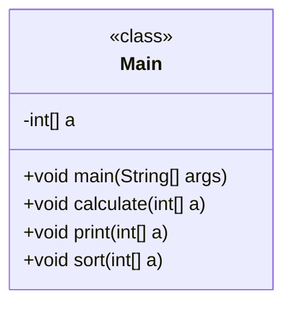

# Granite Code Prompt Cookbook - WCA Chat

this repo target to share potential use case and prompt on granite-code models.

## prerequisite

- get an API KEY for watsonx Code Assistant

## tips

### tips for WCA

- new a chat session, it help to get clear context and better outcome.
- simple instruction works fine, hence make it simple
- the output is quite consistent


## use cases

### 1. Generate Documentation

- chat input in WCA

```text
/document @filename
```

- sample output

```cpp
# Assisted by watsonx Code Assistant 
//blob
#include <iostream>
#include <vector>
#include <algorithm>
/**
 * @brief Struct to represent a person
 */
struct Person {
    /**
     * @brief Name of the person
     */
    std::string name;
    /**
     * @brief Age of the person
     */
    int age;
};
/**
 * @brief Function to compare two persons by age
 * @param a First person to compare
 * @param b Second person to compare
 * @return True if a is younger than b, false otherwise
 */
bool compareByAge(const Person& a, const Person& b) {
    return a.age < b.age;
}
int main() {
    /**
     * @brief Vector of Person objects
     */
    std::vector<Person> people = {
        {"Alice", 30},
        {"Bob", 25},
        {"Charlie", 35},
        {"Diana", 28},
        {"Eve", 40}
    };
    /**
     * @brief Sort the vector of persons by age
     */
    std::sort(people.begin(), people.end(), compareByAge);
    /**
     * @brief Print the sorted vector of persons
     */
    for (const auto& person : people) {
        std::cout << person.name << ": " << person.age << std::endl;
    }
    return 0;
}
```

### 2. Review and Scoring

- chat input in WCA

```text
review @filename
```

- sample output

```text
The code is a C++ program that defines a struct Person with two members: name and age. It also includes a function compareByAge that compares two Person objects based on their age. The main function creates a vector of Person objects, sorts them using the compareByAge function, and then prints the sorted list of names and ages.

The code uses the standard library <iostream>, <vector>, and <algorithm> headers. It defines a Person struct with two members: name of type std::string and age of type int. The compareByAge function takes two Person objects as arguments and returns true if the first object's age is less than the second object's age, and false otherwise.

In the main function, a vector of Person objects is created and initialized with five people. The std::sort function is then used to sort the vector based on the compareByAge function. Finally, a loop is used to iterate over the sorted vector and print the name and age of each person.

Overall, the code is a simple example of how to use C++ to define a struct, create a vector of objects, sort the vector based on a custom comparison function, and print the sorted results.
```

### 4. Fix code

- chat in WCA

```text
fix @filename
```

- sample output


```cpp
# Assisted by watsonx Code Assistant 
# watsonx Code Assistant did not check whether this code suggestion might be similar to third party code.
//blob
#include <iostream>
#include <vector>
struct Person {
    std::string name;
    int age;
};
bool compareByAge(const Person& a, const Person& b) {
    return a.age < b.age;
}
int main() {
    std::vector<Person> people = {
        {"Alice", 30},
        {"Bob", 25},
        {"Charlie", 35},
        {"Diana", 28},
        {"Eve", 40}
    };
    std::sort(people.begin(), people.end(), compareByAge);
    for (const auto& person : people) {
        std::cout << person.name << ": " << person.age << std::endl;
    }
    return 0;
}
```

### 5. Generate Diagram

- chat in WCA

```text
generate mermaid diagram for the java code provided. @filename
```

- sample output



### 6. Code Conversion

- chat in WCA

```text
convert it to csharp, @filename
```

- sample output

```csharp
// Assisted by WCA@IBM
// Latest GenAI contribution: ibm/granite-20b-code-instruct-v2
//Main.cs
using System;
using System.Collections.Generic;
using System.Linq;

namespace Main
{
    class Program
    {
        static void Main(string[] args)
        {
            try
            {
                var input = Console.ReadLine().Split(' ').Select(int.Parse).ToArray();
                var n = input[0];
                var a = new int[n];
                for (int i = 0; i < n; i++)
                {
                    a[i] = Convert.ToInt32(Console.ReadLine());
                }
            }
            catch (Exception e)
            {
                Console.WriteLine(e);
            }
        }

        public void Calculate(int[] a)
        {
            int sum = 0;
            for (int i = 0; i < a.Length; i++)
            {
                sum += a[i];
            }
            Console.WriteLine(sum);
        }

        public void Print(int[] a)
        {
            for (int i = 0; i < a.Length; i++)
            {
                Console.WriteLine(a[i]);
            }
        }

        public void Sort(int[] a)
        {
            Array.Sort(a);
            double median;
            if (a.Length % 2 == 0)
            {
                median = (a[a.Length / 2 - 1] + a[a.Length / 2]) / 2.0;
            }
            else
            {
                median = a[a.Length / 2];
            }
        }
    }
}
```


### 9. Test Case Generation

- chat in WCA

```text
generate Test Cases in junit for the java code provided. @filename
```

- sample output

```java
// Assisted by WCA@IBM
// Latest GenAI contribution: ibm/granite-20b-code-instruct-v2
package com.example;

import org.junit.jupiter.api.Test;

import static org.junit.jupiter.api.Assertions.*;

class MainTest {

    @Test
    void testCalculate() {
        int[] a = {1, 2, 3};
        Main main = new Main();
        assertEquals(6, main.calculate(a));
    }

    @Test
    void testPrint() {
        int[] a = {1, 2, 3};
        Main main = new Main();
        main.print(a);
    }

    @Test
    void testSort() {
        int[] a = {1, 2, 3};
        Main main = new Main();
        main.sort(a);
    }
}

```

### 10. Interface Generation

- chat in WCA

```text
generate java interface version base on the java code provided. @filename
```

```java
// Assisted by WCA@IBM
// Latest GenAI contribution: ibm/granite-20b-code-instruct-v2
//Main.java
import java.util.*;

import com.ibm.j9ddr.vm29.pointer.generated.processor_cpu_load_infoPointer;

public interface Main {

    public void calculate(int[] a);

    public void print(int[] a);

    public void sort(int[] a);
}
```

### 11. Build and Deployment Scipt Generation

- chat in WCA

```text
generate build and deployment (openshift and liberty) script for the java code provided. @filename
```

- sample output

```bash
Build Script:


// Assisted by WCA@IBM
// Latest GenAI contribution: ibm/granite-20b-code-instruct-v2
#!/bin/bash

# Build the Java application
javac -cp .:./lib/* ./src/Main.java

# Create a Liberty server package
mkdir server
cp ./src/server.xml ./server/server.xml
cp ./target/Main.class ./server/apps/

# Package the application as a Docker image
docker build -t java-app .

Deployment Script:


// Assisted by WCA@IBM
// Latest GenAI contribution: ibm/granite-20b-code-instruct-v2
#!/bin/bash

# Deploy the Docker image to OpenShift
oc new-project java-app
oc new-app java-app --name=java-app

# Expose the application to the outside world
oc expose svc/java-app
```

### 13. Code Explanation

- chat in WCA

```text
Please provide a detailed explanation for the following java code @filename
```

- sample output

```markdown
The above code defines a class named Main which contains a main method that takes an array of integers as input and performs various operations on it. The first operation is to read the size of the array from the standard input using the Scanner class, and then create an array of that size. The next operation is to read the elements of the array from the standard input using the same Scanner instance and store them in the array. The calculate method calculates the sum of all the elements in the array and prints it to the standard output. The print method simply prints each element of the array on a separate line. The sort method sorts the array using the Arrays.sort method, and then calculates the median of the array by checking whether the length of the array is even or odd, and computing the average of the two middle elements if it's even, or returning the middle element if it's odd.
```

## sample java

```java
import java.util.*;
public class Main {
public static void main(String[] args) {
try (Scanner in = new Scanner(System.in)) {
int n = in.nextInt();
int[] a = new int[n];
for(int a_i=0; a_i < n; a_i++){
a[a_i] = in.nextInt();
}
}
}
public void calculate(int[] a) {
int sum = 0;
for (int i = 0; i < a.length; i++) {
sum += a[i];
}
System.out.println(sum);
}
public void print(int[] a) {
for (int i = 0; i < a.length; i++) {
System.out.println(a[i]);
}
}
public void sort(int[] a) {
Arrays.sort(a);
double median;
if (a.length % 2 == 0) {
median = (a[a.length / 2 - 1] + a[a.length / 2]) / 2.0;
} else {
median = a[a.length / 2];
}
}
}
```

## Sample Bad Java

```java
import java.util.*;
public class Main {
public static void main(String[] args) {
try (Scanner in = new Scanner(System.in)) {
int n = in.nextInt();
}
public void calculate(int[] a) {
int sum = 0;
for (int i = 0; 
}
System.out.println(sum);
}
public void print(int[] a) {
for (int i = 0; System.out.println(a[i]);
}
}
public void sort(int[] a) {
Arrays.sort(a);
double me
if (a.length % 2 == 0) {
th / 2 - 1] + a[a.length / 2]) / 2.0;
} else {
median = a[a.len
}
}
}
```