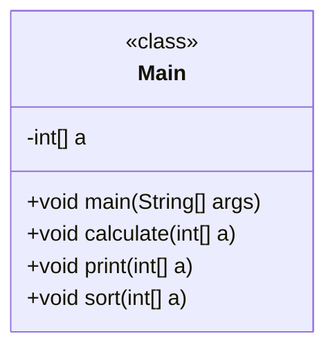

# Granite Code Prompt Cookbook - WCA Chat

this repo target to share potential use case and prompt on granite-code models.

## prerequisite

- get an API KEY for watsonx Code Assistant

- you can leverage the [sample code provided](/samples/golang/)

## tips

### tips for WCA

- simple instruction works fine, hence make it simple
- the output is quite consistent

## use cases

### 1. Generate Documentation

- chat input in WCA

```text
generate godoc document for the golang provided. golang: @filename
```

- sample output

```markdown
// Assisted by WCA@IBM
// Latest GenAI contribution: ibm/granite-20b-code-instruct-v2
# sample.go

```go
package main

import (
	"fmt"
	"sync"
)

type Worker struct {
	ID    int
	tasks chan int
	done  chan struct{}
	wg    sync.WaitGroup
}

func NewWorker(id int, tasks chan int, done chan struct{}) *Worker {
	return &Worker{
		ID:    id,
		tasks: tasks,
		done:  done,
		wg:    sync.WaitGroup{},
	}
}

func (w *Worker) Start() {
	for task := range w.tasks {
		w.wg.Add(1)
		go func(task int) {
			defer w.wg.Done()
			fmt.Printf("Worker %d processing task %d\n", w.ID, task)
			// Simulate task processing time
			time.Sleep(1 * time.Second)
			fmt.Printf("Worker %d finished task %d\n", w.ID, task)
		}(task)
	}
}

func (w *Worker) Stop() {
	close(w.done)
	w.wg.Wait()
}

func main() {
	tasks := make(chan int, 10)
	done := make(chan struct{})

	for i := 1; i <= 5; i++ {
		worker := NewWorker(i, tasks, done)
		go worker.Start()
	}

	// Send tasks to workers
	for i := 1; i <= 10; i++ {
		tasks <- i
	}

	// Close tasks channel and wait for all workers to finish
	close(tasks)
	for i := 1; i <= 5; i++ {
		<-done
	}

	fmt.Println("All tasks completed")
}
```
```

### 2. Review and Scoring

- chat input in WCA

```text
Review the code @filename
```

- sample output

```
Answer: Sure, I can review your code. Here's what I found:

Line 3: The package declaration is incorrect. It should be package com.example; instead of package com.ibm.j9ddr.vm29.pointer.generated;.

Line 6: The import statement is unnecessary. It should be removed.

Line 14: The method calculate does not perform any operations on the array a. It should be renamed to something more appropriate, such as sumArray.

Line 18: The method print does not perform any operations on the array a. It should be renamed to something more appropriate, such as printArray.

Line 22: The method sort does not perform any operations on the array a. It should be renamed to something more appropriate, such as sortArray.

Line 25: The variable median is unused. It should be removed.

Overall, the code is well-written and follows best practices in Java. However, there are some areas where it could be improved.
```

- chat input in WCA

```text
review the code in completeness, logic, performance and quality. @filename
```

- sample output

```text
The code is complete as it contains all the necessary components to solve the problem. The code is well-written and follows good coding practices. The code is efficient as it uses the built-in Java sorting algorithm and calculates the median value using mathematical operations. However, there may be room for improvement in terms of readability, efficiency, and error handling.
```

- chat input in WCA

```text
give a score out of 10 for the quality of code. @filename
```

- sample output

```text
5
```

### 4. Fix code

- chat in WCA

```text
fix the code provided. @filename
```

- sample output


```java
import java.util.*;

import com.ibm.j9ddr.vm29.pointer.generated.processor_cpu_load_infoPointer;

public class Main {

    public static void main(String[] args) {
        try (Scanner in = new Scanner(System.in)) {
            int n = in.nextInt();
        }
    }

    public void calculate(int[] a) {
        int sum = 0;
        for (int i = 0; i < a.length; i++) {
            sum += a[i];
        }
        System.out.println(sum);
    }

    public void print(int[] a) {
        for (int i = 0; i < a.length; i++) {
            System.out.println(a[i]);
        }
    }

    public void sort(int[] a) {
        Arrays.sort(a);
        double median;
        if (a.length % 2 == 0) {
            median = (a[a.length / 2 - 1] + a[a.length / 2]) / 2.0;
        } else {
            median = a[a.length / 2];
        }
    }
}
```

### 5. Generate Diagram

- chat in WCA

```text
generate mermaid diagram for the java code provided. @filename
```

- sample output



### 6. Code Conversion

- chat in WCA

```text
convert it to csharp, @filename
```

- sample output

```csharp
// Assisted by WCA@IBM
// Latest GenAI contribution: ibm/granite-20b-code-instruct-v2
//Main.cs
using System;
using System.Collections.Generic;
using System.Linq;

namespace Main
{
    class Program
    {
        static void Main(string[] args)
        {
            try
            {
                var input = Console.ReadLine().Split(' ').Select(int.Parse).ToArray();
                var n = input[0];
                var a = new int[n];
                for (int i = 0; i < n; i++)
                {
                    a[i] = Convert.ToInt32(Console.ReadLine());
                }
            }
            catch (Exception e)
            {
                Console.WriteLine(e);
            }
        }

        public void Calculate(int[] a)
        {
            int sum = 0;
            for (int i = 0; i < a.Length; i++)
            {
                sum += a[i];
            }
            Console.WriteLine(sum);
        }

        public void Print(int[] a)
        {
            for (int i = 0; i < a.Length; i++)
            {
                Console.WriteLine(a[i]);
            }
        }

        public void Sort(int[] a)
        {
            Array.Sort(a);
            double median;
            if (a.Length % 2 == 0)
            {
                median = (a[a.Length / 2 - 1] + a[a.Length / 2]) / 2.0;
            }
            else
            {
                median = a[a.Length / 2];
            }
        }
    }
}
```


### 9. Test Case Generation

- chat in WCA

```text
generate Test Cases in junit for the java code provided. @filename
```

- sample output

```java
// Assisted by WCA@IBM
// Latest GenAI contribution: ibm/granite-20b-code-instruct-v2
package com.example;

import org.junit.jupiter.api.Test;

import static org.junit.jupiter.api.Assertions.*;

class MainTest {

    @Test
    void testCalculate() {
        int[] a = {1, 2, 3};
        Main main = new Main();
        assertEquals(6, main.calculate(a));
    }

    @Test
    void testPrint() {
        int[] a = {1, 2, 3};
        Main main = new Main();
        main.print(a);
    }

    @Test
    void testSort() {
        int[] a = {1, 2, 3};
        Main main = new Main();
        main.sort(a);
    }
}

```

### 10. Interface Generation

- chat in WCA

```text
generate java interface version base on the java code provided. @filename
```

```java
// Assisted by WCA@IBM
// Latest GenAI contribution: ibm/granite-20b-code-instruct-v2
//Main.java
import java.util.*;

import com.ibm.j9ddr.vm29.pointer.generated.processor_cpu_load_infoPointer;

public interface Main {

    public void calculate(int[] a);

    public void print(int[] a);

    public void sort(int[] a);
}
```

### 11. Build and Deployment Scipt Generation

- chat in WCA

```text
generate build and deployment (openshift and liberty) script for the java code provided. @filename
```

- sample output

```bash
Build Script:


// Assisted by WCA@IBM
// Latest GenAI contribution: ibm/granite-20b-code-instruct-v2
#!/bin/bash

# Build the Java application
javac -cp .:./lib/* ./src/Main.java

# Create a Liberty server package
mkdir server
cp ./src/server.xml ./server/server.xml
cp ./target/Main.class ./server/apps/

# Package the application as a Docker image
docker build -t java-app .

Deployment Script:


// Assisted by WCA@IBM
// Latest GenAI contribution: ibm/granite-20b-code-instruct-v2
#!/bin/bash

# Deploy the Docker image to OpenShift
oc new-project java-app
oc new-app java-app --name=java-app

# Expose the application to the outside world
oc expose svc/java-app
```

### 13. Code Explanation

- chat in WCA

```text
Please provide a detailed explanation for the following java code @filename
```

- sample output

```markdown
The above code defines a class named Main which contains a main method that takes an array of integers as input and performs various operations on it. The first operation is to read the size of the array from the standard input using the Scanner class, and then create an array of that size. The next operation is to read the elements of the array from the standard input using the same Scanner instance and store them in the array. The calculate method calculates the sum of all the elements in the array and prints it to the standard output. The print method simply prints each element of the array on a separate line. The sort method sorts the array using the Arrays.sort method, and then calculates the median of the array by checking whether the length of the array is even or odd, and computing the average of the two middle elements if it's even, or returning the middle element if it's odd.
```

## sample java

```java
import java.util.*;
public class Main {
public static void main(String[] args) {
try (Scanner in = new Scanner(System.in)) {
int n = in.nextInt();
int[] a = new int[n];
for(int a_i=0; a_i < n; a_i++){
a[a_i] = in.nextInt();
}
}
}
public void calculate(int[] a) {
int sum = 0;
for (int i = 0; i < a.length; i++) {
sum += a[i];
}
System.out.println(sum);
}
public void print(int[] a) {
for (int i = 0; i < a.length; i++) {
System.out.println(a[i]);
}
}
public void sort(int[] a) {
Arrays.sort(a);
double median;
if (a.length % 2 == 0) {
median = (a[a.length / 2 - 1] + a[a.length / 2]) / 2.0;
} else {
median = a[a.length / 2];
}
}
}
```

## Sample Bad Java

```java
import java.util.*;
public class Main {
public static void main(String[] args) {
try (Scanner in = new Scanner(System.in)) {
int n = in.nextInt();
}
public void calculate(int[] a) {
int sum = 0;
for (int i = 0; 
}
System.out.println(sum);
}
public void print(int[] a) {
for (int i = 0; System.out.println(a[i]);
}
}
public void sort(int[] a) {
Arrays.sort(a);
double me
if (a.length % 2 == 0) {
th / 2 - 1] + a[a.length / 2]) / 2.0;
} else {
median = a[a.len
}
}
}
```