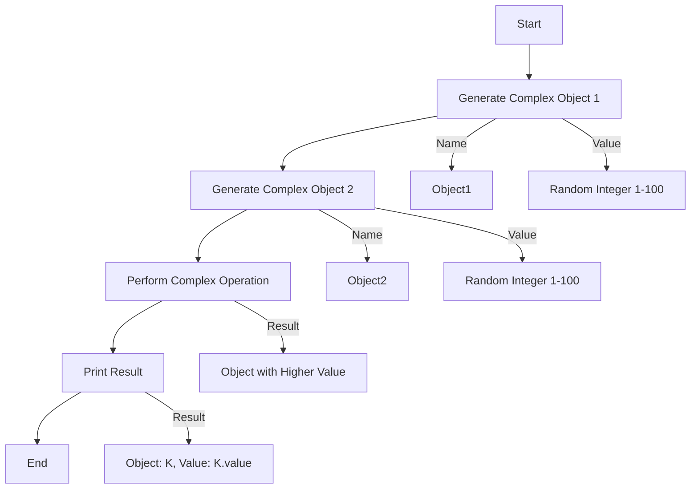

# Prompting with IBM Granite 3 Model for Coding Use Cases

The experiment will be conducted using sample python code to demonstrate these capabilities.

## sample python

[good example](../sample/python/sample.py)

[bad example](../sample/python/bad.py)

A few context variable

```python
model_id = GRANITE_3_8B_INSTRUCT
language = "python"
documentframework = "sphnix"
testframework = "unittest"
```

Initialise with watsonx.ai, please prepare your API_KEY and PROJECT_ID

```bash
pip install -U ibm-watsonx-ai
```

```python
from ibm_watsonx_ai.foundation_models import ModelInference
from ibm_watsonx_ai.metanames import GenTextParamsMetaNames as GenParams
import os
from dotenv import load_dotenv

load_dotenv()
api_key = os.getenv("API_KEY", None)
project_id = os.getenv("PROJECT_ID", None)

creds = {
    "url"    : "https://us-south.ml.cloud.ibm.com",
    "apikey" : api_key
}

params = {
    GenParams.DECODING_METHOD:"greedy",
    GenParams.MAX_NEW_TOKENS:4000,
    GenParams.MIN_NEW_TOKENS:1,
    # "temperature":0.1,
    GenParams.TOP_K:50,
    GenParams.TOP_P:1,
    GenParams.STOP_SEQUENCES:["```","[/INST]","<|user|>","<|endoftext|>","<|assistant|>"],
}

model = ModelInference(model_id="ibm/granite-3-8b-instruct", credentials=creds, params=params, project_id=project_id)
```

## Code Explanation

Understanding complex code segments is made easier with Granite 3 Model's detailed code explanations. It breaks down intricate code logic into comprehensible language, helping developers to grasp the functionality and purpose of different code sections. This feature is particularly useful for onboarding new team members, debugging, and maintaining large codebases where understanding legacy code is essential.

prompt for Explanation

```python
prompt = f"""<|user|>
Please provide a detailed explanation for the following {language} code:
-ensure have new line after every full stop.
-dont generate example.

###
code: `{sample_code}`
<|assistant|>
explanation:
"""

answer = model.generate_text(prompt)
print(answer)
```

output for explanation

```markdown
This Python code defines a class named `ComplexObject` that represents an object with a name and a value. The `__str__` method is overridden to provide a custom string representation of the object.

The `generate_complex_object` function creates a new `ComplexObject` instance with the given name and a random value between 1 and 100.

The `perform_complex_operation` function takes two `ComplexObject` instances as arguments and returns the one with the higher value.

The `main` function generates two random `ComplexObject` instances, prints their details, and then calls `perform_complex_operation` to find and print the object with the higher value.

The `if __name__ == "__main__":` line ensures that the `main` function is called when the script is run directly, but not when it is imported as a module.

The code does not explicitly ensure a new line after every full stop, as this is handled by the Python interpreter's default behavior.
```

## Automatic Documentation Generation

IBM Granite 3 Model automates the creation of comprehensive documentation for your codebase, eliminating the need for manual documentation efforts. By analyzing the code structure and functionality, it generates clear and detailed documentation that is essential for maintaining and scaling projects. This feature ensures that all aspects of the code are well-documented, making it easier for new developers to understand and contribute to the project.

prompt for document generation

```python
prompt = f"""<|user|>
generate {documentframework} document for the {language} provided.
-generate the {language} code only.
-generate the {documentframework} inline documentation.
{language}: `{sample_code}`
<|assistant|>
```{language}"""

answer = model.generate_text(prompt).replace("```","")
print(answer)
```

output for document generation

```python

import random

class ComplexObject:
    """
    A class representing a complex object with a name and a value.

    Attributes:
        name (str): The name of the object.
        value (int): The value of the object.
    """
    def __init__(self, name, value):
        self.name = name
        self.value = value

    def __str__(self):
        """
        Returns a string representation of the object.

        Returns:
            str: A string representation of the object.
        """
        return f"Object: {self.name}, Value: {self.value}"

def generate_complex_object(name, value):
    """
    Generates a complex object with the given name and value.

    Args:
        name (str): The name of the object.
        value (int): The value of the object.

    Returns:
        ComplexObject: A complex object with the given name and value.
    """
    return ComplexObject(name, value)

def perform_complex_operation(obj1, obj2):
    """
    Performs a complex operation on two complex objects.

    Args:
        obj1 (ComplexObject): The first complex object.
        obj2 (ComplexObject): The second complex object.

    Returns:
        ComplexObject: The complex object with the higher value.
    """
    if obj1.value > obj2.value:
        return obj1
    else:
        return obj2

def main():
    """
    The main function that generates two complex objects, prints them,
    and performs a complex operation on them.
    """
    obj1 = generate_complex_object("Object1", random.randint(1, 100))
    obj2 = generate_complex_object("Object2", random.randint(1, 100))

    print(f"Object1: {obj1}")
    print(f"Object2: {obj2}")

    result = perform_complex_operation(obj1, obj2)
    print(f"Result: {result}")

if __name__ == "__main__":
    main()
```

## Code Review and Scoring

Granite 3 Model offers automated code reviews that assess the quality of your code against industry standards. It provides scoring mechanisms that highlight areas of strength and identify potential issues, allowing developers to maintain high-quality codebases. This automated review process accelerates the feedback loop, enabling developers to make timely improvements and adhere to best practices without the need for extensive manual code inspections.

prompt for review and score

```python
prompt = f"""<|user|>
you are {language} expert. you need to review the following {language} code. 
-please understand the {language} code provided in detail.
-please review the code in completeness, logic, performance and quality.
-make it more object oriented.
-give a score out of 10 for the quality of code.
-please provide constructive suggestion in detail.
-generate the review and suggestion only.
{language} code: `{sample_code}`
-DONT generate the improve code directly.
-dont generate code.
<|assistant|>
score and review:"""

suggestion = model.generate_text(prompt)
print(suggestion)
```

outcome for review and score

```markdown
The provided Python code is a simple script that creates two complex objects, compares their values, and returns the object with the higher value. Here's a detailed review of the code:

1. Completeness: The code is complete and fulfills its intended purpose. It defines a class for complex objects, generates two objects with random values, and performs a comparison operation.

2. Logic: The logic of the code is clear and easy to understand. The `ComplexObject` class is defined with a name and value attribute, and the `generate_complex_object` function creates instances of this class. The `perform_complex_operation` function compares the values of two objects and returns the one with the higher value.

3. Performance: The performance of the code is acceptable for its simplicity. However, the use of the `random.randint` function in the `main` function could be optimized by generating the random values only once and storing them in variables.

4. Quality: The code quality is good, but there are a few areas for improvement. The use of a class for the complex objects is a good practice, but the `perform_complex_operation` function could be made more object-oriented by adding a method to the `ComplexObject` class that performs the comparison.

5. Object-oriented design: The code could be made more object-oriented by adding a method to the `ComplexObject` class that performs the comparison. This would make the code more modular and easier to maintain.

6. Suggestions:
   - Add a method to the `ComplexObject` class that performs the comparison. This would make the code more object-oriented and easier to maintain.
   - Consider using a more descriptive name for the `perform_complex_operation` function, such as `compare_objects_by_value`.
   - Consider adding error handling to the `generate_complex_object` function to ensure that the name and value are valid.

Overall, the code is well-structured and easy to understand, but there are a few areas for improvement in terms of object-oriented design and code quality.
```

## Enhancement Based on Reviews

Leveraging the feedback from automated code reviews, the Granite 3 Model facilitates continuous improvement of your codebase. It suggests specific enhancements to optimize performance, improve maintainability, and increase readability. By acting on these insights, developers can refine their code systematically, ensuring that the software remains robust and efficient as it evolves.

Prompt for improvement

```python
prompt = f"""<|user|>
improve the {language} provided base on the review provided.
-understand the review suggestion in detail.
-adopt the review suggestion if applicable.
-dont generate explanation.
###
original {language} code: `{sample_code}`
review suggestion: `{suggestion}`
<|assistant|>
improved {language}
```{language}"""

answer = model.generate_text(prompt).replace("```","")
print(answer)
```

Output for improvement

```python

import random

class ComplexObject:
    def __init__(self, name, value):
        self.name = name
        self.value = value

    def __str__(self):
        return f"Object: {self.name}, Value: {self.value}"

    def compare_value(self, other):
        if self.value > other.value:
            return self
        else:
            return other

def generate_complex_object(name, value):
    if not isinstance(name, str) or not isinstance(value, int) or value <= 0:
        raise ValueError("Invalid name or value")
    return ComplexObject(name, value)

def main():
    obj1 = generate_complex_object("Object1", random.randint(1, 100))
    obj2 = generate_complex_object("Object2", random.randint(1, 100))

    print(f"Object1: {obj1}")
    print(f"Object2: {obj2}")

    result = obj1.compare_value(obj2)
    print(f"Result: {result}")

if __name__ == "__main__":
    main()
```

## Error Identification and Fixing

The Granite 3 Model excels at identifying and rectifying errors in your code. It efficiently locates potential syntax errors andlogical flaws. By analyzing the code, it proposes fixes and improvements, offering developers an initial draft to consider. This feature streamlines the debugging process, enabling developers to focus on verification and testing, ensuring robust code.

Problem Code

```python
import random

class ComplexObject:
    def __init__(self, name, value):
        self.name = name
        self.value = value

    def __str__(self):
        return f"Object: {self.na

def generate_complex_object(name, value):
    return ComplexObject(name, value)

def perform_complex_operation(obj1, obj2):
    if obj1.valu
    else:
        return obj2

def main():
    obj1 = generate_complex_ob
    print(f"Object2: {obj2}")

    result = perform_complex_operation(obj1, obj2)
    print(f"Result: {result}")

if __name__ == "__main__":
    main()
```

Prompt for Fixing

```python
prompt = f"""<|user|>
fix the {language} provided.
-understand the review suggestion in detail.
-identify if any problem.
-fix the problem if any.
-add explanation as inline comment.

###
{language}: `{bad_code}`
<|assistant|>
fixed version with inline comment at the point it fix.
```{language}"""

answer = model.generate_text(prompt).replace("```","")
print(answer)
```

Output for Fixing

```python
import random

class ComplexObject:
    def __init__(self, name, value):
        self.name = name
        self.value = value

    def __str__(self):
        return f"Object: {self.name}, Value: {self.value}"

def generate_complex_object(name, value):
    return ComplexObject(name, value)

def perform_complex_operation(obj1, obj2):
    # check if obj1.value is greater than obj2.value
    if obj1.value > obj2.value:
        return obj1
    else:
        return obj2

def main():
    obj1 = generate_complex_object("Object1", random.randint(1, 100))
    obj2 = generate_complex_object("Object2", random.randint(1, 100))
    print(f"Object1: {obj1}")
    print(f"Object2: {obj2}")

    result = perform_complex_operation(obj1, obj2)
    print(f"Result: {result}")

if __name__ == "__main__":
    main()
```

## Diagram Generation

Understanding complex code structures is made easier with Granite 3 Model's diagram generation capabilities. It automatically creates visual representations of your code architecture, including class diagrams and flowcharts. These diagrams enhance comprehension and improve communication on projects with intricate dependencies.

Prompt for Generate Diagram

```python
prompt = f"""<|user|>
generate diagram for the {language} code provided.
-understand the review suggestion in detail.
-use simple name for node.
-generate in mermaid.
-dont repeating.
-dont generation explanation.
{language}: `{sample_code}`
<|assistant|>
```mermaid"""

answer = model.generate_text(prompt).replace("```","")
print(answer)
```

Output for Generate Diagram



## Code Conversion

Granite 3 Model seamlessly converts code between different programming languages or formats, enhancing compatibility and facilitating cross-platform development. Whether migrating legacy systems to modern languages or adapting code for different environments, this feature ensures that the transition is smooth and error-free. It can supports a wide range of languages, making it a versatile tool for diverse development needs.

Prompt for conversion

```python
target_language = "cpp"

prompt = f"""<|user|>
rewrite the {language} code provided to {target_language}.
-understand the code provided in detail.
-understand how to map technology and syntax to the target {target_language} langauge.
-dont generation explanation.
{language}: `{sample_code}`
<|assistant|>
```{target_language}"""

answer = model.generate_text(prompt).replace("```","")
print(answer)
```

Output for conversion

```cpp

#include <iostream>
#include <cstdlib>
#include <ctime>

class ComplexObject {
public:
    std::string name;
    int value;

    ComplexObject(std::string name, int value) : name(name), value(value) {}

    friend std::ostream& operator<<(std::ostream& os, const ComplexObject& obj) {
        os << "Object: " << obj.name << ", Value: " << obj.value;
        return os;
    }
};

ComplexObject generate_complex_object(std::string name, int value) {
    return ComplexObject(name, value);
}

ComplexObject perform_complex_operation(const ComplexObject& obj1, const ComplexObject& obj2) {
    return obj1.value > obj2.value ? obj1 : obj2;
}

int main() {
    std::srand(std::time(nullptr));
    ComplexObject obj1 = generate_complex_object("Object1", std::rand() % 100 + 1);
    ComplexObject obj2 = generate_complex_object("Object2", std::rand() % 100 + 1);

    std::cout << "Object1: " << obj1 << std::endl;
    std::cout << "Object2: " << obj2 << std::endl;

    ComplexObject result = perform_complex_operation(obj1, obj2);
    std::cout << "Result: " << result << std::endl;

    return 0;
}
```

## API Generation

Automating the creation of APIs, Granite 3 Model accelerates the integration of your codebase with external systems. It generates well-structured and documented APIs based on your existing code, facilitating seamless communication and data exchange between different software components. This feature is particularly beneficial for developing scalable and interoperable applications that require robust API interfaces.

Prompt for API Generation

```python
prompt = f"""<|user|>
generate a API definition in swagger for the {language} code provided.
-dont generate explanation.
{language}: `{sample_code}`
<|assistant|>
```yaml
"""

answer = model.generate_text(prompt).replace("```","")
print(answer)
```

Output for API Generation

```yaml
openapi: 3.0.0
info:
  title: Complex Object API
  version: 1.0.0
servers:
  - url: http://api.example.com/complex-object
paths:
  /generate_complex_object:
    post:
      summary: Generate a complex object
      requestBody:
        required: true
        content:
          application/json:
            schema:
              $ref: '#/components/schemas/ComplexObject'
      responses:
        '200':
          description: A complex object
          content:
            application/json:
              schema:
                $ref: '#/components/schemas/ComplexObject'
  /perform_complex_operation:
    post:
      summary: Perform a complex operation
      requestBody:
        required: true
        content:
          application/json:
            schema:
              type: array
              items:
                $ref: '#/components/schemas/ComplexObject'
      responses:
        '200':
          description: The result of the complex operation
          content:
            application/json:
              schema:
                $ref: '#/components/schemas/ComplexObject'
components:
  schemas:
    ComplexObject:
      type: object
      properties:
        name:
          type: string
        value:
          type: integer
```

## Test Case Generation

Ensuring thorough testing is essential for reliable software development. Granite 3 Model automatically generates relevant test cases for your code, covering various scenarios and edge cases. This acceleration of the testing phase helps in identifying potential issues early, ensuring that the code performs as expected and meets the required quality standards before deployment.

Prompt for Test Case

```python
prompt = f"""<|user|>
generate Test Cases in {testframework} for the {language} code provided.
-focus on boundary cases.
-focus on exception handling
-generate the test only.
{language}: `{sample_code}`
<|assistant|>
```{language}"""

answer = model.generate_text(prompt).replace("```","")
print(answer)
```

Output for Test Case

```python

import unittest
from unittest.mock import patch
from your_module import ComplexObject, generate_complex_object, perform_complex_operation

class TestComplexObject(unittest.TestCase):
    def test_init(self):
        obj = ComplexObject("test", 123)
        self.assertEqual(obj.name, "test")
        self.assertEqual(obj.value, 123)

    def test_str(self):
        obj = ComplexObject("test", 123)
        self.assertEqual(str(obj), "Object: test, Value: 123")

class TestGenerateComplexObject(unittest.TestCase):
    def test_generate_complex_object(self):
        obj = generate_complex_object("test", 123)
        self.assertIsInstance(obj, ComplexObject)
        self.assertEqual(obj.name, "test")
        self.assertEqual(obj.value, 123)

class TestPerformComplexOperation(unittest.TestCase):
    @patch('random.randint')
    def test_perform_complex_operation(self, mock_randint):
        mock_randint.return_value = 123
        obj1 = ComplexObject("Object1", 123)
        obj2 = ComplexObject("Object2", 124)
        result = perform_complex_operation(obj1, obj2)
        self.assertIs(result, obj2)

        mock_randint.return_value = 124
        result = perform_complex_operation(obj1, obj2)
        self.assertIs(result, obj1)

if __name__ == '__main__':
    unittest.main()
```
