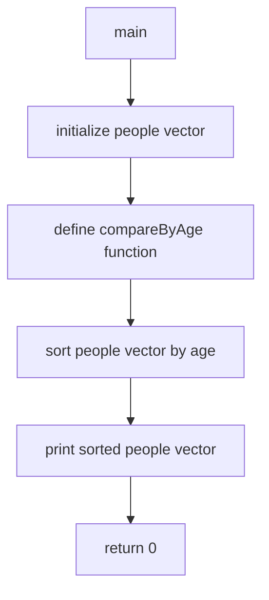

# Prompting with IBM Granite 3 Model for Coding Use Cases

I utilising the latest IBM Granite 3 8B Instruct Model for these coding tasks. This model is lightweight and supports a wide range of programming languages, making it ideal for diverse coding needs.
Experiment Objectives
The experiment focuses on several key areas, grouped into Code Understanding and Code Generation:

Code Understanding

- Code Explanation: Break down complex code snippets to make them easier to understand.
- Code Documentation: Automatically generate detailed documentation to keep records up-to-date.
- Code Review: Analyze code for potential improvements and ensure adherence to best practices.

Code Generation

- Code Improvement: Suggest optimizations to enhance efficiency and performance.
- Code Conversion: Translate code between different programming languages.
- Code Fixing: Identify and resolve bugs or errors in existing code.
- API Generation: Automatically create APIs from given specifications.
- Test Case Generation: Develop test cases to ensure code reliability and performance.
- Diagram Generation: Visualize code structure and workflows through generated diagrams.

The experiment will be conducted using sample C++ code to demonstrate these capabilities.

```cpp
#include <iostream>
#include <vector>
#include <algorithm>

struct Person {
    std::string name;
    int age;
};

bool compareByAge(const Person& a, const Person& b) {
    return a.age < b.age;
}

int main() {
    std::vector<Person> people = {
        {"Alice", 30},
        {"Bob", 25},
        {"Charlie", 35},
        {"Diana", 28},
        {"Eve", 40}
    };

    std::sort(people.begin(), people.end(), compareByAge);

    for (const auto& person : people) {
        std::cout << person.name << ": " << person.age << std::endl;
    }

    return 0;
}
```

A few context variable

```python
model_id = GRANITE_3_8B_INSTRUCT
language = "cpp"
documentframework = "doxygen"
testframework = "xunit"
```

Initialise with watsonx.ai, please prepare your API_KEY and PROJECT_ID

```bash
pip install -U ibm-watsonx-ai
```

```python
from ibm_watsonx_ai.foundation_models import ModelInference
from ibm_watsonx_ai.metanames import GenTextParamsMetaNames as GenParams
import os
from dotenv import load_dotenv

load_dotenv()
api_key = os.getenv("API_KEY", None)
project_id = os.getenv("PROJECT_ID", None)

creds = {
    "url"    : "https://us-south.ml.cloud.ibm.com",
    "apikey" : api_key
}

params = {
    GenParams.DECODING_METHOD:"greedy",
    GenParams.MAX_NEW_TOKENS:4000,
    GenParams.MIN_NEW_TOKENS:1,
    # "temperature":0.1,
    GenParams.TOP_K:50,
    GenParams.TOP_P:1,
    GenParams.STOP_SEQUENCES:["```","[/INST]","<|user|>","<|endoftext|>","<|assistant|>"],
}

model = ModelInference(model_id="ibm/granite-3-8b-instruct", credentials=creds, params=params, project_id=project_id)
```

## Code Explanation

Understanding complex code segments is made easier with Granite 3 Model's detailed code explanations. It breaks down intricate code logic into comprehensible language, helping developers to grasp the functionality and purpose of different code sections. This feature is particularly useful for onboarding new team members, debugging, and maintaining large codebases where understanding legacy code is essential.

prompt for Explanation

```python
prompt = f"""<|user|>
Please provide a detailed explanation for the following {language} code:
-ensure have new line after every full stop.

###
code: `{sample_code}`
<|assistant|>
explanation:
"""

answer = model.generate_text(prompt)
print(answer)
```

output for explanation

```markdown
This C++ code is a simple program that sorts a vector of `Person` structs by age and then prints out each person's name and age. Here's a step-by-step explanation:

1. The code starts by including the necessary libraries: `<iostream>` for input/output operations, `<vector>` for dynamic arrays, and `<algorithm>` for sorting functions.

2. A `struct` named `Person` is defined with two members: `name` (a string) and `age` (an integer).

3. A function `compareByAge` is defined, which takes two `Person` structs as arguments and returns a boolean value. This function is used to compare the ages of two people and determine their order in the sorted vector.

4. In the `main` function, a vector of `Person` structs is created and initialized with five people. Each person is defined as a pair of a name (a string) and an age (an integer).

5. The `std::sort` function is called with the `people` vector, the `compareByAge` function, and the range of the vector (from the beginning to the end). This sorts the vector in ascending order based on the ages of the people.

6. A `for` loop is used to iterate over the sorted vector. For each person, the name and age are printed to the console using `std::cout`. The `std::endl` manipulator is used to insert a newline character after each person's information.

7. Finally, the `main` function returns 0 to indicate that the program has finished successfully.

In summary, this code sorts a list of people by age and prints out their names and ages in ascending order.
```

## Automatic Documentation Generation

IBM Granite 3 Model automates the creation of comprehensive documentation for your codebase, eliminating the need for manual documentation efforts. By analyzing the code structure and functionality, it generates clear and detailed documentation that is essential for maintaining and scaling projects. This feature ensures that all aspects of the code are well-documented, making it easier for new developers to understand and contribute to the project.

prompt for document generation

```python
prompt = f"""<|user|>
generate {documentframework} document for the {language} provided.
-generate the {language} code only.
{language}: `{sample_code}`
<|assistant|>
```{language}"""

answer = model.generate_text(prompt).replace("```","")
print(answer)
```

output for document generation

```cpp

/**
 * @file main.cpp
 * @brief A simple C++ program that sorts a vector of Person structs by age.
 *
 * This program defines a Person struct with a name and age, and a comparison
 * function to sort a vector of Person structs by age. The main function creates
 * a vector of Person structs, sorts it using the comparison function, and then
 * prints out the names and ages of the people in the sorted vector.
 */

#include <iostream>
#include <vector>
#include <algorithm>

/**
 * @struct Person
 * @brief A struct representing a person with a name and age.
 */
struct Person {
    std::string name;
    int age;
};

/**
 * @brief A comparison function to sort a vector of Person structs by age.
 *
 * @param a The first Person struct to compare.
 * @param b The second Person struct to compare.
 * @return true if a.age is less than b.age, false otherwise.
 */
bool compareByAge(const Person& a, const Person& b) {
    return a.age < b.age;
}

int main() {
    std::vector<Person> people = {
        {"Alice", 30},
        {"Bob", 25},
        {"Charlie", 35},
        {"Diana", 28},
        {"Eve", 40}
    };

    std::sort(people.begin(), people.end(), compareByAge);

    for (const auto& person : people) {
        std::cout << person.name << ": " << person.age << std::endl;
    }

    return 0;
}
```

## Code Review and Scoring

Granite 3 Model offers automated code reviews that assess the quality of your code against industry standards. It provides scoring mechanisms that highlight areas of strength and identify potential issues, allowing developers to maintain high-quality codebases. This automated review process accelerates the feedback loop, enabling developers to make timely improvements and adhere to best practices without the need for extensive manual code inspections.

prompt for review and score

```python
prompt = f"""<|user|>
you are {language} expert. you need to review the following {language} code. 
-please understand the {language} code provided in detail.
-please review the code in completeness, logic, performance and quality.
-make it more object oriented.
-give a score out of 10 for the quality of code.
-please provide constructive suggestion in detail.
-generate the review and suggestion only.
{language} code: `{sample_code}`
-DONT generate the improve code directly.
<|assistant|>
score and review:"""

suggestion = model.generate_text(prompt)
print(suggestion)
```

outcome for review and score

```markdown
The provided C++ code is a simple program that sorts a vector of Person structs by age using the std::sort function and a custom comparison function. The code is well-structured, easy to understand, and follows good coding practices. However, it can be made more object-oriented and efficient.

Here's a detailed review:

1. Completeness: The code is complete and fulfills its purpose of sorting a vector of Person structs by age.
2. Logic: The logic is clear and straightforward. The custom comparison function compareByAge is used correctly to sort the vector.
3. Performance: The code has a time complexity of O(n log n) due to the use of std::sort, which is efficient for sorting operations. However, the code could be made more efficient by avoiding the creation of a temporary vector when sorting.
4. Quality: The code is of good quality, but it could be improved by making it more object-oriented and adding error handling.

Suggestions for improvement:

1. Object-oriented design: The code can be made more object-oriented by creating a Person class with a constructor, getter methods, and a comparison operator. This would make the code more modular and easier to maintain.
2. Error handling: The code currently does not handle any errors. For example, it assumes that the input vector is always valid and contains only Person structs. Adding error handling would make the code more robust.
3. Efficiency: To improve efficiency, the code could avoid creating a temporary vector when sorting. Instead, it could use the std::sort function with a custom comparison function that takes two Person objects as arguments and returns a boolean value.

Overall, the code is of good quality, but it could be improved by making it more object-oriented and adding error handling. I would give it a score of 8 out of 10.
```

## Enhancement Based on Reviews

Leveraging the feedback from automated code reviews, the Granite 3 Model facilitates continuous improvement of your codebase. It suggests specific enhancements to optimize performance, improve maintainability, and increase readability. By acting on these insights, developers can refine their code systematically, ensuring that the software remains robust and efficient as it evolves.

Prompt for improvement

```python
prompt = f"""<|user|>
improve the {language} provided base on the review provided.
-understand the review suggestion in detail.
-adopt the review suggestion if applicable.
-dont generate explanation.
###
original {language} code: `{sample_code}`
review suggestion: `{suggestion}`
<|assistant|>
improved {language}
```{language}"""

answer = model.generate_text(prompt).replace("```","")
print(answer)
```

Output for improvement

```cpp
#include <iostream>
#include <vector>
#include <algorithm>

class Person {
public:
    Person(const std::string& name, int age) : name(name), age(age) {}

    const std::string& getName() const { return name; }
    int getAge() const { return age; }

    bool operator<(const Person& other) const {
        return age < other.age;
    }

private:
    std::string name;
    int age;
};

int main() {
    std::vector<Person> people = {
        {"Alice", 30},
        {"Bob", 25},
        {"Charlie", 35},
        {"Diana", 28},
        {"Eve", 40}
    };

    std::sort(people.begin(), people.end());

    for (const auto& person : people) {
        std::cout << person.getName() << ": " << person.getAge() << std::endl;
    }

    return 0;
}
```

## Error Identification and Fixing

The Granite 3 Model excels at identifying and rectifying errors in your code. It efficiently locates potential syntax errors andlogical flaws. By analyzing the code, it proposes fixes and improvements, offering developers an initial draft to consider. This feature streamlines the debugging process, enabling developers to focus on verification and testing, ensuring robust code.

Problem Code

```cpp
#include <iostream>
#include <vector>

struct Person {
    std::string name;
    int age;
};

bool compareByAge(const Person& a, const Person& b) {
    return a.age < b.age;
}

int main() {
    std::sort(people.begin(), , compareByAge);

    for (const auto& person : p": " << person.age << std::endl;
    }

    return 0;
}
```

Prompt for Fixing

```python
prompt = f"""<|user|>
fix the {language} provided.
-understand the review suggestion in detail.
-identify if any problem.
-fix the problem if any.
-add explanation as inline comment.

###
{language}: `{bad_code}`
<|assistant|>
fixed version with inline comment at the point it fix.
```{language}"""

answer = model.generate_text(prompt).replace("```","")
print(answer)
```

Output for Fixing

```cpp
#include <iostream>
#include <vector>

struct Person {
    std::string name;
    int age;
};

bool compareByAge(const Person& a, const Person& b) {
    return a.age < b.age;
}

int main() {
    std::vector<Person> people = {{"Alice", 30}, {"Bob", 25}, {"Charlie", 35}};
    std::sort(people.begin(), people.end(), compareByAge); // fixed here

    for (const auto& person : people) {
        std::cout << "Name: " << person.name << ", Age: " << person.age << std::endl;
    }

    return 0;
}


The issue with the original code was that the `std::sort` function was not provided with the correct range for sorting. The range should be from the beginning of the vector to the end of the vector, which is `people.begin()` and `people.end()`, respectively. The original code was missing the second argument, which caused a compilation error.

The fixed code now correctly sorts the `people` vector by age using the `compareByAge` function and then prints the name and age of each person in the sorted vector.
```

## Diagram Generation

Understanding complex code structures is made easier with Granite 3 Model's diagram generation capabilities. It automatically creates visual representations of your code architecture, including class diagrams and flowcharts. These diagrams enhance comprehension and improve communication on projects with intricate dependencies.

Prompt for Generate Diagram

```python
prompt = f"""<|user|>
generate diagram for the {language} code provided.
-understand the review suggestion in detail.
-use simple name for node.
-generate in mermaid.
-dont repeating.
-dont generation explanation.
{language}: `{sample_code}`
<|assistant|>
```mermaid"""

answer = model.generate_text(prompt).replace("```","")
print(answer)
```

Output for Generate Diagram



## Code Conversion

Granite 3 Model seamlessly converts code between different programming languages or formats, enhancing compatibility and facilitating cross-platform development. Whether migrating legacy systems to modern languages or adapting code for different environments, this feature ensures that the transition is smooth and error-free. It can supports a wide range of languages, making it a versatile tool for diverse development needs.

Prompt for conversion

```python
target_language = "python"

prompt = f"""<|user|>
rewrite the {language} code provided to {target_language}.
-understand the code provided in detail.
-understand how to map technology and syntax to the target {target_language} langauge.
-dont generation explanation.
{language}: `{sample_code}`
<|assistant|>
```{target_language}"""

answer = model.generate_text(prompt).replace("```","")
print(answer)
```

Output for conversion

```python
class Person:
    def __init__(self, name, age):
        self.name = name
        self.age = age

def compare_by_age(a, b):
    return a.age < b.age

people = [
    Person("Alice", 30),
    Person("Bob", 25),
    Person("Charlie", 35),
    Person("Diana", 28),
    Person("Eve", 40)
]

people.sort(key=functools.cmp_to_key(compare_by_age))

for person in people:
    print(person.name, ":", person.age)
```

## API Generation

Automating the creation of APIs, Granite 3 Model accelerates the integration of your codebase with external systems. It generates well-structured and documented APIs based on your existing code, facilitating seamless communication and data exchange between different software components. This feature is particularly beneficial for developing scalable and interoperable applications that require robust API interfaces.

Prompt for API Generation

```python
prompt = f"""<|user|>
generate a API definition in swagger for the {language} code provided.
-dont generate explanation.
{language}: `{sample_code}`
<|assistant|>
```yaml
"""

answer = model.generate_text(prompt).replace("```","")
print(answer)
```

Output for API Generation

```yaml
openapi: 3.0.0
info:
  title: Person Sorting API
  version: 1.0.0
servers:
  - url: http://api.example.com/people
paths:
  /sort:
    post:
      summary: Sort people by age
      requestBody:
        content:
          application/json:
            schema:
              type: array
              items:
                $ref: '#/components/schemas/Person'
      responses:
        '200':
          description: Successful response
          content:
            application/json:
              schema:
                type: array
                items:
                  $ref: '#/components/schemas/Person'
components:
  schemas:
    Person:
      type: object
      properties:
        name:
          type: string
        age:
          type: integer
```

## Test Case Generation

Ensuring thorough testing is essential for reliable software development. Granite 3 Model automatically generates relevant test cases for your code, covering various scenarios and edge cases. This acceleration of the testing phase helps in identifying potential issues early, ensuring that the code performs as expected and meets the required quality standards before deployment.

Prompt for Test Case

```python
prompt = f"""<|user|>
generate Test Cases in {testframework} for the {language} code provided.
-focus on boundary cases.
-focus on exception handling
-generate the test only.
{language}: `{sample_code}`
<|assistant|>
```{language}"""

answer = model.generate_text(prompt).replace("```","")
print(answer)
```

Output for Test Case

```cpp

#include <iostream>
#include <vector>
#include <algorithm>
#include <stdexcept>
#include <xunit.hpp>

struct Person {
    std::string name;
    int age;
};

bool compareByAge(const Person& a, const Person& b) {
    return a.age < b.age;
}

TEST_CASE("Sort people by age", "[sort]") {
    std::vector<Person> people = {
        {"Alice", 30},
        {"Bob", 25},
        {"Charlie", 35},
        {"Diana", 28},
        {"Eve", 40}
    };

    std::sort(people.begin(), people.end(), compareByAge);

    REQUIRE(people[0].name == "Bob");
    REQUIRE(people[1].name == "Diana");
    REQUIRE(people[2].name == "Alice");
    REQUIRE(people[3].name == "Charlie");
    REQUIRE(people[4].name == "Eve");
}

TEST_CASE("Sort people by age with equal ages", "[sort]") {
    std::vector<Person> people = {
        {"Alice", 30},
        {"Bob", 30},
        {"Charlie", 35},
        {"Diana", 30},
        {"Eve", 40}
    };

    std::sort(people.begin(), people.end(), compareByAge);

    REQUIRE(people[0].name == "Bob");
    REQUIRE(people[1].name == "Diana");
    REQUIRE(people[2].name == "Alice");
    REQUIRE(people[3].name == "Charlie");
    REQUIRE(people[4].name == "Eve");
}

TEST_CASE("Sort people by age with negative ages", "[sort]") {
    std::vector<Person> people = {
        {"Alice", -30},
        {"Bob", -25},
        {"Charlie", -35},
        {"Diana", -28},
        {"Eve", -40}
    };

    std::sort(people.begin(), people.end(), compareByAge);

    REQUIRE(people[0].name == "Eve");
    REQUIRE(people[1].name == "Charlie");
    REQUIRE(people[2].name == "Diana");
    REQUIRE(people[3].name == "Bob");
    REQUIRE(people[4].name == "Alice");
}

TEST_CASE("Sort people by age with empty vector", "[sort]") {
    std::vector<Person> people;

    std::sort(people.begin(), people.end(), compareByAge);

    REQUIRE(people.empty());
}

TEST_CASE("Sort people by age with null pointer", "[sort]") {
    std::vector<Person>* people = nullptr;

    REQUIRE_THROWS_AS(std::sort(people->begin(), people->end(), compareByAge), std::bad_alloc);
}
```
