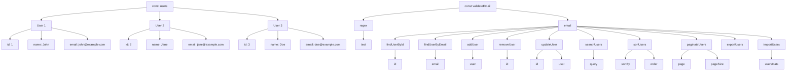

# Prompting with IBM Granite 3 Model for Coding Use Cases

I utilising the latest IBM Granite 3 8B Instruct Model for these coding tasks. This model is lightweight and supports a wide range of programming languages, making it ideal for diverse coding needs.
Experiment Objectives
The experiment focuses on several key areas, grouped into Code Understanding and Code Generation:

Code Understanding

- Code Explanation: Break down complex code snippets to make them easier to understand.
- Code Documentation: Automatically generate detailed documentation to keep records up-to-date.
- Code Review: Analyze code for potential improvements and ensure adherence to best practices.

Code Generation

- Code Improvement: Suggest optimizations to enhance efficiency and performance.
- Code Conversion: Translate code between different programming languages.
- Code Fixing: Identify and resolve bugs or errors in existing code.
- API Generation: Automatically create APIs from given specifications.
- Test Case Generation: Develop test cases to ensure code reliability and performance.
- Diagram Generation: Visualize code structure and workflows through generated diagrams.

The experiment will be conducted using sample JavaScript code to demonstrate these capabilities.

```javascript
const users = [
  { id: 1, name: 'John', email: 'john@example.com' },
  { id: 2, name: 'Jane', email: 'jane@example.com' },
  { id: 3, name: 'Doe', email: 'doe@example.com' },
];

const validateEmail = (email) => {
  const regex = /^[^\s@]+@[^\s@]+\.[^\s@]+$/;
  return regex.test(email);
};

const findUserById = (id) => {
  return users.find(user => user.id === id);
};

const findUserByEmail = (email) => {
  return users.find(user => user.email === email);
};

const addUser = (user) => {
  users.push(user);
};

const removeUser = (id) => {
  const index = users.findIndex(user => user.id === id);
  if (index !== -1) {
    users.splice(index, 1);
  }
};

const updateUser = (id, user) => {
  const index = users.findIndex(user => user.id === id);
  if (index !== -1) {
    users[index] = user;
  }
};

const searchUsers = (query) => {
  return users.filter(user => user.name.includes(query) || user.email.includes(query));
};

const sortUsers = (sortBy, order) => {
  return users.sort((a, b) => {
    if (order === 'asc') {
      return a[sortBy] < b[sortBy] ? -1 : a[sortBy] > b[sortBy] ? 1 : 0;
    } else {
      return a[sortBy] > b[sortBy] ? -1 : a[sortBy] < b[sortBy] ? 1 : 0;
    }
  });
};

const paginateUsers = (page, pageSize) => {
  const start = (page - 1) * pageSize;
  return users.slice(start, start + pageSize);
};

const exportUsers = () => {
  return JSON.stringify(users);
};

const importUsers = (usersData) => {
  users.length = 0;
  users.push(...usersData);
};
```

A few context variable

```python
model_id = GRANITE_3_8B_INSTRUCT
language = "cpp"
documentframework = "doxygen"
testframework = "xunit"
```

Initialise with watsonx.ai, please prepare your API_KEY and PROJECT_ID

```bash
pip install -U ibm-watsonx-ai
```

```python
from ibm_watsonx_ai.foundation_models import ModelInference
from ibm_watsonx_ai.metanames import GenTextParamsMetaNames as GenParams
import os
from dotenv import load_dotenv

load_dotenv()
api_key = os.getenv("API_KEY", None)
project_id = os.getenv("PROJECT_ID", None)

creds = {
    "url"    : "https://us-south.ml.cloud.ibm.com",
    "apikey" : api_key
}

params = {
    GenParams.DECODING_METHOD:"greedy",
    GenParams.MAX_NEW_TOKENS:4000,
    GenParams.MIN_NEW_TOKENS:1,
    # "temperature":0.1,
    GenParams.TOP_K:50,
    GenParams.TOP_P:1,
    GenParams.STOP_SEQUENCES:["```","[/INST]","<|user|>","<|endoftext|>","<|assistant|>"],
}

model = ModelInference(model_id="ibm/granite-3-8b-instruct", credentials=creds, params=params, project_id=project_id)
```

## Code Explanation

Understanding complex code segments is made easier with Granite 3 Model's detailed code explanations. It breaks down intricate code logic into comprehensible language, helping developers to grasp the functionality and purpose of different code sections. This feature is particularly useful for onboarding new team members, debugging, and maintaining large codebases where understanding legacy code is essential.

prompt for Explanation

```python
prompt = f"""<|user|>
Please provide a detailed explanation for the following {language} code:
-ensure have new line after every full stop.
-dont generate code.

###
code: `{sample_code}`
<|assistant|>
explanation:
"""

answer = model.generate_text(prompt)
print(answer)
```

output for explanation

```markdown

This JavaScript code defines a module for managing a list of users. Here's a breakdown of the functions:

1. `users`: An array of objects, each representing a user with properties `id`, `name`, and `email`.

2. `validateEmail(email)`: A function that checks if an email is valid using a regular expression. It returns `true` if the email is valid and `false` otherwise.

3. `findUserById(id)`: A function that finds a user by their ID and returns the user object if found, or `undefined` if not found.

4. `findUserByEmail(email)`: A function that finds a user by their email and returns the user object if found, or `undefined` if not found.

5. `addUser(user)`: A function that adds a new user to the `users` array.

6. `removeUser(id)`: A function that removes a user from the `users` array by their ID.

7. `updateUser(id, user)`: A function that updates an existing user in the `users` array by their ID.

8. `searchUsers(query)`: A function that searches the `users` array for users whose name or email includes the provided query and returns an array of matching users.

9. `sortUsers(sortBy, order)`: A function that sorts the `users` array based on the provided `sortBy` property and `order` (either 'asc' for ascending or 'desc' for descending).

10. `paginateUsers(page, pageSize)`: A function that paginates the `users` array based on the provided `page` number and `pageSize`.

11. `exportUsers()`: A function that exports the `users` array as a JSON string.

12. `importUsers(usersData)`: A function that imports a new `users` array from the provided `usersData`.

This module provides a comprehensive set of functions for managing a list of users, including adding, removing, updating, searching, sorting, and paginating users.
```

## Automatic Documentation Generation

IBM Granite 3 Model automates the creation of comprehensive documentation for your codebase, eliminating the need for manual documentation efforts. By analyzing the code structure and functionality, it generates clear and detailed documentation that is essential for maintaining and scaling projects. This feature ensures that all aspects of the code are well-documented, making it easier for new developers to understand and contribute to the project.

prompt for document generation

```python
prompt = f"""<|user|>
generate {documentframework} document for the {language} provided.
-generate the {language} code only.
{language}: `{sample_code}`
<|assistant|>
```{language}"""

answer = model.generate_text(prompt).replace("```","")
print(answer)
```

output for document generation

```javascript

/**
 * An array of user objects.
 * @type {Array<Object>}
 */
const users = [
  { id: 1, name: 'John', email: 'john@example.com' },
  { id: 2, name: 'Jane', email: 'jane@example.com' },
  { id: 3, name: 'Doe', email: 'doe@example.com' },
];

/**
 * Validates an email address.
 * @param {string} email - The email address to validate.
 * @returns {boolean} - True if the email is valid, false otherwise.
 */
const validateEmail = (email) => {
  const regex = /^[^\s@]+@[^\s@]+\.[^\s@]+$/;
  return regex.test(email);
};

/**
 * Finds a user by their ID.
 * @param {number} id - The ID of the user to find.
 * @returns {Object} - The user object if found, null otherwise.
 */
const findUserById = (id) => {
  return users.find(user => user.id === id);
};

/**
 * Finds a user by their email address.
 * @param {string} email - The email address of the user to find.
 * @returns {Object} - The user object if found, null otherwise.
 */
const findUserByEmail = (email) => {
  return users.find(user => user.email === email);
};

/**
 * Adds a user to the users array.
 * @param {Object} user - The user object to add.
 */
const addUser = (user) => {
  users.push(user);
};

/**
 * Removes a user from the users array by their ID.
 * @param {number} id - The ID of the user to remove.
 */
const removeUser = (id) => {
  const index = users.findIndex(user => user.id === id);
  if (index !== -1) {
    users.splice(index, 1);
  }
};

/**
 * Updates a user in the users array by their ID.
 * @param {number} id - The ID of the user to update.
 * @param {Object} user - The updated user object.
 */
const updateUser = (id, user) => {
  const index = users.findIndex(user => user.id === id);
  if (index !== -1) {
    users[index] = user;
  }
};

/**
 * Searches for users by their name or email.
 * @param {string} query - The search query.
 * @returns {Array<Object>} - An array of user objects that match the query.
 */
const searchUsers = (query) => {
  return users.filter(user => user.name.includes(query) || user.email.includes(query));
};

/**
 * Sorts the users array by a specified property in ascending or descending order.
 * @param {string} sortBy - The property to sort by.
 * @param {string} order - The sort order ('asc' for ascending, 'desc' for descending).
 * @returns {Array<Object>} - The sorted users array.
 */
const sortUsers = (sortBy, order) => {
  return users.sort((a, b) => {
    if (order === 'asc') {
      return a[sortBy] < b[sortBy] ? -1 : a[sortBy] > b[sortBy] ? 1 : 0;
    } else {
      return a[sortBy] > b[sortBy] ? -1 : a[sortBy] < b[sortBy] ? 1 : 0;
    }
  });
};

/**
 * Paginates the users array.
 * @param {number} page - The current page number.
 * @param {number} pageSize - The number of users to display per page.
 * @returns {Array<Object>} - The paginated users array.
 */
const paginateUsers = (page, pageSize) => {
  const start = (page - 1) * pageSize;
  return users.slice(start, start + pageSize);
};

/**
 * Exports the users array as a JSON string.
 * @returns {string} - The JSON string representation of the users array.
 */
const exportUsers = () => {
  return JSON.stringify(users);
};

/**
 * Imports a new users array.
 * @param {Array<Object>} usersData - The new users array to import.
 */
const importUsers = (usersData) => {
  users.length = 0;
  users.push(...usersData);
};
```

## Code Review and Scoring

Granite 3 Model offers automated code reviews that assess the quality of your code against industry standards. It provides scoring mechanisms that highlight areas of strength and identify potential issues, allowing developers to maintain high-quality codebases. This automated review process accelerates the feedback loop, enabling developers to make timely improvements and adhere to best practices without the need for extensive manual code inspections.

prompt for review and score

```python
prompt = f"""<|user|>
you are {language} expert. you need to review the following {language} code. 
-please understand the {language} code provided in detail.
-please review the code in completeness, logic, performance and quality.
-make it more object oriented.
-give a score out of 10 for the quality of code.
-please provide constructive suggestion in detail.
-generate the review and suggestion only.
{language} code: `{sample_code}`
-DONT generate the improve code directly.
-dont generate code.
<|assistant|>
score and review:"""

suggestion = model.generate_text(prompt)
print(suggestion)
```

outcome for review and score

```markdown


The provided JavaScript code is a well-structured and functional implementation of a user management system. It includes various methods for adding, removing, updating, searching, sorting, paginating, and exporting/importing users. The code is clean, readable, and follows good practices.

However, there are a few areas that could be improved to make the code more object-oriented and maintainable. Here are my suggestions:

1. Encapsulation: The `users` array is a global variable, which can lead to issues with scope and potential conflicts with other parts of the codebase. Consider encapsulating this data within a class or module.

2. Validation: The `validateEmail` function is a good start, but it could be expanded to include more comprehensive email validation, such as checking for the presence of a domain and top-level domain.

3. Error Handling: The functions `findUserById`, `findUserByEmail`, `removeUser`, and `updateUser` could benefit from error handling. For example, they could return a message or throw an error if the user is not found or if the ID is invalid.

4. Type Checking: The `addUser` function assumes that the input is always an object with the correct properties. Consider adding type checking to ensure that the input is valid.

5. Documentation: While the code is generally clear, adding comments and documentation can improve its readability and maintainability.

6. Consistency: The `sortUsers` function uses a different syntax for the sort comparison than the rest of the code. Consider using a consistent style throughout the codebase.

7. Performance: The `searchUsers` function uses the `includes` method, which can be slow for large arrays. Consider using a more efficient search algorithm or library for larger datasets.

8. Testing: While not directly related to the code quality, adding unit tests can help ensure that the functions work as expected and can catch regressions if the code is modified in the future.

Overall, I would give this code a score of 8 out of 10 for quality. It is well-structured and functional, but there are several areas where it could be improved to make it more robust, maintainable, and efficient.
```

## Enhancement Based on Reviews

Leveraging the feedback from automated code reviews, the Granite 3 Model facilitates continuous improvement of your codebase. It suggests specific enhancements to optimize performance, improve maintainability, and increase readability. By acting on these insights, developers can refine their code systematically, ensuring that the software remains robust and efficient as it evolves.

Prompt for improvement

```python
prompt = f"""<|user|>
improve the {language} provided base on the review provided.
-understand the review suggestion in detail.
-adopt the review suggestion if applicable.
-dont generate explanation.
###
original {language} code: `{sample_code}`
review suggestion: `{suggestion}`
<|assistant|>
improved {language}
```{language}"""

answer = model.generate_text(prompt).replace("```","")
print(answer)
```

Output for improvement

```javascript

class UserManager {
  constructor() {
    this.users = [
      { id: 1, name: 'John', email: 'john@example.com' },
      { id: 2, name: 'Jane', email: 'jane@example.com' },
      { id: 3, name: 'Doe', email: 'doe@example.com' },
    ];
  }

  validateEmail(email) {
    const regex = /^[^\s@]+@[^\s@]+\.[^\s@]+$/;
    return regex.test(email);
  }

  findUserById(id) {
    const user = this.users.find(user => user.id === id);
    if (!user) {
      throw new Error(`User with ID ${id} not found.`);
    }
    return user;
  }

  findUserByEmail(email) {
    const user = this.users.find(user => user.email === email);
    if (!user) {
      throw new Error(`User with email ${email} not found.`);
    }
    return user;
  }

  addUser(user) {
    if (!user || typeof user !== 'object' || !user.id || !user.name || !user.email) {
      throw new Error('Invalid user object.');
    }
    this.users.push(user);
  }

  removeUser(id) {
    const index = this.users.findIndex(user => user.id === id);
    if (index === -1) {
      throw new Error(`User with ID ${id} not found.`);
    }
    this.users.splice(index, 1);
  }

  updateUser(id, user) {
    if (!user || typeof user !== 'object' || !user.id || !user.name || !user.email) {
      throw new Error('Invalid user object.');
    }
    const index = this.users.findIndex(user => user.id === id);
    if (index === -1) {
      throw new Error(`User with ID ${id} not found.`);
    }
    this.users[index] = user;
  }

  searchUsers(query) {
    return this.users.filter(user => user.name.includes(query) || user.email.includes(query));
  }

  sortUsers(sortBy, order) {
    return this.users.sort((a, b) => {
      if (order === 'asc') {
        return a[sortBy] < b[sortBy] ? -1 : a[sortBy] > b[sortBy] ? 1 : 0;
      } else {
        return a[sortBy] > b[sortBy] ? -1 : a[sortBy] < b[sortBy] ? 1 : 0;
      }
    });
  }

  paginateUsers(page, pageSize) {
    const start = (page - 1) * pageSize;
    return this.users.slice(start, start + pageSize);
  }

  exportUsers() {
    return JSON.stringify(this.users);
  }

  importUsers(usersData) {
    this.users.length = 0;
    this.users.push(...usersData);
  }
}
```

## Error Identification and Fixing

The Granite 3 Model excels at identifying and rectifying errors in your code. It efficiently locates potential syntax errors andlogical flaws. By analyzing the code, it proposes fixes and improvements, offering developers an initial draft to consider. This feature streamlines the debugging process, enabling developers to focus on verification and testing, ensuring robust code.

Problem Code

```javascript
const users = [
  { id: 1, name: 'John', email: 'john@example.com' },
  { id: 2, name: 'Jane', email: 'jane@example.com' },
  { id: 3, name: 'Doe', email: 'doe@example.com' },
];

const validateEmail = (email) => {
  const regex = /^[^\s@]+@[^\s@
};

const findUserById = (id) => {
  return users.find(user => user.id === id);
};

const findUserByEmail = (email) => {
  return users.find(user => user.email === email);
};

const addUser = (user) => {
  users.push(user);
};

const removeUser = (id) => {
  const index = users.findIndex(user => user.id === id);
  if (index !== -1) {
    users.splice(index, 1);
  }
};

const updateUser = (id, user) => {
  const index = users.find
    users[index] = user;
  }
};

const searchUsers = (query) => {
  return users.filter(user => useery) || user.email.includes(query));
};

const sortUsers = (sortBy, order) => {
  return users.sort((a, b) => {
    if (order === 'asc') {
      return a[sortBy] < b[sortBy] ? -1 : a[sortBy] > b[sortBy] ? 1 : 0;
    } else {
      return a[sortBy] > b[s
  });
};

const paginateUsers = (page, pageSize) => {
  const start = (page - 1) * pageSize;
  return users.slice(start, start + pageSize);
};

const exportUsers = () => {
  return JSON.stringify(users);
};

const importUsers = (usersData) => {
  users.length = 0;
  users.push(...usersData);
};
```

Prompt for Fixing

```python
prompt = f"""<|user|>
fix the {language} provided.
-understand the review suggestion in detail.
-identify if any problem.
-fix the problem if any.
-add explanation as inline comment.

###
{language}: `{bad_code}`
<|assistant|>
fixed version with inline comment at the point it fix.
```{language}"""

answer = model.generate_text(prompt).replace("```","")
print(answer)
```

Output for Fixing

```javascript

const users = [
  { id: 1, name: 'John', email: 'john@example.com' },
  { id: 2, name: 'Jane', email: 'jane@example.com' },
  { id: 3, name: 'Doe', email: 'doe@example.com' },
];

const validateEmail = (email) => {
  // The regular expression for email validation is incomplete.
  // It should include the entire email format, including the '@' symbol and domain.
  const regex = /^[^\s@]+@[^\s@]+\.[^\s@]+$/;
  return regex.test(email);
};

const findUserById = (id) => {
  return users.find(user => user.id === id);
};

const findUserByEmail = (email) => {
  return users.find(user => user.email === email);
};

const addUser = (user) => {
  users.push(user);
};

const removeUser = (id) => {
  const index = users.findIndex(user => user.id === id);
  if (index !== -1) {
    users.splice(index, 1);
  }
};

const updateUser = (id, user) => {
  const index = users.findIndex(user => user.id === id);
  if (index !== -1) {
    users[index] = user; // Update the user at the found index
  }
};

const searchUsers = (query) => {
  return users.filter(user => user.name.includes(query) || user.email.includes(query));
};

const sortUsers = (sortBy, order) => {
  return users.sort((a, b) => {
    if (order === 'asc') {
      return a[sortBy] < b[sortBy] ? -1 : a[sortBy] > b[sortBy] ? 1 : 0;
    } else {
      return a[sortBy] > b[sortBy] ? 1 : a[sortBy] < b[sortBy] ? -1 : 0;
    }
  });
};

const paginateUsers = (page, pageSize) => {
  const start = (page - 1) * pageSize;
  return users.slice(start, start + pageSize);
};

const exportUsers = () => {
  return JSON.stringify(users);
};

const importUsers = (usersData) => {
  users.length = 0;
  users.push(...usersData);
};
```

## Diagram Generation

Understanding complex code structures is made easier with Granite 3 Model's diagram generation capabilities. It automatically creates visual representations of your code architecture, including class diagrams and flowcharts. These diagrams enhance comprehension and improve communication on projects with intricate dependencies.

Prompt for Generate Diagram

```python
prompt = f"""<|user|>
generate diagram for the {language} code provided.
-understand the review suggestion in detail.
-use simple name for node.
-generate in mermaid.
-dont repeating.
-dont generation explanation.
{language}: `{sample_code}`
<|assistant|>
```mermaid"""

answer = model.generate_text(prompt).replace("```","")
print(answer)
```

Output for Generate Diagram



## Code Conversion

Granite 3 Model seamlessly converts code between different programming languages or formats, enhancing compatibility and facilitating cross-platform development. Whether migrating legacy systems to modern languages or adapting code for different environments, this feature ensures that the transition is smooth and error-free. It can supports a wide range of languages, making it a versatile tool for diverse development needs.

Prompt for conversion

```python
target_language = "angular"

prompt = f"""<|user|>
rewrite the {language} code provided to {target_language}.
-understand the code provided in detail.
-understand how to map technology and syntax to the target {target_language} langauge.
-dont generation explanation.
{language}: `{sample_code}`
<|assistant|>
```{target_language}"""

answer = model.generate_text(prompt).replace("```","")
print(answer)
```

Output for conversion

```javascript

import { Component } from '@angular/core';

@Component({
  selector: 'app-root',
  templateUrl: './app.component.html',
  styleUrls: ['./app.component.css']
})
export class AppComponent {
  users = [
    { id: 1, name: 'John', email: 'john@example.com' },
    { id: 2, name: 'Jane', email: 'jane@example.com' },
    { id: 3, name: 'Doe', email: 'doe@example.com' },
  ];

  validateEmail(email: string): boolean {
    const regex = /^[^\s@]+@[^\s@]+\.[^\s@]+$/;
    return regex.test(email);
  }

  findUserById(id: number): any {
    return this.users.find(user => user.id === id);
  }

  findUserByEmail(email: string): any {
    return this.users.find(user => user.email === email);
  }

  addUser(user: any): void {
    this.users.push(user);
  }

  removeUser(id: number): void {
    const index = this.users.findIndex(user => user.id === id);
    if (index !== -1) {
      this.users.splice(index, 1);
    }
  }

  updateUser(id: number, user: any): void {
    const index = this.users.findIndex(user => user.id === id);
    if (index !== -1) {
      this.users[index] = user;
    }
  }

  searchUsers(query: string): any[] {
    return this.users.filter(user => user.name.includes(query) || user.email.includes(query));
  }

  sortUsers(sortBy: string, order: string): any[] {
    return this.users.sort((a, b) => {
      if (order === 'asc') {
        return a[sortBy] < b[sortBy] ? -1 : a[sortBy] > b[sortBy] ? 1 : 0;
      } else {
        return a[sortBy] > b[sortBy] ? -1 : a[sortBy] < b[sortBy] ? 1 : 0;
      }
    });
  }

  paginateUsers(page: number, pageSize: number): any[] {
    const start = (page - 1) * pageSize;
    return this.users.slice(start, start + pageSize);
  }

  exportUsers(): string {
    return JSON.stringify(this.users);
  }

  importUsers(usersData: any[]): void {
    this.users.length = 0;
    this.users.push(...usersData);
  }
}
```

## API Generation

Automating the creation of APIs, Granite 3 Model accelerates the integration of your codebase with external systems. It generates well-structured and documented APIs based on your existing code, facilitating seamless communication and data exchange between different software components. This feature is particularly beneficial for developing scalable and interoperable applications that require robust API interfaces.

Prompt for API Generation

```python
prompt = f"""<|user|>
generate a API definition in swagger for the {language} code provided.
-dont generate explanation.
{language}: `{sample_code}`
<|assistant|>
```yaml
"""

answer = model.generate_text(prompt).replace("```","")
print(answer)
```

Output for API Generation

```yaml
openapi: 3.0.0
info:
  title: User Management API
  version: 1.0.0
paths:
  /users:
    get:
      summary: Get users
      parameters:
        - name: query
          in: query
          description: Search query
          schema:
            type: string
        - name: sortBy
          in: query
          description: Sort by field
          schema:
            type: string
        - name: order
          in: query
          description: Sort order (asc or desc)
          schema:
            type: string
        - name: page
          in: query
          description: Page number
          schema:
            type: integer
        - name: pageSize
          in: query
          description: Page size
          schema:
            type: integer
      responses:
        '200':
          description: OK
          content:
            application/json:
              schema:
                type: array
                items:
                  $ref: '#/components/schemas/User'
    post:
      summary: Add user
      requestBody:
        required: true
        content:
          application/json:
            schema:
              $ref: '#/components/schemas/User'
      responses:
        '201':
          description: Created
          content:
            application/json:
              schema:
                $ref: '#/components/schemas/User'
  /users/{id}:
    get:
      summary: Get user by ID
      parameters:
        - name: id
          in: path
          description: User ID
          required: true
          schema:
            type: integer
    put:
      summary: Update user by ID
      parameters:
        - name: id
          in: path
          description: User ID
          required: true
          schema:
            type: integer
      requestBody:
        required: true
        content:
          application/json:
            schema:
              $ref: '#/components/schemas/User'
      responses:
        '200':
          description: OK
          content:
            application/json:
              schema:
                $ref: '#/components/schemas/User'
    delete:
      summary: Remove user by ID
      parameters:
        - name: id
          in: path
          description: User ID
          required: true
          schema:
            type: integer
      responses:
        '204':
          description: No Content
  /users/email/{email}:
    get:
      summary: Get user by email
      parameters:
        - name: email
          in: path
          description: User email
          required: true
          schema:
            type: string
    put:
      summary: Update user by email
      parameters:
        - name: email
          in: path
          description: User email
          required: true
          schema:
            type: string
      requestBody:
        required: true
        content:
          application/json:
            schema:
              $ref: '#/components/schemas/User'
      responses:
        '200':
          description: OK
          content:
            application/json:
              schema:
                $ref: '#/components/schemas/User'
    delete:
      summary: Remove user by email
      parameters:
        - name: email
          in: path
          description: User email
          required: true
          schema:
            type: string
      responses:
        '204':
          description: No Content
  /users/search:
    get:
      summary: Search users
      parameters:
        - name: query
          in: query
          description: Search query
          schema:
            type: string
      responses:
        '200':
          description: OK
          content:
            application/json:
              schema:
                type: array
                items:
                  $ref: '#/components/schemas/User'
  /users/sort:
    get:
      summary: Sort users
      parameters:
        - name: sortBy
          in: query
          description: Sort by field
          schema:
            type: string
        - name: order
          in: query
          description: Sort order (asc or desc)
          schema:
            type: string
      responses:
        '200':
          description: OK
          content:
            application/json:
              schema:
                type: array
                items:
                  $ref: '#/components/schemas/User'
  /users/paginate:
    get:
      summary: Paginate users
      parameters:
        - name: page
          in: query
          description: Page number
          schema:
            type: integer
        - name: pageSize
          in: query
          description: Page size
          schema:
            type: integer
      responses:
        '200':
          description: OK
          content:
            application/json:
              schema:
                type: array
                items:
                  $ref: '#/components/schemas/User'
  /users/export:
    get:
      summary: Export users
      responses:
        '200':
          description: OK
          content:
            application/json:
              schema:
                type: string
  /users/import:
    post:
      summary: Import users
      requestBody:
        required: true
        content:
          application/json:
            schema:
              type: array
              items:
                $ref: '#/components/schemas/User'
      responses:
        '202':
          description: Accepted
components:
  schemas:
    User:
      type: object
      properties:
        id:
          type: integer
        name:
          type: string
        email:
          type: string
```

## Test Case Generation

Ensuring thorough testing is essential for reliable software development. Granite 3 Model automatically generates relevant test cases for your code, covering various scenarios and edge cases. This acceleration of the testing phase helps in identifying potential issues early, ensuring that the code performs as expected and meets the required quality standards before deployment.

Prompt for Test Case

```python
prompt = f"""<|user|>
generate Test Cases in {testframework} for the {language} code provided.
-focus on boundary cases.
-focus on exception handling
-generate the test only.
{language}: `{sample_code}`
<|assistant|>
```{language}"""

answer = model.generate_text(prompt).replace("```","")
print(answer)
```

Output for Test Case

```javascript

const { expect } = require('chai');
const { addUser, removeUser, updateUser, searchUsers, sortUsers, paginateUsers, exportUsers, importUsers } = require('./userManagement');

describe('User Management', () => {
  let users;

  beforeEach(() => {
    users = [
      { id: 1, name: 'John', email: 'john@example.com' },
      { id: 2, name: 'Jane', email: 'jane@example.com' },
      { id: 3, name: 'Doe', email: 'doe@example.com' },
    ];
  });

  describe('addUser', () => {
    it('should add a new user', () => {
      const newUser = { id: 4, name: 'New User', email: 'newuser@example.com' };
      addUser(newUser);
      expect(users).to.include(newUser);
    });

    it('should not add a user with an invalid email', () => {
      const invalidUser = { id: 5, name: 'Invalid User', email: 'invalid' };
      expect(() => addUser(invalidUser)).to.throw('Invalid email');
    });
  });

  describe('removeUser', () => {
    it('should remove a user by id', () => {
      removeUser(2);
      expect(users).not.to.include(users.find(user => user.id === 2));
    });

    it('should not remove a user with an invalid id', () => {
      expect(() => removeUser(4)).to.throw('User not found');
    });
  });

  describe('updateUser', () => {
    it('should update a user by id', () => {
      const updatedUser = { id: 1, name: 'Updated User', email: 'updateduser@example.com' };
      updateUser(1, updatedUser);
      expect(users.find(user => user.id === 1)).to.deep.equal(updatedUser);
    });

    it('should not update a user with an invalid id', () => {
      expect(() => updateUser(4, { id: 4, name: 'Invalid User', email: 'invalid@example.com' })).to.throw('User not found');
    });
  });

  describe('searchUsers', () => {
    it('should search users by name', () => {
      expect(searchUsers('John')).to.include(users.find(user => user.name === 'John'));
    });

    it('should search users by email', () => {
      expect(searchUsers('jane@example.com')).to.include(users.find(user => user.email === 'jane@example.com'));
    });

    it('should return an empty array if no users are found', () => {
      expect(searchUsers('Non-existent User')).to.be.empty;
    });
  });

  describe('sortUsers', () => {
    it('should sort users by name in ascending order', () => {
      const sortedUsers = sortUsers('name', 'asc');
      expect(sortedUsers).to.deep.equal(users.sort((a, b) => a.name.localeCompare(b.name)));
    });

    it('should sort users by name in descending order', () => {
      const sortedUsers = sortUsers('name', 'desc');
      expect(sortedUsers).to.deep.equal(users.sort((a, b) => b.name.localeCompare(a.name)));
    });

    it('should sort users by email in ascending order', () => {
      const sortedUsers = sortUsers('email', 'asc');
      expect(sortedUsers).to.deep.equal(users.sort((a, b) => a.email.localeCompare(b.email)));
    });

    it('should sort users by email in descending order', () => {
      const sortedUsers = sortUsers('email', 'desc');
      expect(sortedUsers).to.deep.equal(users.sort((a, b) => b.email.localeCompare(a.email)));
    });
  });

  describe('paginateUsers', () => {
    it('should paginate users by page and page size', () => {
      const paginatedUsers = paginateUsers(1, 2);
      expect(paginatedUsers).to.deep.equal(users.slice(0, 2));
    });

    it('should return an empty array if no users are found', () => {
      expect(paginateUsers(1, 2)).to.be.empty;
    });
  });

  describe('exportUsers', () => {
    it('should export users as a JSON string', () => {
      const exportedUsers = exportUsers();
      expect(JSON.parse(exportedUsers)).to.deep.equal(users);
    });
  });

  describe('importUsers', () => {
    it('should import users from a JSON string', () => {
      const importedUsers = [
        { id: 4, name: 'Imported User', email: 'importeduser@example.com' },
      ];
      importUsers(importedUsers);
      expect(users).to.deep.equal(importedUsers);
    });

    it('should clear the users array before importing new users', () => {
      importUsers([]);
      expect(users).to.be.empty;
    });
  });
});
```
