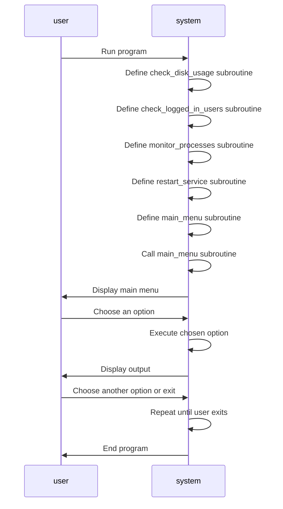

```mermaid
sequenceDiagram
    user->>system: Run program
    system->>system: Define check_disk_usage subroutine
    system->>system: Define check_logged_in_users subroutine
    system->>system: Define monitor_processes subroutine
    system->>system: Define restart_service subroutine
    system->>system: Define main_menu subroutine
    system->>system: Call main_menu subroutine
    system->>user: Display main menu
    user->>system: Choose an option
    system->>system: Execute chosen option
    system->>user: Display output
    user->>system: Choose another option or exit
    system->>system: Repeat until user exits
    system->>user: End program
```