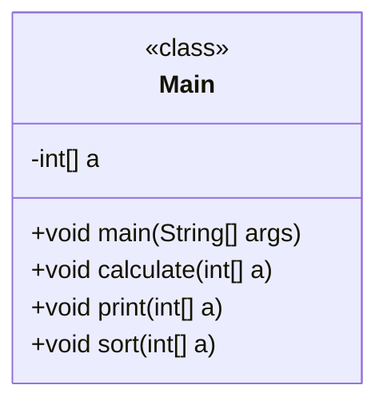

# Granite Code Prompt Cookbook - WCA Chat

this repo target to share potential use case and prompt on granite-code models.

## prerequisite

- get an API KEY for watsonx Code Assistant

## tips

### tips for WCA

- new a chat session, it help to get clear context and better outcome.
- simple instruction works fine, hence make it simple
- the output is quite consistent

## sample c

[good example](../sample/c/sample.c)

[bad example](../sample/c/bad.c)

## use cases

### 1. Code Explanation

- chat in WCA

```text
/explain @filename
```

- sample output

```markdown
The above code defines a class named Main which contains a main method that takes an array of integers as input and performs various operations on it. The first operation is to read the size of the array from the standard input using the Scanner class, and then create an array of that size. The next operation is to read the elements of the array from the standard input using the same Scanner instance and store them in the array. The calculate method calculates the sum of all the elements in the array and prints it to the standard output. The print method simply prints each element of the array on a separate line. The sort method sorts the array using the Arrays.sort method, and then calculates the median of the array by checking whether the length of the array is even or odd, and computing the average of the two middle elements if it's even, or returning the middle element if it's odd.
```

### 2. Generate Documentation

- chat input in WCA

```text
/document @filename
```

- sample output

```c
/**
 * This program reads an integer N from stdin, followed by N integers A1,A2,...,AN. It then prints the sum of all elements in the array A, and the median of the array.
 */
package com.test;

import java.util.Arrays;
import java.util.Scanner;

public class Main {

    /**
     * This method reads an integer N from stdin, followed by N integers A1,A2,...,AN. It then prints the sum of all elements in the array A, and the median of the array.
     * @param args Unused command line arguments.
     */
    public static void main(String[] args) {
        try (Scanner in = new Scanner(System.in)) {
            int n = in.nextInt();
            int[] a = new int[n];
            for(int a_i=0; a_i < n; a_i++){
                a[a_i] = in.nextInt();
            }
        }
    }

    /**
     * This method calculates the sum of all elements in the array A.
     * @param a The input array.
     */
    public void calculate(int[] a) {
        int sum = 0;
        for (int i = 0; i < a.length; i++) {
            sum += a[i];
        }
        System.out.println(sum);
    }

    /**
     * This method prints each element in the array A on a separate line.
     * @param a The input array.
     */
    public void print(int[] a) {
        for (int i = 0; i < a.length; i++) {
            System.out.println(a[i]);
        }
    }

    /**
     * This method sorts the array A in ascending order, and then calculates the median. If the length of the array is even, it takes the average of the two middle elements.
     * @param a The input array.
     */
    public void sort(int[] a) {
        Arrays.sort(a);
        double median;
        if (a.length % 2 == 0) {
            median = (a[a.length / 2 - 1] + a[a.length / 2]) / 2.0;
        } else {
            median = a[a.length / 2];
        }
    }
}
```

### 3. Code Conversion

- chat in WCA

```text
/translate to csharp @filename
```

- sample output

```csharp
// Assisted by WCA@IBM
// Latest GenAI contribution: ibm/granite-20b-code-instruct-v2
//Main.cs
using System;
using System.Collections.Generic;
using System.Linq;

namespace Main
{
    class Program
    {
        static void Main(string[] args)
        {
            try
            {
                var input = Console.ReadLine().Split(' ').Select(int.Parse).ToArray();
                var n = input[0];
                var a = new int[n];
                for (int i = 0; i < n; i++)
                {
                    a[i] = Convert.ToInt32(Console.ReadLine());
                }
            }
            catch (Exception e)
            {
                Console.WriteLine(e);
            }
        }

        public void Calculate(int[] a)
        {
            int sum = 0;
            for (int i = 0; i < a.Length; i++)
            {
                sum += a[i];
            }
            Console.WriteLine(sum);
        }

        public void Print(int[] a)
        {
            for (int i = 0; i < a.Length; i++)
            {
                Console.WriteLine(a[i]);
            }
        }

        public void Sort(int[] a)
        {
            Array.Sort(a);
            double median;
            if (a.Length % 2 == 0)
            {
                median = (a[a.Length / 2 - 1] + a[a.Length / 2]) / 2.0;
            }
            else
            {
                median = a[a.Length / 2];
            }
        }
    }
}
```


### 4. Test Case Generation

- chat in WCA

```text
/unit-test @filename
```

- sample output

```c
// Assisted by WCA@IBM
// Latest GenAI contribution: ibm/granite-20b-code-instruct-v2
package com.example;

import org.junit.jupiter.api.Test;

import static org.junit.jupiter.api.Assertions.*;

class MainTest {

    @Test
    void testCalculate() {
        int[] a = {1, 2, 3};
        Main main = new Main();
        assertEquals(6, main.calculate(a));
    }

    @Test
    void testPrint() {
        int[] a = {1, 2, 3};
        Main main = new Main();
        main.print(a);
    }

    @Test
    void testSort() {
        int[] a = {1, 2, 3};
        Main main = new Main();
        main.sort(a);
    }
}

```

### 5. Review Code

- chat input in WCA

```text
Review the code @filename
```

- sample output

```
Answer: Sure, I can review your code. Here's what I found:

Line 3: The package declaration is incorrect. It should be package com.example; instead of package com.ibm.j9ddr.vm29.pointer.generated;.

Line 6: The import statement is unnecessary. It should be removed.

Line 14: The method calculate does not perform any operations on the array a. It should be renamed to something more appropriate, such as sumArray.

Line 18: The method print does not perform any operations on the array a. It should be renamed to something more appropriate, such as printArray.

Line 22: The method sort does not perform any operations on the array a. It should be renamed to something more appropriate, such as sortArray.

Line 25: The variable median is unused. It should be removed.

Overall, the code is well-written and follows best practices in Java. However, there are some areas where it could be improved.
```

- chat input in WCA

```text
review the code in completeness, logic, performance and quality. @filename
```

- sample output

```text
The code is complete as it contains all the necessary components to solve the problem. The code is well-written and follows good coding practices. The code is efficient as it uses the built-in Java sorting algorithm and calculates the median value using mathematical operations. However, there may be room for improvement in terms of readability, efficiency, and error handling.
```

- chat input in WCA

```text
give a score out of 10 for the quality of code. @filename
```

- sample output

```text
5
```

### 6. Fix Code

- chat in WCA

```text
/fix @filename
```

- sample output


```java
import java.util.*;

import com.ibm.j9ddr.vm29.pointer.generated.processor_cpu_load_infoPointer;

public class Main {

    public static void main(String[] args) {
        try (Scanner in = new Scanner(System.in)) {
            int n = in.nextInt();
        }
    }

    public void calculate(int[] a) {
        int sum = 0;
        for (int i = 0; i < a.length; i++) {
            sum += a[i];
        }
        System.out.println(sum);
    }

    public void print(int[] a) {
        for (int i = 0; i < a.length; i++) {
            System.out.println(a[i]);
        }
    }

    public void sort(int[] a) {
        Arrays.sort(a);
        double median;
        if (a.length % 2 == 0) {
            median = (a[a.length / 2 - 1] + a[a.length / 2]) / 2.0;
        } else {
            median = a[a.length / 2];
        }
    }
}
```

### 7. Generate Diagram

- chat in WCA

```text
generate mermaid diagram for the c code provided. @filename
```

- sample output



### 8. Interface Generation

- chat in WCA

```text
generate c interface version base on the c code provided. @filename
```

```c
// Assisted by WCA@IBM
// Latest GenAI contribution: ibm/granite-20b-code-instruct-v2
//Main.java
import java.util.*;

import com.ibm.j9ddr.vm29.pointer.generated.processor_cpu_load_infoPointer;

public interface Main {

    public void calculate(int[] a);

    public void print(int[] a);

    public void sort(int[] a);
}
```

### 9. Build and Deployment Scipt Generation

- chat in WCA

```text
generate build and deployment script for the c code provided. @filename
```

- sample output

```bash
Build Script:


// Assisted by WCA@IBM
// Latest GenAI contribution: ibm/granite-20b-code-instruct-v2
#!/bin/bash

# Build the Java application
javac -cp .:./lib/* ./src/Main.java

# Create a Liberty server package
mkdir server
cp ./src/server.xml ./server/server.xml
cp ./target/Main.class ./server/apps/

# Package the application as a Docker image
docker build -t java-app .

Deployment Script:


// Assisted by WCA@IBM
// Latest GenAI contribution: ibm/granite-20b-code-instruct-v2
#!/bin/bash

# Deploy the Docker image to OpenShift
oc new-project java-app
oc new-app java-app --name=java-app

# Expose the application to the outside world
oc expose svc/java-app
```
