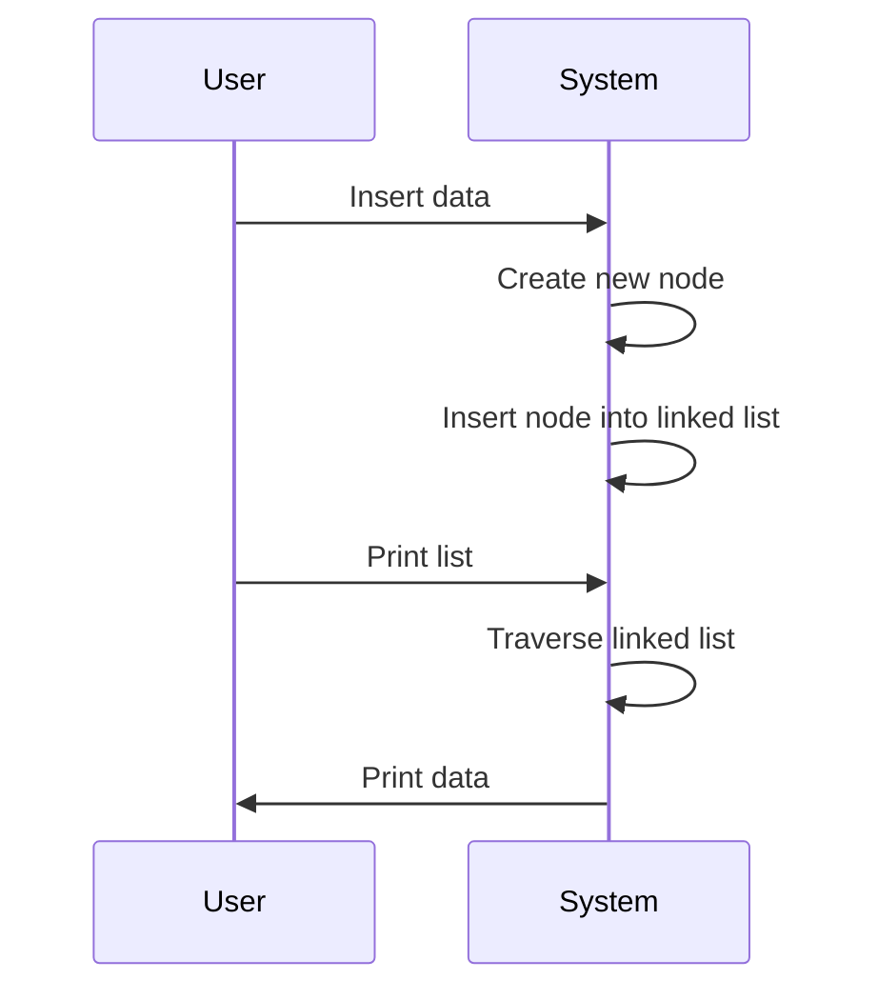

# WCA Chat Command Cookbook - C

this repo target to share potential use case and prompt on granite-code models.

## prerequisite

### 1. install IBM watsonx Code Assistant extension in your vscode


get an API KEY for watsonx Code Assistant

### 2. instrall GCC

on Mac

```bash
brew install gcc
```

## assumption

- Code Generation may include variation, which means every generation may not exactly same.
- Chat take the conversation as context. so the good side is you can give followup question. but it may also affect the output of your prompt. so in case the output is not desireable, please New a chat session. with following button:


## tips

### tips for WCA

- new a chat session, it help to get clear context and better outcome.
- delete unused chat sessions also help.
- simple instruction works fine, hence make it simple

## sample c

[good example](../sample/c/sample.c)

[bad example](../sample/c/bad.c)

## use cases

### 1. Code Generation

goto the sample code folder

```bash
cd sample/cpp
```

- create a empty file of generated.c

- chat in WCA

```text
generate a c program of bubblesort
```

```c
 // Assisted by watsonx Code Assistant 
 

#include <stdio.h>

void bubbleSort(int arr[], int n) {
    int i, j;
    for (i = 0; i < n-1; i++) {
        for (j = 0; j < n-i-1; j++) {
            if (arr[j] > arr[j+1]) {
                int temp = arr[j];
                arr[j] = arr[j+1];
                arr[j+1] = temp;
            }
        }
    }
}

int main() {
    int arr[] = {64, 34, 25, 12, 22, 11, 90};
    int n = sizeof(arr)/sizeof(arr[0]);
    bubbleSort(arr, n);
    printf("Sorted array: \n");
    int i;
    for (i = 0; i < n; i++) {
        printf("%d ", arr[i]);
    }
    return 0;
}
```

- copy and paste the outcome to the file you just create.

- try to chat to update the code you just generate until you found it good.

- build and run

```bash
gcc generated.c -o generated
chmod 777 generated
./generated
```

sample outcome

```text
Sorted array: 
11 12 22 25 34 64 90 % 
```

- check if compilable or running well.

### 2. Code Completion

#### 2.1 Inline Code Completion

- edit some code, and experience the code completion and accept it with `tab` key.

#### 2.2 Multiple Line Code Completion

- type `Option + .` key to generate the completion base on context, and accept it with `tab` key.


### 3. Code Explanation

- chat in WCA

```text
/explain @sample.c
```

- sample output

```markdown
This code is a C program that implements a singly linked list. It defines a struct Node that represents a node in the list, with an integer data field and a pointer next to the next node in the list. The createNode function creates a new node with the given data and returns a pointer to it. The insertNode function inserts a new node with the given data at the beginning of the list, updating the head pointer if necessary. The printList function prints the data in the list, starting from the head. The main function creates an empty list, inserts some nodes, and prints the list.
```

### 4. Generate Documentation

- chat input in WCA

```text
/document @sample.c
```

- sample output

```c
// Assisted by watsonx Code Assistant 
/**
 * @file main.c
 * @author IBM watsonx Code Assistant
 * @brief Insert a new node at the beginning of a linked list.
 * @version 1.0
 * @date 2021-03-15
 * 
 * @copyright Copyright (c) 2021
 * 
 */
#include <stdio.h>
#include <stdlib.h>
#include <string.h>
/**
 * @brief Node structure for the linked list.
 * 
 */
typedef struct Node {
    int data;
    struct Node* next;
} Node;
/**
 * @brief Create a new node with the given data.
 * 
 * @param data The data to be stored in the new node.
 * @return Node* Pointer to the newly created node.
 */
Node* createNode(int data) {
    Node* newNode = (Node*)malloc(sizeof(Node));
    newNode->data = data;
    newNode->next = NULL;
    return newNode;
}
/**
 * @brief Insert a new node at the beginning of the linked list.
 * 
 * @param head Pointer to the head of the linked list.
 * @param data The data to be stored in the new node.
 */
void insertNode(Node** head, int data) {
    Node* newNode = createNode(data);
    if (*head == NULL) {
        *head = newNode;
        return;
    }
    Node* temp = *head;
    while (temp->next != NULL) {
        temp = temp->next;
    }
    temp->next = newNode;
}
/**
 * @brief Print the elements of the linked list.
 * 
 * @param head Pointer to the head of the linked list.
 */
void printList(Node* head) {
    while (head != NULL) {
        printf("%d ", head->data);
        head = head->next;
    }
    printf("\n");
}
int main() {
    Node* head = NULL;
    insertNode(&head, 1);
    insertNode(&head, 2);
    insertNode(&head, 3);
    insertNode(&head, 4);
    insertNode(&head, 5);
    printList(head);
    return 0;
}
```


### 5. Test Case Generation

- chat in WCA

```text
/unit-test @sample.c
```

- sample output

```c
// Assisted by watsonx Code Assistant 
#include <stdio.h>
#include <stdlib.h>
#include <string.h>
#include "sample.c"

void test_createNode() {
    Node* node = createNode(10);
    if (node == NULL) {
        printf("Failed to create node\n");
        exit(1);
    }
    if (node->data != 10) {
        printf("Node data is incorrect\n");
        exit(1);
    }
    if (node->next != NULL) {
        printf("Next pointer is not NULL\n");
        exit(1);
    }
    free(node);
}

void test_insertNode() {
    Node* head = NULL;
    insertNode(&head, 1);
    if (head == NULL) {
        printf("Failed to insert node\n");
        exit(1);
    }
    if (head->data != 1) {
        printf("Node data is incorrect\n");
        exit(1);
    }
    if (head->next != NULL) {
        printf("Next pointer is not NULL\n");
        exit(1);
    }
    insertNode(&head, 2);
    if (head->data != 1) {
        printf("Node data is incorrect\n");
        exit(1);
    }
    if (head->next->data != 2) {
        printf("Next node data is incorrect\n");
        exit(1);
    }
    if (head->next->next != NULL) {
        printf("Next pointer is not NULL\n");
        exit(1);
    }
}

void test_printList() {
    Node* head = NULL;
    insertNode(&head, 1);
    insertNode(&head, 2);
    insertNode(&head, 3);
    insertNode(&head, 4);
    insertNode(&head, 5);
    printList(head);
}

int main() {
    test_createNode();
    test_insertNode();
    test_printList();
    return 0;
}
```

copy and paste the testcase.c

run the test case

```bash
gcc testcase.c -o testcase
```

copy the error to chat if any

```text
testcase.c:8:5: error: call to undeclared function 'TEST_ASSERT_EQUAL'; ISO C99 and later do not support implicit function declarations [-Wimplicit-function-declaration] 8 | TEST_ASSERT_EQUAL(10, node->data);
```

revise version of testcase

```c
 // Assisted by watsonx Code Assistant 
 
#include <stdio.h>
#include <stdlib.h>
#include <string.h>
#include "sample.c"
#include "unity.h"

void test_createNode() {
    Node* node = createNode(10);
    TEST_ASSERT_NOT_NULL(node);
    TEST_ASSERT_EQUAL(10, node->data);
    TEST_ASSERT_NULL(node->next);
    free(node);
}

void test_insertNode() {
    Node* head = NULL;
    insertNode(&head, 1);
    TEST_ASSERT_NOT_NULL(head);
    TEST_ASSERT_EQUAL(1, head->data);
    TEST_ASSERT_NULL(head->next);
    insertNode(&head, 2);
    TEST_ASSERT_EQUAL(1, head->data);
    TEST_ASSERT_EQUAL(2, head->next->data);
    TEST_ASSERT_NULL(head->next->next);
}

void test_printList() {
    Node* head = NULL;
    insertNode(&head, 1);
    insertNode(&head, 2);
    insertNode(&head, 3);
    insertNode(&head, 4);
    insertNode(&head, 5);
    printList(head);
}

int main() {
    UNITY_BEGIN();
    RUN_TEST(test_createNode);
    RUN_TEST(test_insertNode);
    RUN_TEST(test_printList);
    UNITY_END();
    return 0;
}
```

### 6. Review Code

- chat input in WCA

```text
/review @sample.c
```

- sample output

```
This code is a C program that implements a singly linked list. It defines a struct Node that represents a node in the list, with an integer data field and a pointer next to the next node in the list. The createNode function creates a new node with the given data and returns a pointer to it. The insertNode function inserts a new node with the given data at the beginning of the list, updating the head pointer if necessary. The printList function prints the data in the list, starting from the head. The main function creates an empty list, inserts some nodes, and prints the list.

The code is well-structured and easy to understand. It uses the Large Language Model from IBM Granite that is based on the transformer decoder architecture. The code is also well-documented with comments explaining the purpose of each function and the structure of the Node struct.

Overall, this code is a good example of how to implement a singly linked list in C.
```

- chat input in WCA

```text
review the code in completeness, logic, performance and quality. @sample.c
```

- sample output

```text
This code is a C program that implements a singly linked list. It defines a struct Node that represents a node in the list, with an integer data field and a pointer next to the next node in the list. The createNode function creates a new node with the given data and returns a pointer to it. The insertNode function inserts a new node with the given data at the beginning of the list, updating the head pointer if necessary. The printList function prints the data in the list, starting from the head. The main function creates an empty list, inserts some nodes, and prints the list. The code is well-structured and easy to understand. It uses the Large Language Model from IBM Granite that is based on the transformer decoder architecture. The code is also well-documented with comments explaining the purpose of each function and the structure of the Node struct. Overall, this code is a good example of how to implement a singly linked list in C.
```

### 7. Code Translate

- chat in WCA

```text
/translate to csharp @sample.c
```

- sample output

```csharp
// Assisted by watsonx Code Assistant 
// watsonx Code Assistant did not check whether this code suggestion might be similar to third party code.
using System;

public class Program
{
    public static void Main()
    {
        Node head = null;
        InsertNode(ref head, 1);
        InsertNode(ref head, 2);
        InsertNode(ref head, 3);
        InsertNode(ref head, 4);
        InsertNode(ref head, 5);
        PrintList(head);
    }

    public static void InsertNode(ref Node head, int data)
    {
        Node newNode = new Node();
        newNode.data = data;
        newNode.next = null;
        if (head == null)
        {
            head = newNode;
            return;
        }
        Node temp = head;
        while (temp.next != null)
        {
            temp = temp.next;
        }
        temp.next = newNode;
    }

    public static void PrintList(Node head)
    {
        while (head != null)
        {
            Console.Write(head.data + " ");
            head = head.next;
        }
        Console.WriteLine();
    }
}

public class Node
{
    public int data;
    public Node next;
}
```

### 8. Fix Code

- chat in WCA

```text
/fix @bad.c
```

- sample output


```c
# Assisted by watsonx Code Assistant 
# watsonx Code Assistant did not check whether this code suggestion might be similar to third party code.
//blob
#include <stdio.h>
#include <stdlib.h>
#include <string.h>
typedef struct Node {
    int data;
    struct Node* next;
} Node;
Node* createNode(int data) {
    Node* newNode = (Node*)malloc(sizeof(Node));
    newNode->data = data;
    newNode->next = NULL;
    return newNode;
}
void insertNode(Node** head, int data) {
    Node* newNode = createNode(data);
    if (*head == NULL) {
        *head = newNode;
        return;
    }
    Node* temp = *head;
    while (temp->next != NULL) {
        temp = temp->next;
    }
    temp->next = newNode;
}
void printList(Node* head) {
    while (head != NULL) {
        printf("%d ", head->data);
        head = head->next;
    }
    printf("\n");
}
int main() {
    Node* head = NULL;
    insertNode(&head, 1);
    insertNode(&head, 2);
    insertNode(&head, 3);
    insertNode(&head, 4);
    insertNode(&head, 5);
    printList(head);
    return 0;
}
```

### 9. Generate Diagram

#### 9.1 sequence diagram

```text
generate UML sequence diagram in mermaid for the logic how user interact with system in @sample.c
```

- sample output



#### 9.2 class diagram

```text
generate UML class diagram in mermaid for the logic how user interact with system in @sample.c
```

sample output

```mermaid
// Assisted by watsonx Code Assistant 
// watsonx Code Assistant did not check whether this code suggestion might be similar to third party code.
classDiagram
class User {
    + interact()
}

class System {
    + process()
}

User "uses" System
```

### 10. Interface Generation

- chat in WCA

```text
generate interface for @sample.c
```

```c
// Assisted by watsonx Code Assistant 
//sample.c
#include <stdio.h>
#include <stdlib.h>
#include <string.h>

typedef struct Node {
    int data;
    struct Node* next;
} Node;

Node* createNode(int data);
void insertNode(Node** head, int data);
void printList(Node* head);

int main() {
    Node* head = NULL;
    insertNode(&head, 1);
    insertNode(&head, 2);
    insertNode(&head, 3);
    insertNode(&head, 4);
    insertNode(&head, 5);
    printList(head);
    return 0;
}
```

### 11. Build and Deployment Scipt Generation

- chat in WCA

```text
generate build and deployment script for @sample.c
```

- sample output

```bash
# Assisted by watsonx Code Assistant 
# watsonx Code Assistant did not check whether this code suggestion might be similar to third party code.
#!/bin/bash

# Build the program
gcc -o sample sample.c

# Run the program
./sample
```

run

```text
1 2 3 4 5 
```
