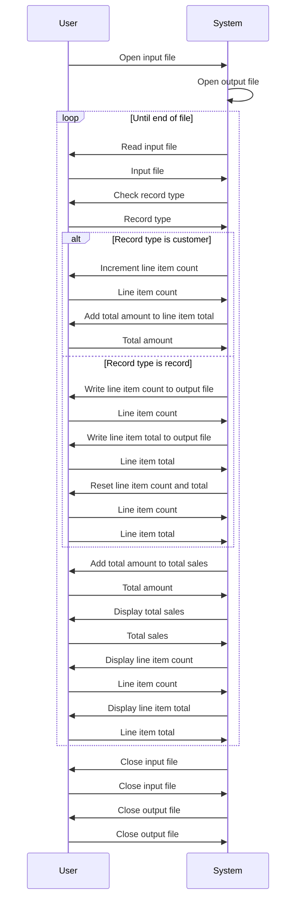
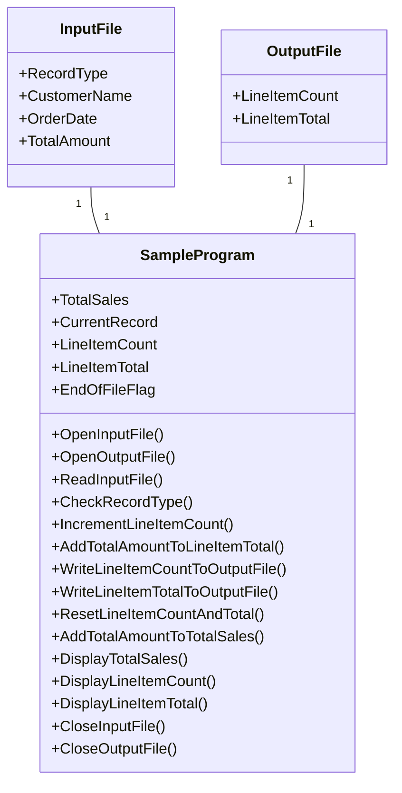

# WCA Chat Command Cookbook - COBOL

this repo target to share potential use case and prompt on granite-code models.

## prerequisite

install IBM watsonx Code Assistant extension in your vscode


- get an API KEY for watsonx Code Assistant

## tips

### tips for WCA

- new a chat session, it help to get clear context and better outcome.
- simple instruction works fine, hence make it simple
- the output is quite consistent

## sample cobol

[COBOL example](../sample/cobol/sample.cbl)

[python source](../sample/cobol/source.py) to be convert to COBOL

## use cases

### 1. Code Generation

#### 1.1 generate the code base

```text
generate cobol to connect to db2 and do a query, please output in markdown
```

```cobol
* Assisted by watsonx Code Assistant 
* watsonx Code Assistant did not check whether this code suggestion might be similar to third party code.
IDENTIFICATION DIVISION.
PROGRAM-ID. DB2CONNECT.

DATA DIVISION.
WORKING-STORAGE SECTION.
01 SQLCA PIC S9(08) COMP.
01 SQLCODE PIC S9(04) COMP.
01 SQLSTATE PIC X(5).
01 DBCNAM PIC X(10) VALUE 'DB2'.
01 DBCPWD PIC X(10) VALUE 'PASSWORD'.
01 DBCTCP PIC S9(04) COMP VALUE 50000.
01 DBCHOST PIC X(20) VALUE 'HOSTNAME'.
01 DBCPORT PIC S9(04) COMP VALUE 50000.
01 DBCTABL PIC X(20) VALUE 'TABLENAME'.
01 DBCQRY  PIC X(100) VALUE 'SELECT * FROM TABLENAME'.
01 DBCQRYLEN PIC S9(04) COMP VALUE 0.
01 DBCQRYOUT PIC X(1000).
01 DBCQRYOUTLEN PIC S9(04) COMP VALUE 0.

PROCEDURE DIVISION.
MAIN-PARAGRAPH.
    PERFORM INITIALIZE-SQLCA.
    PERFORM CONNECT-TO-DB2.
    PERFORM EXECUTE-QUERY.
    PERFORM CLOSE-CONNECTION.
    STOP RUN.

INITIALIZE-SQLCA.
    MOVE 0 TO SQLCA.
    MOVE 0 TO SQLCODE.
    MOVE SPACES TO SQLSTATE.

CONNECT-TO-DB2.
    PERFORM DB2CONNECT USING
        DBCNAM
        DBCPWD
        DBCTCP
        DBCHOST
        DBCPORT
        SQLCA.
    IF SQLCODE NOT= 0
        DISPLAY 'Error connecting to DB2'
        STOP RUN.

EXECUTE-QUERY.
    MOVE LENGTH OF DBCQRY TO DBCQRYLEN.
    PERFORM DB2PREPARE USING
        DBCQRY
        DBCQRYLEN
        SQLCA.
    IF SQLCODE NOT= 0
        DISPLAY 'Error preparing query'
        STOP RUN.
    PERFORM DB2EXECUTE USING
        SQLCA.
    IF SQLCODE NOT= 0
        DISPLAY 'Error executing query'
        STOP RUN.
    PERFORM DB2FETCH USING
        DBCQRYOUT
        DBCQRYOUTLEN
        SQLCA.
    IF SQLCODE NOT= 0
        DISPLAY 'Error fetching results'
        STOP RUN.
    DISPLAY DBCQRYOUT.

CLOSE-CONNECTION.
    PERFORM DB2DISCONNECT USING
        SQLCA.
    IF SQLCODE NOT= 0
        DISPLAY 'Error disconnecting from DB2'
        STOP RUN.

STOP RUN.
```

#### 1.2 update the connection string

```text
update the connection string to db2.ibm.com
```

sample output

```cobol
 * Assisted by watsonx Code Assistant 
* watsonx Code Assistant did not check whether this code suggestion might be similar to third party code.
 

IDENTIFICATION DIVISION.
PROGRAM-ID. DB2CONNECT.

DATA DIVISION.
WORKING-STORAGE SECTION.
01 SQLCA PIC S9(08) COMP.
01 SQLCODE PIC S9(04) COMP.
01 SQLSTATE PIC X(5).
01 DBCNAM PIC X(10) VALUE 'DB2'.
01 DBCPWD PIC X(10) VALUE 'PASSWORD'.
01 DBCTCP PIC S9(04) COMP VALUE 50000.
01 DBCHOST PIC X(20) VALUE 'DB2.IBM.COM'.
01 DBCPORT PIC S9(04) COMP VALUE 50000.
01 DBCTABL PIC X(20) VALUE 'TABLENAME'.
01 DBCQRY  PIC X(100) VALUE 'SELECT * FROM TABLENAME'.
01 DBCQRYLEN PIC S9(04) COMP VALUE 0.
01 DBCQRYOUT PIC X(1000).
01 DBCQRYOUTLEN PIC S9(04) COMP VALUE 0.

PROCEDURE DIVISION.
MAIN-PARAGRAPH.
    PERFORM INITIALIZE-SQLCA.
    PERFORM CONNECT-TO-DB2.
    PERFORM EXECUTE-QUERY.
    PERFORM CLOSE-CONNECTION.
    STOP RUN.

INITIALIZE-SQLCA.
    MOVE 0 TO SQLCA.
    MOVE 0 TO SQLCODE.
    MOVE SPACES TO SQLSTATE.

CONNECT-TO-DB2.
    PERFORM DB2CONNECT USING
        DBCNAM
        DBCPWD
        DBCTCP
        DBCHOST
        DBCPORT
        SQLCA.
    IF SQLCODE NOT= 0
        DISPLAY 'Error connecting to DB2'
        STOP RUN.

EXECUTE-QUERY.
    MOVE LENGTH OF DBCQRY TO DBCQRYLEN.
    PERFORM DB2PREPARE USING
        DBCQRY
        DBCQRYLEN
        SQLCA.
    IF SQLCODE NOT= 0
        DISPLAY 'Error preparing query'
        STOP RUN.
    PERFORM DB2EXECUTE USING
        SQLCA.
    IF SQLCODE NOT= 0
        DISPLAY 'Error executing query'
        STOP RUN.
    PERFORM DB2FETCH USING
        DBCQRYOUT
        DBCQRYOUTLEN
        SQLCA.
    IF SQLCODE NOT= 0
        DISPLAY 'Error fetching results'
        STOP RUN.
    DISPLAY DBCQRYOUT.

CLOSE-CONNECTION.
    PERFORM DB2DISCONNECT USING
        SQLCA.
    IF SQLCODE NOT= 0
        DISPLAY 'Error disconnecting from DB2'
        STOP RUN.

STOP RUN.
```

#### 1.3 change the query

```text
query the table customer for the field name, account_no, balance
```

```cobol
  * Assisted by watsonx Code Assistant 
* watsonx Code Assistant did not check whether this code suggestion might be similar to third party code.
  

 

IDENTIFICATION DIVISION.
PROGRAM-ID. DB2CONNECT.

DATA DIVISION.
WORKING-STORAGE SECTION.
01 SQLCA PIC S9(08) COMP.
01 SQLCODE PIC S9(04) COMP.
01 SQLSTATE PIC X(5).
01 DBCNAM PIC X(10) VALUE 'DB2'.
01 DBCPWD PIC X(10) VALUE 'PASSWORD'.
01 DBCTCP PIC S9(04) COMP VALUE 50000.
01 DBCHOST PIC X(20) VALUE 'HOSTNAME'.
01 DBCPORT PIC S9(04) COMP VALUE 50000.
01 DBCTABL PIC X(20) VALUE 'CUSTOMER'.
01 DBCQRY  PIC X(100) VALUE 'SELECT NAME, ACCOUNT_NO, BALANCE FROM CUSTOMER'.
01 DBCQRYLEN PIC S9(04) COMP VALUE 0.
01 DBCQRYOUT PIC X(1000).
01 DBCQRYOUTLEN PIC S9(04) COMP VALUE 0.

PROCEDURE DIVISION.
MAIN-PARAGRAPH.
    PERFORM INITIALIZE-SQLCA.
    PERFORM CONNECT-TO-DB2.
    PERFORM EXECUTE-QUERY.
    PERFORM CLOSE-CONNECTION.
    STOP RUN.

INITIALIZE-SQLCA.
    MOVE 0 TO SQLCA.
    MOVE 0 TO SQLCODE.
    MOVE SPACES TO SQLSTATE.

CONNECT-TO-DB2.
    PERFORM DB2CONNECT USING
        DBCNAM
        DBCPWD
        DBCTCP
        DBCHOST
        DBCPORT
        SQLCA.
    IF SQLCODE NOT= 0
        DISPLAY 'Error connecting to DB2'
        STOP RUN.

EXECUTE-QUERY.
    MOVE LENGTH OF DBCQRY TO DBCQRYLEN.
    PERFORM DB2PREPARE USING
        DBCQRY
        DBCQRYLEN
        SQLCA.
    IF SQLCODE NOT= 0
        DISPLAY 'Error preparing query'
        STOP RUN.
    PERFORM DB2EXECUTE USING
        SQLCA.
    IF SQLCODE NOT= 0
        DISPLAY 'Error executing query'
        STOP RUN.
    PERFORM DB2FETCH USING
        DBCQRYOUT
        DBCQRYOUTLEN
        SQLCA.
    IF SQLCODE NOT= 0
        DISPLAY 'Error fetching results'
        STOP RUN.
    DISPLAY DBCQRYOUT.

CLOSE-CONNECTION.
    PERFORM DB2DISCONNECT USING
        SQLCA.
    IF SQLCODE NOT= 0
        DISPLAY 'Error disconnecting from DB2'
        STOP RUN.

STOP RUN.
```

#### 1.4 add function

```text
add a function to get calculate interest, with input of number and interest rate
```

sample output

```cobol
   * Assisted by watsonx Code Assistant 
* watsonx Code Assistant did not check whether this code suggestion might be similar to third party code.
   

  

 

IDENTIFICATION DIVISION.
PROGRAM-ID. DB2CONNECT.

DATA DIVISION.
WORKING-STORAGE SECTION.
01 SQLCA PIC S9(08) COMP.
01 SQLCODE PIC S9(04) COMP.
01 SQLSTATE PIC X(5).
01 DBCNAM PIC X(10) VALUE 'DB2'.
01 DBCPWD PIC X(10) VALUE 'PASSWORD'.
01 DBCTCP PIC S9(04) COMP VALUE 50000.
01 DBCHOST PIC X(20) VALUE 'HOSTNAME'.
01 DBCPORT PIC S9(04) COMP VALUE 50000.
01 DBCTABL PIC X(20) VALUE 'CUSTOMER'.
01 DBCQRY  PIC X(100) VALUE 'SELECT NAME, ACCOUNT_NO, BALANCE FROM CUSTOMER'.
01 DBCQRYLEN PIC S9(04) COMP VALUE 0.
01 DBCQRYOUT PIC X(1000).
01 DBCQRYOUTLEN PIC S9(04) COMP VALUE 0.
01 INTEREST-RATE PIC S9(04) COMP VALUE 5.
01 INTEREST PIC S9(08) COMP.

PROCEDURE DIVISION.
MAIN-PARAGRAPH.
    PERFORM INITIALIZE-SQLCA.
    PERFORM CONNECT-TO-DB2.
    PERFORM EXECUTE-QUERY.
    PERFORM CALCULATE-INTEREST.
    PERFORM CLOSE-CONNECTION.
    STOP RUN.

INITIALIZE-SQLCA.
    MOVE 0 TO SQLCA.
    MOVE 0 TO SQLCODE.
    MOVE SPACES TO SQLSTATE.

CONNECT-TO-DB2.
    PERFORM DB2CONNECT USING
        DBCNAM
        DBCPWD
        DBCTCP
        DBCHOST
        DBCPORT
        SQLCA.
    IF SQLCODE NOT= 0
        DISPLAY 'Error connecting to DB2'
        STOP RUN.

EXECUTE-QUERY.
    MOVE LENGTH OF DBCQRY TO DBCQRYLEN.
    PERFORM DB2PREPARE USING
        DBCQRY
        DBCQRYLEN
        SQLCA.
    IF SQLCODE NOT= 0
        DISPLAY 'Error preparing query'
        STOP RUN.
    PERFORM DB2EXECUTE USING
        SQLCA.
    IF SQLCODE NOT= 0
        DISPLAY 'Error executing query'
        STOP RUN.
    PERFORM DB2FETCH USING
        DBCQRYOUT
        DBCQRYOUTLEN
        SQLCA.
    IF SQLCODE NOT= 0
        DISPLAY 'Error fetching results'
        STOP RUN.
    DISPLAY DBCQRYOUT.

CALCULATE-INTEREST.
    MOVE LENGTH OF DBCQRYOUT TO DBCQRYOUTLEN.
    PERFORM DB2PREPARE USING
        'SELECT INTEREST_RATE FROM CUSTOMER'
        DBCQRYOUTLEN
        SQLCA.
    IF SQLCODE NOT= 0
        DISPLAY 'Error preparing query'
        STOP RUN.
    PERFORM DB2EXECUTE USING
        SQLCA.
    IF SQLCODE NOT= 0
        DISPLAY 'Error executing query'
        STOP RUN.
    PERFORM DB2FETCH USING
        DBCQRYOUT
        DBCQRYOUTLEN
        SQLCA.
    IF SQLCODE NOT= 0
        DISPLAY 'Error fetching results'
        STOP RUN.
    MOVE DBCQRYOUT TO INTEREST-RATE.
    MOVE DBCQRYOUTLEN TO DBCQRYOUTLEN.
    PERFORM DB2PREPARE USING
        'SELECT BALANCE FROM CUSTOMER'
        DBCQRYOUTLEN
        SQLCA.
    IF SQLCODE NOT= 0
        DISPLAY 'Error preparing query'
        STOP RUN.
    PERFORM DB2EXECUTE USING
        SQLCA.
    IF SQLCODE NOT= 0
        DISPLAY 'Error executing query'
        STOP RUN.
    PERFORM DB2FETCH USING
        DBCQRYOUT
        DBCQRYOUTLEN
        SQLCA.
    IF SQLCODE NOT= 0
        DISPLAY 'Error fetching results'
        STOP RUN.
    MOVE DBCQRYOUT TO INTEREST.
    DISPLAY 'Interest: ' INTEREST.

CLOSE-CONNECTION.
    PERFORM DB2DISCONNECT USING
        SQLCA.
    IF SQLCODE NOT= 0
        DISPLAY 'Error disconnecting from DB2'
        STOP RUN.

STOP RUN.
```

### 2. Code Explanation

#### 2.1 explain in detail

```text
explain @sample.cbl in detail
```

- sample output

```markdown
The program SampleProgram reads data from an input file named input.txt and processes it to calculate the total sales and generate an output file named output.txt. The input file contains records with the following fields: RecordType, CustomerName, OrderDate, and TotalAmount. The program processes each record and updates the total sales and line item count and total.

The program uses the following data division:

File section: defines the input and output files
Working-storage section: defines variables for total sales, current record, line item count, line item total, and end-of-file flag
The program uses the following procedure division:

Main: opens the input and output files, reads records from the input file, processes each record, and closes the files
ProcessRecord: checks the record type and updates the line item count and total
EndOfFile: displays the total sales, line item count, and line item total, and closes the files
The program uses the Large Language Model from IBM Granite, which is based on the transformer decoder architecture, to process the input file and generate the output file.
```

#### 2.2 Calculation logic explanation

```text
Calculation logic explanation of TotalAmount in @sample.cbl
```

sample output

```markdown
The TotalAmount in sample.cbl is calculated based on the following logic:

If the LineItemType is 'C' (Customer), the TotalAmount is added to the LineItemTotal.
If the LineItemType is 'R' (Record), the LineItemCount and LineItemTotal are written to the OutputFile, and then cleared for the next record.
The TotalAmount is also added to the TotalSales.
The TotalAmount is calculated based on the LineItemType and the values of the CustomerName, OrderDate, and TotalAmount fields in the input file.
```

### 2.3 Generate Functional Spec

```text
Generate Functional Spec for @sample.cbl as markdown
```

```markdown
// Assisted by watsonx Code Assistant 
// watsonx Code Assistant did not check whether this code suggestion might be similar to third party code.
# Functional Spec for Sample Program

## Overview

The Sample Program is a COBOL program that processes input data and generates output data. The program reads input data from a file, processes it, and writes the output data to another file.

## Inputs

The Sample Program takes input data from a file named "input.txt". The input data consists of records with the following fields:

- RecordType: A character string indicating the type of record (e.g., "C" for customer, "R" for record)
- CustomerName: A character string indicating the name of the customer
- OrderDate: A character string indicating the date of the order
- TotalAmount: A numeric value indicating the total amount of the order

## Outputs

The Sample Program generates output data in two files: "output.txt" and "report.txt". The output data consists of the following information:

- LineItemCount: The number of line items in the current record
- LineItemTotal: The total amount of the line items in the current record
- TotalSales: The total amount of all sales

## Processing

The Sample Program processes the input data by reading each record and performing the following actions:

- If the record type is "C", it increments the line item count and adds the total amount to the line item total.
- If the record type is "R", it writes the line item count and line item total to the output file, resets the line item count and line item total, and continues processing the next record.

After processing all records, the Sample Program displays the total sales, line item count, and line item total, and closes the input and output files.

## Assumptions

The Sample Program assumes that the input file is in the correct format and that the input data is valid. It also assumes that the output files can be created and written to.

## Limitations

The Sample Program does not handle errors or exceptions that may occur during processing. It also does not handle cases where the input file is empty or does not exist.

## Dependencies

The Sample Program depends on the COBOL programming language and the IBM Granite Large Language Model for code generation.
```

### 3. Code Translate

#### 3.1 translate COBOL to python

```text
/translate to python @sample.cbl
```

- sample output

```python
# Assisted by watsonx Code Assistant 
#blob
def main():
    input_file = open("input.txt", "r")
    output_file = open("output.txt", "w")
    total_sales = 0
    current_record = 1
    line_item_count = 0
    line_item_total = 0
    end_of_file_flag = False
    while not end_of_file_flag:
        record_type = input_file.readline().strip()
        if record_type == "C":
            line_item_count += 1
            line_item_total += float(input_file.readline().strip())
        elif record_type == "R":
            output_file.write(str(line_item_count) + "\n")
            output_file.write(str(line_item_total) + "\n")
            line_item_count = 0
            line_item_total = 0
        total_sales += float(input_file.readline().strip())
        if record_type == "R":
            end_of_file_flag = True
    input_file.close()
    output_file.close()
    print("Total sales:", total_sales)
    print("Line item count:", line_item_count)
    print("Line item total:", line_item_total)

if __name__ == "__main__":
    main()
```

#### 3.2 translate python to code

```text
convert @source.py to cobol, output as markdown
```

sample output

```cobol
* Assisted by watsonx Code Assistant 
* watsonx Code Assistant did not check whether this code suggestion might be similar to third party code.
IDENTIFICATION DIVISION.
PROGRAM-ID. SOURCE.

DATA DIVISION.
WORKING-STORAGE SECTION.
01 INPUT-FILE PIC X(20).
01 OUTPUT-FILE PIC X(20).
01 TOTAL-SALES PIC 9(5)V99.
01 CURRENT-RECORD PIC 9(5).
01 LINE-ITEM-COUNT PIC 9(5).
01 LINE-ITEM-TOTAL PIC 9(5)V99.
01 END-OF-FILE-FLAG PIC X(1).

PROCEDURE DIVISION.
MAIN-PARAGRAPH.
    DISPLAY "Enter input file name:"
    ACCEPT INPUT-FILE FROM USER.
    DISPLAY "Enter output file name:"
    ACCEPT OUTPUT-FILE FROM USER.
    OPEN INPUT INPUT-FILE FOR INPUT AS FILE-INPUT.
    OPEN OUTPUT OUTPUT-FILE FOR OUTPUT AS FILE-OUTPUT.
    MOVE 0 TO TOTAL-SALES.
    MOVE 1 TO CURRENT-RECORD.
    MOVE 0 TO LINE-ITEM-COUNT.
    MOVE 0 TO LINE-ITEM-TOTAL.
    MOVE "N" TO END-OF-FILE-FLAG.
    PERFORM UNTIL END-OF-FILE-FLAG = "Y"
        READ FILE-INPUT RECORD-TYPE.
        IF RECORD-TYPE = "C"
            ADD 1 TO LINE-ITEM-COUNT.
            READ FILE-INPUT LINE-ITEM-PRICE.
            ADD LINE-ITEM-PRICE TO LINE-ITEM-TOTAL.
        ELSE IF RECORD-TYPE = "R"
            DISPLAY LINE-ITEM-COUNT.
            DISPLAY LINE-ITEM-TOTAL.
            MOVE 0 TO LINE-ITEM-COUNT.
            MOVE 0 TO LINE-ITEM-TOTAL.
        ELSE
            READ FILE-INPUT RECORD-SALES.
            ADD RECORD-SALES TO TOTAL-SALES.
        END-IF
        IF RECORD-TYPE = "R"
            MOVE "Y" TO END-OF-FILE-FLAG.
        END-IF
    END-PERFORM.
    CLOSE FILE-INPUT.
    CLOSE FILE-OUTPUT.
    DISPLAY "Total sales:", TOTAL-SALES.
    DISPLAY "Line item count:", LINE-ITEM-COUNT.
    DISPLAY "Line item total:", LINE-ITEM-TOTAL.
```

### 4. Generate Diagram

install mermaid preview extension in your vscode


copy and paste the mermaid result to the [diagram file](../sample/cobol/diagram.md) file as follow:

```text
```mermaid
your diagram
    diagram detail 1
    diagram detail 2
```

#### 4.1 sequence diagram

```text
generate UML sequence diagram in mermaid for the logic how user interact with system in @sample.cbl
```

sample output



#### 4.2 class diagram

```text
generate UML class diagram in mermaid for the logic how user interact with system in @sample.cbl
```

sample output


