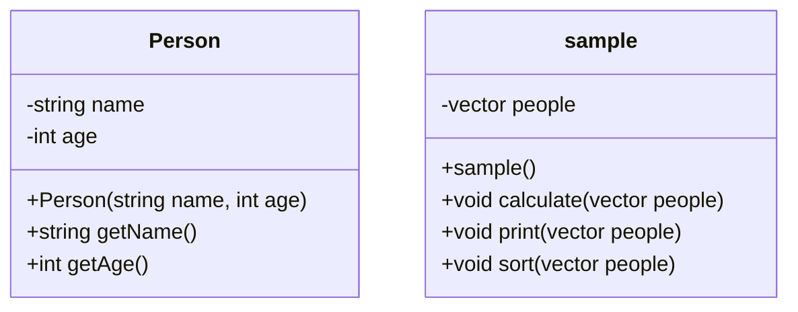

# WCA Chat Command Cookbook - C++

this repo target to share potential use case and prompt on granite-code models.

## prerequisite

### 1. install IBM watsonx Code Assistant extension in your vscode


get an API KEY for watsonx Code Assistant

### 2. instrall GCC

on Mac

```bash
brew install gcc
```

## assumption

- Code Generation may include variation, which means every generation may not exactly same.
- Chat take the conversation as context. so the good side is you can give followup question. but it may also affect the output of your prompt. so in case the output is not desireable, please New a chat session. with following button:


## tips

### tips for WCA

- new a chat session, it help to get clear context and better outcome.
- delete unused chat sessions also help.
- simple instruction works fine, hence make it simple

## sample c++

[good example](../sample/cpp/sample.cpp)

[bad example](../sample/cpp/bad.cpp)

## use cases

### 1. Code Generation

goto the sample code folder

```bash
cd sample/cpp
```

- create a empty file of generated.cpp

- chat in WCA

```text
generate a c++ program of bubblesort
```

- copy and paste the outcome to the file you just create.

- try to chat to update the code you just generate until you found it good.

- build and run

```bash
g++-14 generated.cpp -o generated
chmod 777 generated
./generated
```

sample outcome
```text
Sorted array: 
11 12 22 25 34 64 90 % 
```

- check if compilable or running well.

### 2. Code Completion

#### 2.1 Inline Code Completion

- edit some code, and experience the code completion and accept it with `tab` key.

#### 2.2 Multiple Line Code Completion

- type `Option + .` key to generate the completion base on context, and accept it with `tab` key.


### 3. Code Explanation

- chat in WCA

```text
/explain @sample.cpp
```

- sample output

```markdown
This code is a C++ program that sorts a vector of Person objects by their age. The Person struct has two members: name and age. The compareByAge function is a custom comparison function that is used by the std::sort algorithm to sort the vector. The main function creates a vector of Person objects, sorts them using the std::sort algorithm, and then prints the sorted list of names and ages.
```

#### 3.2 Explain specific login

```text
explain the call flow of @sample.cpp
```

- sample output

```markdown
// Assisted by watsonx Code Assistant 
// watsonx Code Assistant did not check whether this code suggestion might be similar to third party code.
Here is a breakdown of the call flow of the sample.cpp program:

1. The program starts by defining a Person struct with a name and age.
2. It then defines a compareByAge function that compares two Person objects by age.
3. The main function creates a vector of Person objects and initializes it with some sample data.
4. The main function then calls the std::sort function to sort the vector by age using the compareByAge function.
5. Finally, the main function iterates over the sorted vector and prints each person's name and age to the console.

The call flow of the program is as follows:

- main() calls std::sort() to sort the vector of Person objects by age.
- std::sort() calls compareByAge() to compare two Person objects and determine their order.
- compareByAge() compares the age of two Person objects and returns true if the first object is younger than the second object.
- std::sort() uses the result of compareByAge() to sort the vector of Person objects.
- The main function then iterates over the sorted vector and prints each person's name and age to the console.
```

### 4. Generate Documentation

- chat input in WCA

```text
/document @sample.cpp
```

- sample output

```cpp
# Assisted by watsonx Code Assistant 
//blob
#include <iostream>
#include <vector>
#include <algorithm>
/**
 * @brief Struct to represent a person
 */
struct Person {
    /**
     * @brief Name of the person
     */
    std::string name;
    /**
     * @brief Age of the person
     */
    int age;
};
/**
 * @brief Function to compare two persons by age
 * @param a First person to compare
 * @param b Second person to compare
 * @return True if a is younger than b, false otherwise
 */
bool compareByAge(const Person& a, const Person& b) {
    return a.age < b.age;
}
int main() {
    /**
     * @brief Vector of Person objects
     */
    std::vector<Person> people = {
        {"Alice", 30},
        {"Bob", 25},
        {"Charlie", 35},
        {"Diana", 28},
        {"Eve", 40}
    };
    /**
     * @brief Sort the vector of persons by age
     */
    std::sort(people.begin(), people.end(), compareByAge);
    /**
     * @brief Print the sorted vector of persons
     */
    for (const auto& person : people) {
        std::cout << person.name << ": " << person.age << std::endl;
    }
    return 0;
}
```

### 5. Code Translate

- chat in WCA

```text
/translate to csharp @sample.cpp
```

- sample output

```csharp
// Assisted by watsonx Code Assistant 
// watsonx Code Assistant did not check whether this code suggestion might be similar to third party code.
using System;
using System.Collections.Generic;

struct Person {
    public string Name;
    public int Age;
}

class Program {
    static void Main() {
        List<Person> people = new List<Person> {
            new Person { Name = "Alice", Age = 30 },
            new Person { Name = "Bob", Age = 25 },
            new Person { Name = "Charlie", Age = 35 },
            new Person { Name = "Diana", Age = 28 },
            new Person { Name = "Eve", Age = 40 }
        };
        people.Sort((a, b) => a.Age.CompareTo(b.Age));
        foreach (var person in people) {
            Console.WriteLine($"{person.Name}: {person.Age}");
        }
    }
}
```


### 6. Test Case Generation

- chat in WCA

```text
/unit-test @sample.cpp
```

- sample output

```cpp
// Assisted by watsonx Code Assistant 
#include <gtest/gtest.h>
#include <vector>
#include <algorithm>
#include "Person.h"

struct Person {
    std::string name;
    int age;
};

bool compareByAge(const Person& a, const Person& b) {
    return a.age < b.age;
}

TEST(CompareByAge, Ascending) {
    Person p1{"Alice", 30};
    Person p2{"Bob", 25};
    EXPECT_TRUE(compareByAge(p1, p2));
}

TEST(CompareByAge, Descending) {
    Person p1{"Alice", 30};
    Person p2{"Bob", 25};
    EXPECT_FALSE(compareByAge(p2, p1));
}

TEST(SortByAge, Ascending) {
    std::vector<Person> people = {
        {"Alice", 30},
        {"Bob", 25},
        {"Charlie", 35},
        {"Diana", 28},
        {"Eve", 40}
    };
    std::sort(people.begin(), people.end(), compareByAge);
    EXPECT_EQ(people[0].name, "Bob");
    EXPECT_EQ(people[1].name, "Diana");
    EXPECT_EQ(people[2].name, "Alice");
    EXPECT_EQ(people[3].name, "Charlie");
    EXPECT_EQ(people[4].name, "Eve");
}

TEST(SortByAge, Descending) {
    std::vector<Person> people = {
        {"Alice", 30},
        {"Bob", 25},
        {"Charlie", 35},
        {"Diana", 28},
        {"Eve", 40}
    };
    std::sort(people.begin(), people.end(), [&](const Person& a, const Person& b) {
        return a.age > b.age;
    });
    EXPECT_EQ(people[0].name, "Eve");
    EXPECT_EQ(people[1].name, "Charlie");
    EXPECT_EQ(people[2].name, "Alice");
    EXPECT_EQ(people[3].name, "Diana");
    EXPECT_EQ(people[4].name, "Bob");
}
```

### 7. Review Code

- chat input in WCA

```text
review @sample.cpp
```

- sample output

```text
The code is a C++ program that defines a struct Person with two members: name and age. It also includes a function compareByAge that compares two Person objects based on their age. The main function creates a vector of Person objects, sorts them using the compareByAge function, and then prints the sorted list of names and ages.

The code uses the standard library <iostream>, <vector>, and <algorithm> headers. It defines a Person struct with two members: name of type std::string and age of type int. The compareByAge function takes two Person objects as arguments and returns true if the first object's age is less than the second object's age, and false otherwise.

In the main function, a vector of Person objects is created and initialized with five people. The std::sort function is then used to sort the vector based on the compareByAge function. Finally, a loop is used to iterate over the sorted vector and print the name and age of each person.

Overall, the code is a simple example of how to use C++ to define a struct, create a vector of objects, sort the vector based on a custom comparison function, and print the sorted results.
```

### 8. Fix Code

- chat in WCA

```text
fix @bad.cpp
```

- sample output


```cpp
# Assisted by watsonx Code Assistant 
# watsonx Code Assistant did not check whether this code suggestion might be similar to third party code.
//blob
#include <iostream>
#include <vector>
struct Person {
    std::string name;
    int age;
};
bool compareByAge(const Person& a, const Person& b) {
    return a.age < b.age;
}
int main() {
    std::vector<Person> people = {
        {"Alice", 30},
        {"Bob", 25},
        {"Charlie", 35},
        {"Diana", 28},
        {"Eve", 40}
    };
    std::sort(people.begin(), people.end(), compareByAge);
    for (const auto& person : people) {
        std::cout << person.name << ": " << person.age << std::endl;
    }
    return 0;
}
```

### 9. Generate Diagram

install mermaid preview extension in your vscode


copy and paste the mermaid result to the [diagram file](../sample/java/diagram.md) file as follow:

```text
```mermaid
your diagram
    diagram detail 1
    diagram detail 2
```

#### 9.1 sequence diagram

```text
generate UML sequence diagram in mermaid for the logic how user interact with system in @sample.cpp
```

- sample output

```mermaid
equenceDiagram
    participant User as User
    participant System as System
    User->>System: Enter the size of the array
    System->>User: Prompt for array elements
    User->>System: Enter array elements
    System->>User: Display sum of array elements
    User->>System: Display sorted array
    User->>System: Display median of array
```

#### 7.2 class diagram

```text
generate UML class diagram in mermaid for the logic how user interact with system in @sample.cpp
```

sample output




### 10. Interface Generation

- chat in WCA

```text
generate interface for @sample.cpp
```

```cpp
 // Assisted by watsonx Code Assistant 
 
//sample.cpp
#include <iostream>
#include <vector>
#include <algorithm>

struct Person {
    std::string name;
    int age;
};

bool compareByAge(const Person& a, const Person& b);

int main() {
    std::vector<Person> people = {
        {"Alice", 30},
        {"Bob", 25},
        {"Charlie", 35},
        {"Diana", 28},
        {"Eve", 40}
    };

    std::sort(people.begin(), people.end(), compareByAge);

    for (const auto& person : people) {
        std::cout << person.name << ": " << person.age << std::endl;
    }

    return 0;
}
```

### 11. Build and Deployment Scipt Generation

- chat in WCA

```text
generate build and deployment script for @sample.cpp
```

- sample output

```bash
# Assisted by watsonx Code Assistant 
# watsonx Code Assistant did not check whether this code suggestion might be similar to third party code.
#!/bin/bash
# Build and deploy the sample C++ program
# Assuming the program is named sample.cpp

# Compile the program
g++ -o sample sample.cpp

# Create a directory to store the executable
mkdir -p bin

# Move the executable to the bin directory
mv sample bin/

# Create a deployment script to copy the executable to a remote server
cat << EOF > deploy.sh
#!/bin/bash
# Deploy the sample C++ program to a remote server
# Assuming the remote server is named remote_server

# Copy the executable to the remote server
scp bin/sample remote_server:/home/remote_user/

# Execute the program on the remote server
ssh remote_user@remote_server ./sample
EOF

# Make the deployment script executable
chmod +x deploy.sh

# Move the deployment script to the bin directory
mv deploy.sh bin/

# Print the deployment script
cat bin/deploy.sh
```
