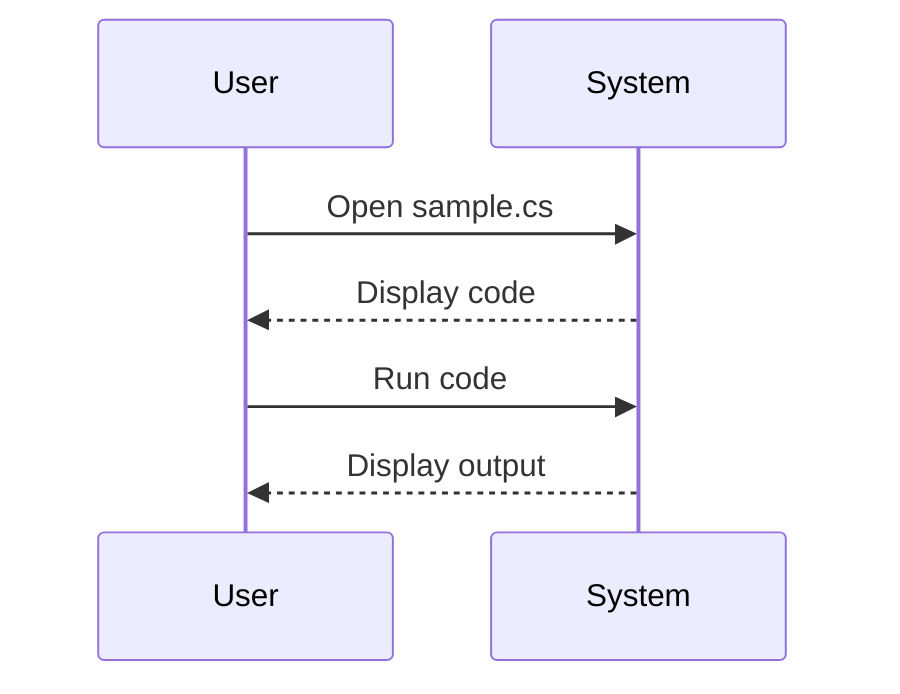
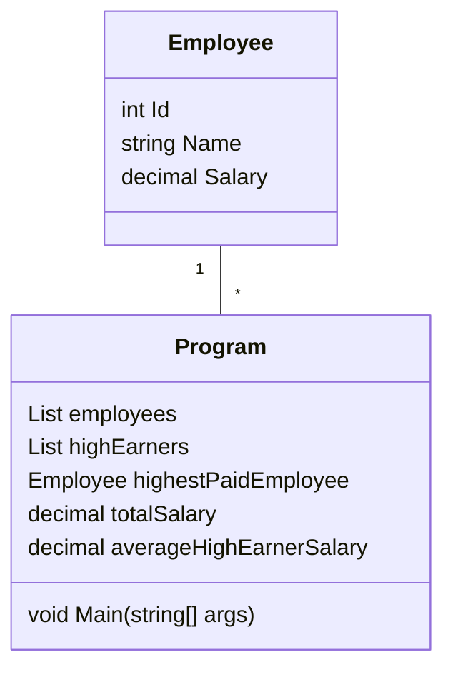

# WCA Chat Command Cookbook - C#

this repo target to share potential use case and prompt on granite-code models.

## prerequisite

### 1. install IBM watsonx Code Assistant extension in your vscode


get an API KEY for watsonx Code Assistant

### 2. Install .NET

on Mac:

[download and install dotnet runtime](https://dotnet.microsoft.com/en-us/download/dotnet/thank-you/runtime-9.0.0-macos-arm64-installer?cid=getdotnetcore)

install dotnet command

```bash
brew install dotnet
```

## assumption

- Code Generation may include variation, which means every generation may not exactly same.
- Chat take the conversation as context. so the good side is you can give followup question. but it may also affect the output of your prompt. so in case the output is not desireable, please New a chat session. with following button:


## tips

### tips for WCA

- new a chat session, it help to get clear context and better outcome.
- delete unused chat sessions also help.
- simple instruction works fine, hence make it simple

## sample c#

[good example](../sample/csharp/sample.cs)

[bad example](../sample/csharp/bad.cs)

[python source](../sample/csharp/source.py) for conversion.

## use cases

### 1. Code Generation

- create a empty file of generated.cs

#### 1.1 Simple Generation

create project

```bash
dotnet new console -n generated
```

```text
generate a csharp program that do calculate compound interest
```

```csharp
// Assisted by watsonx Code Assistant 
// watsonx Code Assistant did not check whether this code suggestion might be similar to third party code.
using System;

namespace CompoundInterestCalculator
{
    class Program
    {
        static void Main(string[] args)
        {
            Console.WriteLine("Enter the principal amount: ");
            double principal = Convert.ToDouble(Console.ReadLine());

            Console.WriteLine("Enter the annual interest rate: ");
            double interestRate = Convert.ToDouble(Console.ReadLine());

            Console.WriteLine("Enter the number of years: ");
            int years = Convert.ToInt32(Console.ReadLine());

            double amount = principal * Math.Pow(1 + interestRate / 100, years);
            Console.WriteLine("The compound interest amount is: " + amount);
        }
    }
}

```

copy and paste and save it to Program.cs in the project created.

goto to the folder

```bash
cd sample/csharp/generated
```

build

```bash
dotnet build
```

```text
Restore complete (0.2s)
  generated succeeded (0.1s) → bin/Debug/net9.0/generated.dll

Build succeeded in 0.7s
```

run

```bash
bin/Debug/net9.0/generated
```

sample output

```text
Enter the principal amount: 
12
Enter the annual interest rate: 
112
Enter the number of years: 
3
The compound interest amount is: 114.337536
```

#### 1.2 Add Function

```text
add a api about calculation sum to @Program.cs
```

```csharp
// Assisted by watsonx Code Assistant 
// watsonx Code Assistant did not check whether this code suggestion might be similar to third party code.
//Program.cs
namespace CompoundInterestCalculator
{
    class Program
    {
        static void Main(string[] args)
        {
            Console.WriteLine("Enter the principal amount: ");
            double principal = Convert.ToDouble(Console.ReadLine());

            Console.WriteLine("Enter the annual interest rate: ");
            double interestRate = Convert.ToDouble(Console.ReadLine());

            Console.WriteLine("Enter the number of years: ");
            int years = Convert.ToInt32(Console.ReadLine());

            double amount = principal * Math.Pow(1 + interestRate / 100, years);
            Console.WriteLine("The compound interest amount is: " + amount);

            Console.WriteLine("The sum of 1 and 2 is: " + Sum(1, 2));
        }

        static int Sum(int a, int b)
        {
            return a + b;
        }
    }
}
```

copy and paste back to Program.cs

and do the test again

```bash
dotnet build
```

```text
Restore complete (0.2s)
  generated succeeded (0.3s) → bin/Debug/net9.0/generated.dll

Build succeeded in 0.9s
```

run

```bash
bin/Debug/net9.0/generated
```

sample output

```text
Enter the principal amount: 
3
Enter the annual interest rate: 
3
Enter the number of years: 
2
The compound interest amount is: 3.1826999999999996
The sum of 1 and 2 is: 3
```

### 2. Code Completion

#### 2.1 Inline Code Completion

- edit some code, and experience the code completion and accept it with `tab` key.

#### 2.2 Multiple Line Code Completion

- type `Option + .` key to generate the completion base on context, and accept it with `tab` key.

### 3. Code Explanation

#### 3.1 Explain the whole program

```text
/explain @sample.cs
```

- sample output

```markdown
This code is a C# program that calculates the total salary of all employees, finds the employee with the highest salary, and finds the average salary of employees who earn more than $60,000.

The code defines a class called Employee with properties for Id, Name, and Salary. It also defines a class called Program with a Main method that creates a list of Employee objects and performs the calculations.

The Main method initializes a list of Employee objects with sample data. It then calculates the total salary of all employees using the Sum method and the lambda expression e => e.Salary. The result is printed to the console using Console.WriteLine.

Next, the code finds the employee with the highest salary using the OrderByDescending method and the lambda expression e => e.Salary. The First method is used to retrieve the first employee in the sorted list. The result is printed to the console using Console.WriteLine.

Finally, the code finds the average salary of employees who earn more than $60,000 using the Where method and the lambda expression e => e.Salary > 60000. The ToList method is used to convert the filtered list to a new list. The Average method is then used to calculate the average salary of the high earners, and the result is printed to the console using Console.WriteLine.
```

### 3.2 Explain particular detail

```text
explain how to do the calculation in @sample.cs
```

- sample output

```markdown
The code in sample.cs calculates the total salary of all employees, finds the employee with the highest salary, and calculates the average salary of employees who earn more than $60,000.

Here's how the code works:

The code defines two classes: Employee and Program. The Employee class has properties for Id, Name, and Salary, while the Program class contains the main logic for the calculations.

Inside the Main method of the Program class, a list of Employee objects is created and populated with sample data.

The Sum method is used to calculate the total salary of all employees. The OrderByDescending and First methods are used to find the employee with the highest salary.

A new list called highEarners is created by filtering the employees list to include only employees who earn more than $60,000. The Average method is then used to calculate the average salary of these high earners.

Finally, the results are printed to the console using Console.WriteLine.

Overall, the code is a simple and effective way to perform these calculations in C#.
```

### 4. Generate Documentation

#### 4.1 Simple Documentation

```text
/document @sample.cs
```

- sample output

```csharp
# Assisted by watsonx Code Assistant 
//blob
using System;
using System.Collections.Generic;
using System.Linq;

namespace EmployeeManagement
{
    public class Employee
    {
        public int Id { get; set; }
        public string Name { get; set; }
        public decimal Salary { get; set; }
    }

    public class Program
    {
        public static void Main(string[] args)
        {
            List<Employee> employees = new List<Employee>
            {
                new Employee { Id = 1, Name = "John Doe", Salary = 50000 },
                new Employee { Id = 2, Name = "Jane Smith", Salary = 60000 },
                new Employee { Id = 3, Name = "Mike Johnson", Salary = 70000 },
                new Employee { Id = 4, Name = "Emily Davis", Salary = 80000 },
                new Employee { Id = 5, Name = "Robert Brown", Salary = 90000 }
            };

            // Calculate the total salary of all employees
            decimal totalSalary = employees.Sum(e => e.Salary);
            Console.WriteLine($"Total salary: {totalSalary}");

            // Find the employee with the highest salary
            Employee highestPaidEmployee = employees.OrderByDescending(e => e.Salary).First();
            Console.WriteLine($"Highest paid employee: {highestPaidEmployee.Name} ({highestPaidEmployee.Salary})");

            // Find the average salary of employees who earn more than $60,000
            List<Employee> highEarners = employees.Where(e => e.Salary > 60000).ToList();
            decimal averageHighEarnerSalary = highEarners.Average(e => e.Salary);
            Console.WriteLine($"Average salary of high earners: {averageHighEarnerSalary}");
        }
    }
}
```

#### 4.2 Generate Function Spec

```text
generate function spec to markdown for @sample.cs
```

- sample output

```markdown
Function Spec Doc for sample.cs
Function: CalculateTotalSalary
Description:
Calculates the total salary of all employees in the given list.

Parameters:
employees: A list of Employee objects.
Returns:
The total salary of all employees in the list.

Function: FindHighestPaidEmployee
Description:
Finds the employee with the highest salary in the given list.

Parameters:
employees: A list of Employee objects.
Returns:
The employee with the highest salary in the list.

Function: CalculateAverageHighEarnerSalary
Description:
Calculates the average salary of employees who earn more than $60,000 in the given list.

Parameters:
employees: A list of Employee objects.
Returns:
The average salary of employees who earn more than $60,000 in the list.
```

### 5. Code Translate

#### 5.1 convert C# to Python

```text
/translate to python @sample.cs
```

- sample output

```python
# Assisted by watsonx Code Assistant 
class Employee:
    def __init__(self, id, name, salary):
        self.id = id
        self.name = name
        self.salary = salary

employees = [
    Employee(1, "John Doe", 50000),
    Employee(2, "Jane Smith", 60000),
    Employee(3, "Mike Johnson", 70000),
    Employee(4, "Emily Davis", 80000),
    Employee(5, "Robert Brown", 90000)
]

# Calculate the total salary of all employees
total_salary = sum(employee.salary for employee in employees)
print(f"Total salary: {total_salary}")

# Find the employee with the highest salary
highest_paid_employee = max(employees, key=lambda e: e.salary)
print(f"Highest paid employee: {highest_paid_employee.name} ({highest_paid_employee.salary})")

# Find the average salary of employees who earn more than $60,000
high_earners = [employee for employee in employees if employee.salary > 60000]
average_high_earner_salary = sum(employee.salary for employee in high_earners) / len(high_earners)
print(f"Average salary of high earners: {average_high_earner_salary}")
```

#### 5.2 convert Python to C#

```text
/translate to csharp @source.py
```

- sample output

```csharp
// Assisted by watsonx Code Assistant 
// watsonx Code Assistant did not check whether this code suggestion might be similar to third party code.
using System;
using System.Linq;

namespace EmployeeManagement
{
    public class Employee
    {
        public int Id { get; set; }
        public string Name { get; set; }
        public decimal Salary { get; set; }
    }

    class Program
    {
        static void Main(string[] args)
        {
            var employees = new Employee[]
            {
                new Employee { Id = 1, Name = "John Doe", Salary = 50000 },
                new Employee { Id = 2, Name = "Jane Smith", Salary = 60000 },
                new Employee { Id = 3, Name = "Mike Johnson", Salary = 70000 },
                new Employee { Id = 4, Name = "Emily Davis", Salary = 80000 },
                new Employee { Id = 5, Name = "Robert Brown", Salary = 90000 }
            };

            // Calculate the total salary of all employees
            decimal totalSalary = employees.Sum(e => e.Salary);
            Console.WriteLine($"Total salary: {totalSalary}");

            // Find the employee with the highest salary
            Employee highestPaidEmployee = employees.Max(e => e.Salary);
            Console.WriteLine($"Highest paid employee: {highestPaidEmployee.Name} ({highestPaidEmployee.Salary})");

            // Find the average salary of employees who earn more than $60,000
            var highEarners = employees.Where(e => e.Salary > 60000);
            decimal averageHighEarnerSalary = highEarners.Average(e => e.Salary);
            Console.WriteLine($"Average salary of high earners: {averageHighEarnerSalary}");
        }
    }
}

```

### 6. Test Case Generation

#### 6.1 Unit Test

```text
/unit-test @sample.cs
```

- sample output

```csharp
# Assisted by watsonx Code Assistant 
# watsonx Code Assistant did not check whether this code suggestion might be similar to third party code.
using System;
using System.Collections.Generic;
using System.Linq;
using Xunit;

namespace EmployeeTests
{
    public class EmployeeTests
    {
        [Fact]
        public void CalculateTotalSalary_ReturnsCorrectTotal()
        {
            List<Employee> employees = new List<Employee>
            {
                new Employee { Id = 1, Name = "John Doe", Salary = 50000 },
                new Employee { Id = 2, Name = "Jane Smith", Salary = 60000 },
                new Employee { Id = 3, Name = "Mike Johnson", Salary = 70000 },
                new Employee { Id = 4, Name = "Emily Davis", Salary = 80000 },
                new Employee { Id = 5, Name = "Robert Brown", Salary = 90000 }
            };
            decimal totalSalary = employees.Sum(e => e.Salary);
            Assert.Equal(450000, totalSalary);
        }

        [Fact]
        public void FindHighestPaidEmployee_ReturnsCorrectEmployee()
        {
            List<Employee> employees = new List<Employee>
            {
                new Employee { Id = 1, Name = "John Doe", Salary = 50000 },
                new Employee { Id = 2, Name = "Jane Smith", Salary = 60000 },
                new Employee { Id = 3, Name = "Mike Johnson", Salary = 70000 },
                new Employee { Id = 4, Name = "Emily Davis", Salary = 80000 },
                new Employee { Id = 5, Name = "Robert Brown", Salary = 90000 }
            };
            Employee highestPaidEmployee = employees.OrderByDescending(e => e.Salary).First();
            Assert.Equal("Robert Brown", highestPaidEmployee.Name);
            Assert.Equal(90000, highestPaidEmployee.Salary);
        }

        [Fact]
        public void FindAverageHighEarnerSalary_ReturnsCorrectAverage()
        {
            List<Employee> employees = new List<Employee>
            {
                new Employee { Id = 1, Name = "John Doe", Salary = 50000 },
                new Employee { Id = 2, Name = "Jane Smith", Salary = 60000 },
                new Employee { Id = 3, Name = "Mike Johnson", Salary = 70000 },
                new Employee { Id = 4, Name = "Emily Davis", Salary = 80000 },
                new Employee { Id = 5, Name = "Robert Brown", Salary = 90000 }
            };
            List<Employee> highEarners = employees.Where(e => e.Salary > 60000).ToList();
            decimal averageHighEarnerSalary = highEarners.Average(e => e.Salary);
            Assert.Equal(75000, averageHighEarnerSalary);
        }
    }
}
```

### 7. Review Code

#### 7.1 General Review

```text
review @sample.cs
```

- sample output

```text
Here is a review of the sample.cs code:

The code defines two classes, Employee and Program. The Employee class has three properties: Id, Name, and Salary. The Program class contains a Main method that demonstrates how to use LINQ to query and manipulate a list of Employee objects.

The Main method creates a list of Employee objects and calculates the total salary of all employees using the Sum method. It then finds the employee with the highest salary using the OrderByDescending and First methods. Finally, it finds the average salary of employees who earn more than $60,000 using the Where, ToList, and Average methods.

The code uses the System namespace for the Console class, as well as the System.Collections.Generic and System.Linq namespaces for the List, OrderByDescending, First, Where, ToList, and Average methods.

Overall, the code is a simple example of how to use LINQ to query and manipulate data in C#.
```

#### 7.2 Specific Review

```text
review @sample.cs on performance
```

- sample output

```text
To improve the performance of the sample.cs code, you can consider the following suggestions:

Use a HashSet instead of a List to store the employees with a salary greater than $60,000. This can improve the time complexity of the Where and Average operations.

Use parallel processing to perform the Sum operation on the list of employees. This can take advantage of multi-core processors and significantly improve the performance.

Use a StringBuilder instead of string concatenation to build the output string. This can improve the performance by reducing the number of memory allocations and string copies.

Use a profiler to identify any performance bottlenecks in the code and optimize them accordingly. This can help you pinpoint specific areas that need improvement and make targeted optimizations.

Here's an example of how you can implement these suggestions:
```
```csharp
// Assisted by watsonx Code Assistant 
// watsonx Code Assistant did not check whether this code suggestion might be similar to third party code.
//good.cs
using System;
using System.Collections.Generic;
using System.Linq;
using System.Text;

public class Employee
{
    public int Id { get; set; }
    public string Name { get; set; }
    public decimal Salary { get; set; }
}

public class Program
{
    static void Main(string[] args)
    {
        List<Employee> employees = new List<Employee>
        {
            new Employee { Id = 1, Name = "John Doe", Salary = 50000 },
            new Employee { Id = 2, Name = "Jane Smith", Salary = 60000 },
            new Employee { Id = 3, Name = "Bob Johnson", Salary = 70000 }
        };

        // Calculate the total salary of all employees
        decimal totalSalary = employees.Sum(e => e.Salary);
        Console.WriteLine($"Total salary: {totalSalary}");

        // Find the employee with the highest salary
        Employee highestPaidEmployee = employees.OrderByDescending(e => e.Salary).First();
        Console.WriteLine($"Highest paid employee: {highestPaidEmployee.Name} ({highestPaidEmployee.Salary})");

        // Find the average salary of employees who earn more than $60,000
        HashSet<Employee> highEarners = new HashSet<Employee>(employees.Where(e => e.Salary > 60000));
        decimal averageHighEarnerSalary = highEarners.Average(e => e.Salary);
        Console.WriteLine($"Average salary of high earners: {averageHighEarnerSalary}");
    }
}
```

### 8. Fix Code

- chat in WCA

```text
fix @bad.cs
```

- sample output


```csharp
// Assisted by watsonx Code Assistant 
// watsonx Code Assistant did not check whether this code suggestion might be similar to third party code.
using System;
using System.Collections.Generic;
using System.Linq;
public class Employee
{
    public int Id { get; set; }
    public string Name { get; set; }
    public decimal Salary { get; set; }
}
public class Program
{
    static void Main(string[] args)
    {
        List<Employee> employees = new List<Employee>
        {
            new Employee { Id = 1, Name = "John Doe", Salary = 50000 },
            new Employee { Id = 2, Name = "Jane Smith", Salary = 60000 }
        };
        // Calculate the total salary of all employees
        decimal totalSalary = employees.Sum(e => e.Salary);
        Console.WriteLine($"Total salary: {totalSalary}");
        // Find the employee with the highest salary
        Employee highestPaidEmployee = employees.OrderByDescending(e => e.Salary).First();
        Console.WriteLine($"Highest paid employee: {highestPaidEmployee.Name} ({highestPaidEmployee.Salary})");
        // Find the average salary of employees who earn more than $60,000
        List<Employee> highEarners = employees.Where(e => e.Salary > 60000).ToList();
        decimal averageHighEarnerSalary = highEarners.Average(e => e.Salary);
        Console.WriteLine($"Average salary of high earners: {averageHighEarnerSalary}");
    }
}

```

### 9. Generate Diagram

install mermaid preview extension in your vscode


copy and paste the mermaid result to the [diagram file](../sample/csharp/diagram.md) file as follow:

```text
```mermaid
your diagram
    diagram detail 1
    diagram detail 2
```

#### 9.1 sequence diagram

```text
generate UML sequence diagram in mermaid for the logic how user interact with system in @sample.cs
```

sample output



#### 9.2 class diagram

```text
generate UML class diagram in mermaid for the logic how user interact with system in @sample.cs
```

sample output



### 10. Interface Generation

- chat in WCA

```text
generate interface @sample.cs
```

```csharp
  // Assisted by watsonx Code Assistant 
// watsonx Code Assistant did not check whether this code suggestion might be similar to third party code.
  
 
using System;

namespace SampleNamespace
{
    public interface ISampleInterface
    {
        void DoSomething();
    }

    public class SampleClass : ISampleInterface
    {
        public void DoSomething()
        {
            Console.WriteLine("Doing something...");
        }
    }

    public class Program
    {
        public static void Main(string[] args)
        {
            ISampleInterface sample = new SampleClass();
            sample.DoSomething();
        }
    }
}

```

### 11. Build and Deployment Scipt Generation

- chat in WCA

```text
generate build and deployment script @sample.cs
```

- sample output

```bash
 // Assisted by watsonx Code Assistant 
// watsonx Code Assistant did not check whether this code suggestion might be similar to third party code.
 
#!/bin/bash

# Build the sample.cs program
dotnet build sample.cs

# Run the sample.cs program
dotnet run sample.cs

# Clean up the build artifacts
rm -rf bin obj
```
