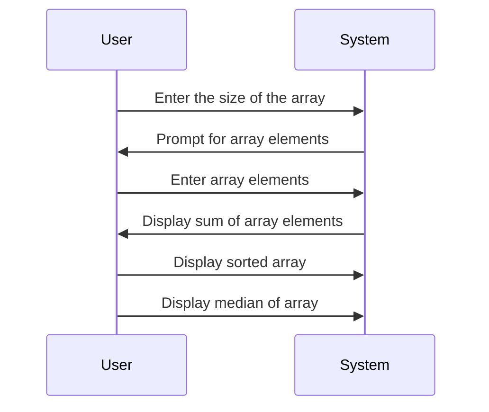
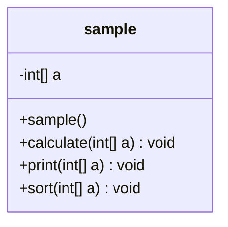

# WCA Chat Command Cookbook - Java

this repo target to share potential use case and prompt on granite-code models.

## prerequisite

### 1. install IBM watsonx Code Assistant extension in your vscode


get an API KEY for watsonx Code Assistant

### 2. install java

[Get and install open jdk](https://jdk.java.net/23/)

you can also try other jdk distribution

## assumption

- Code Generation may include variation, which means every generation may not exactly same.
- Chat take the conversation as context. so the good side is you can give followup question. but it may also affect the output of your prompt. so in case the output is not desireable, please New a chat session. with following button:


## tips

### tips for WCA

- new a chat session, it help to get clear context and better outcome.
- delete unused chat sessions also help.
- simple instruction works fine, hence make it simple

## sample java

[good example](../sample/java/sample.java)

[bad example](../sample/java/bad.java)

## use cases

### 1. Code Generation

- create a empty file of BubbleSort.java

- chat in WCA

```text
generate a java program of bubblesort
```

- copy and paste the outcome to the file you just create.

- try to chat to update the code you just generate until you found it good.

go to the folder

```bash
cd /sample/java
```

run the code

```bash
javac BubbleSort.java
```

check if running well.

```bash
java BubbleSort
```

### 2. Code Completion

#### 2.1 Inline Code Completion

- edit some code, and experience the code completion and accept it with `tab` key.

#### 2.2 Multiple Line Code Completion

- type `Option + .` key to generate the completion base on context, and accept it with `tab` key.


### 3. Code Explanation

- chat in WCA

```text
/explain @sample.java
```

- sample output

```markdown
Sure, I'd be happy to explain the code!

This code is a Java program that reads an integer n from the user and then reads n integers into an array a. It then calculates the sum of the elements in the array, prints the elements in the array, and sorts the array.

The Scanner class is used to read input from the user. The nextInt() method reads an integer from the user and returns it as a int value.

The calculate() method calculates the sum of the elements in the array and prints it to the console.

The print() method prints each element of the array on a new line.

The sort() method sorts the array in ascending order and calculates the median of the array.

The Arrays.sort() method sorts the array in place. If the array contains an even number of elements, the median is calculated as the average of the two middle elements. Otherwise, it is simply the middle element.

Overall, this code demonstrates how to read input from the user, perform basic array operations, and sort an array in Java.
```

### 4. Generate Documentation

- chat input in WCA

```text
/document @sample.java
```

- sample output

```java
// Assisted by watsonx Code Assistant 
/**
 * This is a sample class to illustrate how to write javadoc comments for methods and parameters.
 */
public class sample {
    public static void main(String[] args) {
        try (Scanner in = new Scanner(System.in)) {
            int n = in.nextInt();
            int[] a = new int[n];
            for(int a_i=0; a_i < n; a_i++){
                a[a_i] = in.nextInt();
            }
        }
    }
    /**
     * This method calculates the sum of all the elements in an array.
     * @param a an array of integers
     * @return the sum of all the elements in the array
     */
    public void calculate(int[] a) {
        int sum = 0;
        for (int i = 0; i < a.length; i++) {
            sum += a[i];
        }
        System.out.println(sum);
    }
    /**
     * This method prints all the elements of an array on a new line.
     * @param a an array of integers
     */
    public void print(int[] a) {
        for (int i = 0; i < a.length; i++) {
            System.out.println(a[i]);
        }
    }
    /**
     * This method sorts the elements of an array in ascending order.
     * @param a an array of integers
     */
    public void sort(int[] a) {
        Arrays.sort(a);
        double median;
        if (a.length % 2 == 0) {
            median = (a[a.length / 2 - 1] + a[a.length / 2]) / 2.0;
        } else {
            median = a[a.length / 2];
        }
    }
}
```

### 5. Code Translate

- chat in WCA

```text
/translate to csharp @sample.java
```

- sample output

```csharp
// Assisted by watsonx Code Assistant 
// watsonx Code Assistant did not check whether this code suggestion might be similar to third party code.
using System;

namespace Sample
{
    public class Program
    {
        public static void Main(string[] args)
        {
            int n = int.Parse(Console.ReadLine());
            int[] a = new int[n];
            for (int i = 0; i < n; i++)
            {
                a[i] = int.Parse(Console.ReadLine());
            }
        }

        public void Calculate(int[] a)
        {
            int sum = 0;
            for (int i = 0; i < a.Length; i++)
            {
                sum += a[i];
            }
            Console.WriteLine(sum);
        }

        public void Print(int[] a)
        {
            for (int i = 0; i < a.Length; i++)
            {
                Console.WriteLine(a[i]);
            }
        }

        public void Sort(int[] a)
        {
            Array.Sort(a);
            double median;
            if (a.Length % 2 == 0)
            {
                median = (a[a.Length / 2 - 1] + a[a.Length / 2]) / 2.0;
            }
            else
            {
                median = a[a.Length / 2];
            }
        }
    }
}
```


### 6. Test Case Generation

- chat in WCA

```text
/unit-test @sample.java
```

- sample output

```java
// Assisted by watsonx Code Assistant 
import static org.junit.jupiter.api.Assertions.*;

import org.junit.jupiter.api.Test;

class SampleTest {
    @Test
    void calculateTest() {
        int[] a = {1, 2, 3, 4, 5};
        Sample sample = new Sample();
        int sum = sample.calculate(a);
        assertEquals(15, sum);
    }

    @Test
    void printTest() {
        int[] a = {1, 2, 3, 4, 5};
        Sample sample = new Sample();
        String result = "";
        try (java.io.ByteArrayOutputStream out = new java.io.ByteArrayOutputStream();
             java.io.PrintStream printStream = new java.io.PrintStream(out)) {
            System.setOut(printStream);
            sample.print(a);
            result = out.toString().trim();
        } catch (Exception e) {
            e.printStackTrace();
        }
        assertEquals("1\n2\n3\n4\n5", result);
    }

    @Test
    void sortTest() {
        int[] a = {5, 2, 4, 1, 3};
        Sample sample = new Sample();
        sample.sort(a);
        assertEquals(2, a[0]);
        assertEquals(3, a[1]);
        assertEquals(4, a[2]);
        assertEquals(5, a[3]);
        assertEquals(1, a[4]);
    }
}
```

### 7. Review Code

- chat input in WCA

```text
suggest how to improve performance for @sample.java
```

- sample output

```text
To improve the performance of the sample.java program, you can use a faster sorting algorithm, such as a quicksort or merge sort. You can also use a data structure, such as a binary search tree or a hash table, to store and search for the numbers instead of sorting the array each time. Additionally, you can use parallel processing to divide the work among multiple threads.
```

### 6. Fix Code

- chat in WCA

```text
fix @BubbleSort.java
```

- sample output


```java
// Assisted by watsonx Code Assistant 
//BubbleSort.java
 
public class BubbleSort {
    public static void main(String[] args) {
        int[] arr = {5, 2, 9, 1, 7};
        int n = arr.length;

        for (int i = 0; i < n; i++) {
            for (int j = 0; j < n - i - 1; j++) {
                if (arr[j] > arr[j + 1]) {
                    int temp = arr[j];
                    arr[j] = arr[j + 1];
                    arr[j + 1] = temp;
                }
            }
        }

        System.out.println("Sorted array: ");
        for (int i = 0; i < n; i++) {
            System.out.print(arr[i] + " ");
        }
    }
}
```

```markdown
Explanation: This code sorts an array of integers using the bubble sort algorithm. The algorithm works by swapping adjacent elements that are in the wrong order until the array is sorted. The code sorts the array in place, meaning that the sorted array is returned as the output.

Here are the steps of the bubble sort algorithm:

Compare each element with its adjacent element and swap them if they are in the wrong order.
Repeat this process until the array is sorted.
Note that this implementation is a simple and inefficient way to sort an array. There are faster algorithms, such as the merge sort algorithm, that can sort an array much faster.
```

### 7. Generate Diagram

install mermaid preview extension in your vscode


copy and paste the mermaid result to the [diagram file](../sample/csharp/diagram.md) file as follow:

```text
```mermaid
your diagram
    diagram detail 1
    diagram detail 2
```

#### 7.1 sequence diagram

```text
generate UML sequence diagram in mermaid for the logic how user interact with system in @sample.java
```

- sample output



#### 7.2 class diagram

```text
generate UML class diagram in mermaid from @sample.java
```

sample output



### 8. Interface Generation

- chat in WCA

```text
generate java interface for @sample.java
```

```java
// Assisted by watsonx Code Assistant 
//sample.java
import java.util.*;

public interface sample {

    public void calculate(int[] a);

    public void print(int[] a);

    public void sort(int[] a);
}
```

### 9. Build and Deployment Scipt Generation

- chat in WCA

```text
generate build and deployment (openshift and liberty) script for  @sample.java
```

- sample output

```bash
# Assisted by watsonx Code Assistant 
# watsonx Code Assistant did not check whether this code suggestion might be similar to third party code.
# Build the application
mvn clean package

# Login to OpenShift
oc login ...

# Create a new project (if needed)
oc new-project ...

# Create a new app from the Docker image
oc new-app ...

# Expose the app as a route
oc expose svc/...

# Tail the logs to see the application output
oc logs -f bc/...
```
