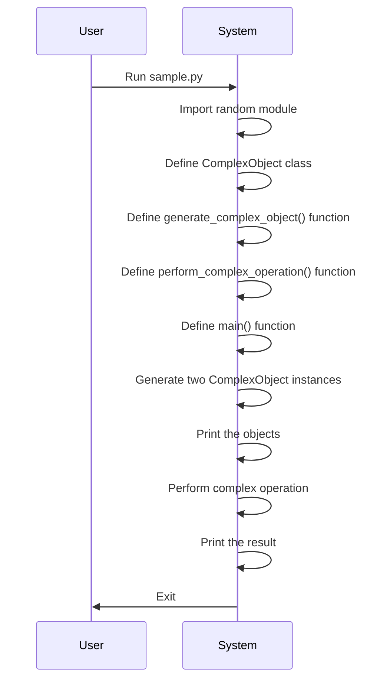
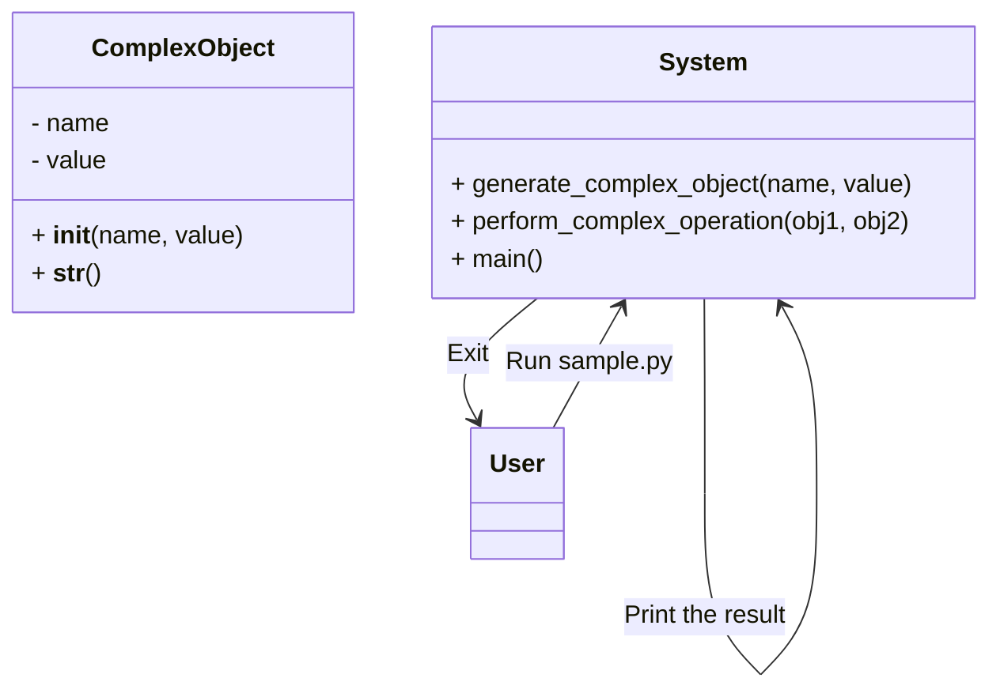

# WCA Chat Command Cookbook - Python

this repo target to share potential use case and prompt on granite-code models.

## prerequisite

### 1. install IBM watsonx Code Assistant extension in your vscode


get an API KEY for watsonx Code Assistant

### 2. install Python in case you dont have.

[Download and install Python](https://www.python.org/)

## assumption

- Code Generation may include variation, which means every generation may not exactly same.
- Chat take the conversation as context. so the good side is you can give followup question. but it may also affect the output of your prompt. so in case the output is not desireable, please New a chat session. with following button:


## tips

### tips for WCA

- new a chat session, it help to get clear context and better outcome.
- delete unused chat sessions also help.
- simple instruction works fine, hence make it simple

## sample python

[good example](../sample/python/sample.py)

[bad example](../sample/python/bad.py)

[c# source](../sample/python/source.cs)


## use cases

### 1. Code Generation

- create a empty file of `filename`.py

#### 1.1 Simple Generation

```text
generate a python program as web service base on fastapi
```

```python
# Assisted by watsonx Code Assistant 
from fastapi import FastAPI

app = FastAPI()

@app.get("/")
def read_root():
    return {"Hello": "World"}

@app.get("/items/{item_id}")
def read_item(item_id: int, q: str = None):
    return {"item_id": item_id, "q": q}
```

#### 1.2 Add Function

```text
add a api about calculation sum
```

```python
# Assisted by watsonx Code Assistant 
from fastapi import FastAPI

app = FastAPI()

@app.get("/")
def read_root():
    return {"Hello": "World"}

@app.get("/items/{item_id}")
def read_item(item_id: int, q: str = None):
    return {"item_id": item_id, "q": q}

@app.get("/sum/{a}/{b}")
def sum(a: int, b: int):
    return {"result": a + b}
```

#### 1.3 Revise Function

```text
change the read_item to read_more_item
```

```python
 # Assisted by watsonx Code Assistant 
 
from fastapi import FastAPI

app = FastAPI()

@app.get("/")
def read_root():
    return {"Hello": "World"}

@app.get("/more_items/{item_id}")
def read_more_item(item_id: int, q: str = None):
    return {"item_id": item_id, "q": q}

@app.get("/sum/{a}/{b}")
def sum(a: int, b: int):
    return {"result": a + b}
```

### 2. Code Completion

#### 2.1 Inline Code Completion

- edit some code, and experience the code completion and accept it with `tab` key.

#### 2.2 Multiple Line Code Completion

- type `Option + .` key to generate the completion base on context, and accept it with `tab` key.


### 3. Code Explanation

#### 3.1 Explain the whole program

```text
/explain @sample.py
```

- sample output

```markdown
This code defines a class ComplexObject with two attributes name and value. It also defines two functions generate_complex_object and perform_complex_operation. The main function generates two ComplexObject instances, performs a complex operation on them, and prints the results.

The generate_complex_object function takes two arguments name and value and returns a new ComplexObject instance with the given values.

The perform_complex_operation function takes two ComplexObject instances as arguments and returns the object with the greater value.

The main function generates two ComplexObject instances, obj1 and obj2, with random values between 1 and 100. It then prints the values of obj1 and obj2. Finally, it calls the perform_complex_operation function with obj1 and obj2 as arguments and prints the result.
```

#### 3.2 Explain specific login

```text
explain the call flow of @sample.py
```

- sample output

```markdown
The call flow of sample.py is as follows:

The script starts by importing the random module.
It defines a class called ComplexObject with an init method that initializes the name and value attributes.
It also defines a str method that returns a string representation of the object.
The script defines a function called generate_complex_object that takes two arguments (name and value) and returns a new ComplexObject instance.
It also defines a function called perform_complex_operation that takes two ComplexObject instances as arguments and returns the object with the highest value.
The script defines a main function that generates two random ComplexObject instances, prints their values, and calls perform_complex_operation to get the result.
Finally, the script checks if the script is being run directly (not imported as a module) and calls the main function.
```

### 4. Generate Documentation

- chat input in WCA

```text
/document @sample.py
```

- sample output

```python
# Assisted by watsonx Code Assistant 
#blob
import random
class ComplexObject:
    """
    A class to represent a complex object with a name and value.

    Attributes:
        name (str): The name of the object.
        value (int): The value of the object.

    Methods:
        __init__(name, value): Initializes the object with a name and value.
        __str__(): Returns a string representation of the object.
    """
    def __init__(self, name, value):
        self.name = name
        self.value = value
    def __str__(self):
        return f"Object: {self.name}, Value: {self.value}"
def generate_complex_object(name, value):
    """
    Generates a complex object with a given name and value.

    Args:
        name (str): The name of the object.
        value (int): The value of the object.

    Returns:
        ComplexObject: The generated complex object.
    """
    return ComplexObject(name, value)
def perform_complex_operation(obj1, obj2):
    """
    Performs a complex operation on two complex objects.

    Args:
        obj1 (ComplexObject): The first object.
        obj2 (ComplexObject): The second object.

    Returns:
        ComplexObject: The object with the highest value.
    """
    if obj1.value > obj2.value:
        return obj1
    else:
        return obj2
def main():
    obj1 = generate_complex_object("Object1", random.randint(1, 100))
    obj2 = generate_complex_object("Object2", random.randint(1, 100))
    print(f"Object1: {obj1}")
    print(f"Object2: {obj2}")
    result = perform_complex_operation(obj1, obj2)
    print(f"Result: {result}")
if __name__ == "__main__":
    main()
```

### 5. Code Translate

#### 5.1 convert python to c#

```text
/translate to csharp @sample.py
```

- sample output

```csharp
// Assisted by watsonx Code Assistant 
// watsonx Code Assistant did not check whether this code suggestion might be similar to third party code.
using System;

namespace ComplexObjectExample
{
    public class ComplexObject
    {
        public string Name { get; set; }
        public int Value { get; set; }

        public ComplexObject(string name, int value)
        {
            Name = name;
            Value = value;
        }

        public override string ToString()
        {
            return $"Object: {Name}, Value: {Value}";
        }
    }

    public class Program
    {
        public static ComplexObject GenerateComplexObject(string name, int value)
        {
            return new ComplexObject(name, value);
        }

        public static ComplexObject PerformComplexOperation(ComplexObject obj1, ComplexObject obj2)
        {
            if (obj1.Value > obj2.Value)
            {
                return obj1;
            }
            else
            {
                return obj2;
            }
        }

        public static void Main()
        {
            ComplexObject obj1 = GenerateComplexObject("Object1", new Random().Next(1, 100));
            ComplexObject obj2 = GenerateComplexObject("Object2", new Random().Next(1, 100));

            Console.WriteLine($"Object1: {obj1}");
            Console.WriteLine($"Object2: {obj2}");

            ComplexObject result = PerformComplexOperation(obj1, obj2);

            Console.WriteLine($"Result: {result}");
        }
    }
}
```

#### 5.2 convert python to c#

```text
/translate to python @source.cs
```

- sample output

```python
# Assisted by watsonx Code Assistant 
class ComplexObject:
    def __init__(self, name, value):
        self.Name = name
        self.Value = value

    def __str__(self):
        return f"Object: {self.Name}, Value: {self.Value}"

def GenerateComplexObject(name, value):
    return ComplexObject(name, value)

def PerformComplexOperation(obj1, obj2):
    if obj1.Value > obj2.Value:
        return obj1
    else:
        return obj2

obj1 = GenerateComplexObject("Object1", random.randint(1, 100))
obj2 = GenerateComplexObject("Object2", random.randint(1, 100))

print(f"Object1: {obj1}")
print(f"Object2: {obj2}")

result = PerformComplexOperation(obj1, obj2)

print(f"Result: {result}")
```

### 6. Test Case Generation

#### 6.1 Unit Test Generation

```text
/unit-test @sample.py
```

- sample output

```python
# Assisted by watsonx Code Assistant 
# watsonx Code Assistant did not check whether this code suggestion might be similar to third party code.
import unittest
import random
from blob import ComplexObject, generate_complex_object, perform_complex_operation
class TestComplexObject(unittest.TestCase):
    def test_init(self):
        obj = ComplexObject("Object1", 10)
        self.assertEqual(obj.name, "Object1")
        self.assertEqual(obj.value, 10)
    def test_str(self):
        obj = ComplexObject("Object1", 10)
        self.assertEqual(str(obj), "Object: Object1, Value: 10")
class TestGenerateComplexObject(unittest.TestCase):
    def test_generate(self):
        name = "Object1"
        value = random.randint(1, 100)
        obj = generate_complex_object(name, value)
        self.assertEqual(obj.name, name)
        self.assertEqual(obj.value, value)
class TestPerformComplexOperation(unittest.TestCase):
    def test_greater(self):
        obj1 = ComplexObject("Object1", 10)
        obj2 = ComplexObject("Object2", 5)
        result = perform_complex_operation(obj1, obj2)
        self.assertEqual(result, obj1)
    def test_less(self):
        obj1 = ComplexObject("Object1", 5)
        obj2 = ComplexObject("Object2", 10)
        result = perform_complex_operation(obj1, obj2)
        self.assertEqual(result, obj2)
if __name__ == "__main__":
    unittest.main()

```

### 7. Review Code

#### 7.1 General Review

```text
review @sample.py
```

- sample output

```text
Here is a review of the sample.py file:

The file imports the random module and defines a class called ComplexObject. The class has two attributes, name and value, and a string representation method.

The file also defines two functions: generate_complex_object and perform_complex_operation. The generate_complex_object function takes two arguments, name and value, and returns a new ComplexObject instance. The perform_complex_operation function takes two ComplexObject instances as arguments and returns the object with the greater value.

The file contains a main function that generates two random ComplexObject instances, prints their string representations, and calls the perform_complex_operation function to determine which object has the greater value.

Overall, the sample.py file demonstrates the use of the ComplexObject class and the generate_complex_object and perform_complex_operation functions to create and manipulate objects with a name and value attribute.
```

#### 7.2 Ask for suggestion on specific area

```text
suggest how to improve performance for @sample.py
```

- sample output

```text
To improve the performance of the sample.py script, you can consider the following suggestions:

Utilize built-in functions: Instead of using the random.randint() function to generate random values for the ComplexObject instances, you can use the random module's randint() function, which is more efficient and optimized for generating random numbers.

Use list comprehension: Instead of using a for loop to generate multiple ComplexObject instances, you can use list comprehension to create a list of objects in a more concise and efficient manner.

Utilize the built-in max() function: Instead of manually comparing obj1 and obj2 in the perform_complex_operation() function, you can use the built-in max() function to find the object with the highest value. This approach is more readable and efficient.

Utilize the random module's shuffle() function: If you need to randomly select objects from a list, you can use the random module's shuffle() function to shuffle the list in-place, ensuring that each selection is random and unbiased.

Here's an updated version of the sample.py script with these improvements:
```

```python
# Assisted by watsonx Code Assistant 
import random

class ComplexObject:
    def __init__(self, name, value):
        self.name = name
        self.value = value

    def __str__(self):
        return f"Object: {self.name}, Value: {self.value}"

def generate_complex_object(name, value):
    return ComplexObject(name, value)

def perform_complex_operation(obj1, obj2):
    return max(obj1, obj2)

def main():
    objects = [generate_complex_object(f"Object{i}", random.randint(1, 100)) for i in range(1, 11)]
    random.shuffle(objects)

    print("Objects:")
    for obj in objects:
        print(obj)

    result = perform_complex_operation(*objects)
    print(f"Result: {result}")

if __name__ == "__main__":
    main()
```

```text
By implementing these suggestions, you can improve the performance of the sample.py script by utilizing built-in functions, list comprehension, and the max() function for efficient object generation and comparison. Additionally, the random module's shuffle() function ensures random selection of objects from a list.
```

### 8. Fix Code

- chat in WCA

```text
/fix @bad.py
```

- sample output


```python
# Assisted by watsonx Code Assistant 
import random
class ComplexObject:
    def __init__(self, name, value):
        self.name = name
        self.value = value
    def __str__(self):
        return f"Object: {self.name}, Value: {self.value}"
def generate_complex_object(name, value):
    return ComplexObject(name, value)
def perform_complex_operation(obj1, obj2):
    if obj1.value > obj2.value:
        return obj1
    else:
        return obj2
def main():
    obj1 = generate_complex_object("Object1", random.randint(1, 100))
    obj2 = generate_complex_object("Object2", random.randint(1, 100))
    print(f"Object1: {obj1}")
    print(f"Object2: {obj2}")
    result = perform_complex_operation(obj1, obj2)
    print(f"Result: {result}")
if __name__ == "__main__":
    main()
```

### 9. Generate Diagram

install mermaid preview extension in your vscode


copy and paste the mermaid result to the [diagram file](../sample/cobol/diagram.md) file as follow:

```text
```mermaid
your diagram
    diagram detail 1
    diagram detail 2
```

#### 9.1 sequence diagram

```text
generate UML sequence diagram in mermaid for the logic how user interact with system in @sample.py
```

sample output



#### 7.2 class diagram

```text
generate UML class diagram in mermaid for the logic how user interact with system in @sample.py
```

sample output



### 10. Interface Generation

- chat in WCA

```text
generate interface @sample.py
```

```python
 # Assisted by watsonx Code Assistant 
 
class IComplexObject:
    def __init__(self, name, value):
        self.name = name
        self.value = value

    def __str__(self):
        return f"Object: {self.name}, Value: {self.value}"

def generate_complex_object(name, value):
    return IComplexObject(name, value)

def perform_complex_operation(obj1, obj2):
    if obj1.value > obj2.value:
        return obj1
    else:
        return obj2

def main():
    obj1 = generate_complex_object("Object1", random.randint(1, 100))
    obj2 = generate_complex_object("Object2", random.randint(1, 100))

    print(f"Object1: {obj1}")
    print(f"Object2: {obj2}")

    result = perform_complex_operation(obj1, obj2)
    print(f"Result: {result}")

if __name__ == "__main__":
    main()

```

### 11. Build and Deployment Scipt Generation

- chat in WCA

```text
generate build and deployment script for @sample.py
```

- sample output

```bash
 # Assisted by watsonx Code Assistant 
 
#!/bin/bash

# Build the sample.py program
python3 setup.py sdist bdist_wheel

# Install the sample.py program
pip3 install dist/sample-1.0.0-py3-none-any.whl

# Run the sample.py program
sample

# Clean up the build artifacts
rm -rf build dist sample.egg-info
```
