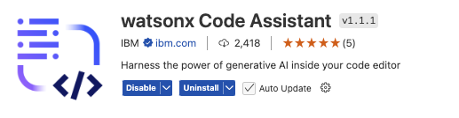
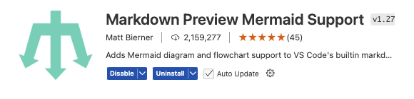
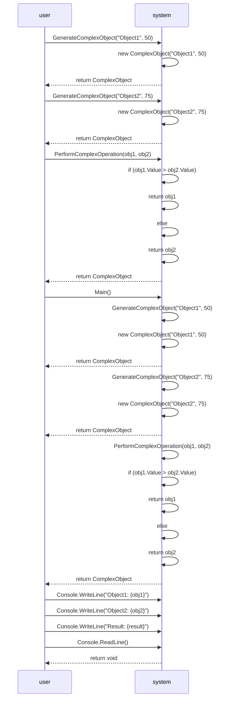

# WCA Chat Command Cookbook - Python and C#

this repo target to share potential use case and prompt on granite-code models.

## prerequisite

### 1. install IBM watsonx Code Assistant extension in your vscode



get an API KEY for watsonx Code Assistant

### 2. install Python in case you dont have.

[Download and install Python](https://www.python.org/)

## assumption

- Code Generation may include variation, which means every generation may not exactly same.
- Chat take the conversation as context. so the good side is you can give followup question. but it may also affect the output of your prompt. so in case the output is not desireable, please New a chat session. with following button:


## tips

### tips for WCA

- new a chat session, it help to get clear context and better outcome.
- delete unused chat sessions also help.
- simple instruction works fine, hence make it simple


## sample python

[good example](../sample/python/sample.py)

[bad example](../sample/python/bad.py)

[c# source](../sample/python/source.cs)

## test environment

run it local

open the Terminal, that ready for testing.

```bash
cd sample/python/
```

## use cases

### 1. Code Generation

- create a empty file of `filename`.py

#### 1.1 Simple Generation

```text
generate a python program that do calculate compound interest
```

```python
# Assisted by watsonx Code Assistant 
def calculate_compound_interest(principal, rate, time):
    # formula to calculate compound interest
    compound_interest = principal * (pow((1 + rate / 100), time)) - principal
    return compound_interest

# input values
principal = 1000
rate = 5
time = 2

# calculate compound interest
compound_interest = calculate_compound_interest(principal, rate, time)

# print the result
print("Compound interest is", compound_interest)
```

copy and paste and save it to generated.py file provided.

run testing

```bash
python generated.py
```

sample output

```text
Compound interest is 102.5
```

#### 1.2 Add Function

```text
add function to calculate sum of 2 numbers along with a sample call to the function to generated.py
```

```python
# Assisted by watsonx Code Assistant 
//generated.py
 
  # Assisted by watsonx Code Assistant 
  
 
//generated.py
 
def calculate_compound_interest(principal, rate, time):
    # formula to calculate compound interest
    compound_interest = principal * (pow((1 + rate / 100), time)) - principal

    return compound_interest

def calculate_sum(a, b):
    return a + b

# input values
principal = 1000
rate = 5
time = 2

# calculate compound interest
compound_interest = calculate_compound_interest(principal, rate, time)

# print the result
print("Compound interest is", compound_interest)

# sample call to calculate_sum function
sum = calculate_sum(10, 20)
print("Sum is", sum)

```

copy and paste back to generated.py

and do the test again

```bash
python generated.py
```

sample output

```text
Compound interest is 102.5
Sum is 30
```

### 2. Code Completion

#### 2.1 Inline Code Completion

- edit some code, and experience the code completion and accept it with `tab` key.

#### 2.2 Multiple Line Code Completion

- type `Option + .` key to generate the completion base on context, and accept it with `tab` key.

### 3. Code Explanation

#### 3.1 Explain the whole program

```text
/explain @sample.py
```

- sample output

```markdown
This code defines a class ComplexObject with two attributes name and value. It also defines two functions generate_complex_object and perform_complex_operation. The main function generates two ComplexObject instances, performs a complex operation on them, and prints the results.

The generate_complex_object function takes two arguments name and value and returns a new ComplexObject instance with the given values.

The perform_complex_operation function takes two ComplexObject instances as arguments and returns the object with the greater value.

The main function generates two ComplexObject instances, obj1 and obj2, with random values between 1 and 100. It then prints the values of obj1 and obj2. Finally, it calls the perform_complex_operation function with obj1 and obj2 as arguments and prints the result.
```

#### 3.2 Explain specific logic

```text
explain the call flow of @sample.py
```

- sample output

```markdown
The call flow of sample.py is as follows:

The script starts by importing the random module.
It defines a class called ComplexObject with an init method that initializes the name and value attributes.
It also defines a str method that returns a string representation of the object.
The script defines a function called generate_complex_object that takes two arguments (name and value) and returns a new ComplexObject instance.
It also defines a function called perform_complex_operation that takes two ComplexObject instances as arguments and returns the object with the highest value.
The script defines a main function that generates two random ComplexObject instances, prints their values, and calls perform_complex_operation to get the result.
Finally, the script checks if the script is being run directly (not imported as a module) and calls the main function.
```

try explain in local language (e.g. Chinese)

```text
請解釋 sample.py 程式流程
```

```markdown
這是一個 Python 程式，它有一個名為 ComplexObject 的類別，它有兩個屬性：name 和 value。這個類別還有兩個函數：generate_complex_object 和 perform_complex_operation。

generate_complex_object 函數是一個工廠函數，它創建並返回一個 ComplexObject 的實例。它accepts 兩個參數：name 和 value。

perform_complex_operation 函數accepts 兩個 ComplexObject 的實例作為參數，並比較它們的 value。如果 obj1 的 value 大於 obj2 的 value，它將返回 obj1，否則返回 obj2。

main 函數創建兩個 ComplexObject 的實例，並將它們作為參數傳遞給 perform_complex_operation。然後，它將結果打印為輸出。

最後，if name == "main": 區塊是一個保護性的主程式區塊，它只有在程式被直接運行時才會執行。在這個區塊中，main 函數被調用，以啟動程式的執行。
```

### 4. Generate Documentation

- chat input in WCA

```text
/document @sample.py
```

- sample output

```python
# Assisted by watsonx Code Assistant 
#blob
import random
class ComplexObject:
    """
    A class to represent a complex object with a name and value.

    Attributes:
        name (str): The name of the object.
        value (int): The value of the object.

    Methods:
        __init__(name, value): Initializes the object with a name and value.
        __str__(): Returns a string representation of the object.
    """
    def __init__(self, name, value):
        self.name = name
        self.value = value
    def __str__(self):
        return f"Object: {self.name}, Value: {self.value}"
def generate_complex_object(name, value):
    """
    Generates a complex object with a given name and value.

    Args:
        name (str): The name of the object.
        value (int): The value of the object.

    Returns:
        ComplexObject: The generated complex object.
    """
    return ComplexObject(name, value)
def perform_complex_operation(obj1, obj2):
    """
    Performs a complex operation on two complex objects.

    Args:
        obj1 (ComplexObject): The first object.
        obj2 (ComplexObject): The second object.

    Returns:
        ComplexObject: The object with the highest value.
    """
    if obj1.value > obj2.value:
        return obj1
    else:
        return obj2
def main():
    obj1 = generate_complex_object("Object1", random.randint(1, 100))
    obj2 = generate_complex_object("Object2", random.randint(1, 100))
    print(f"Object1: {obj1}")
    print(f"Object2: {obj2}")
    result = perform_complex_operation(obj1, obj2)
    print(f"Result: {result}")
if __name__ == "__main__":
    main()
```

### 5. Test Case Generation

#### 5.1 Unit Test Generation

```text
/unit-test @sample.py
```

- sample output

```python
# Assisted by watsonx Code Assistant 
# watsonx Code Assistant did not check whether this code suggestion might be similar to third party code.
import unittest
import random
from blob import ComplexObject, generate_complex_object, perform_complex_operation
class TestComplexObject(unittest.TestCase):
    def test_init(self):
        obj = ComplexObject("Object1", 10)
        self.assertEqual(obj.name, "Object1")
        self.assertEqual(obj.value, 10)
    def test_str(self):
        obj = ComplexObject("Object1", 10)
        self.assertEqual(str(obj), "Object: Object1, Value: 10")
class TestGenerateComplexObject(unittest.TestCase):
    def test_generate(self):
        name = "Object1"
        value = random.randint(1, 100)
        obj = generate_complex_object(name, value)
        self.assertEqual(obj.name, name)
        self.assertEqual(obj.value, value)
class TestPerformComplexOperation(unittest.TestCase):
    def test_greater(self):
        obj1 = ComplexObject("Object1", 10)
        obj2 = ComplexObject("Object2", 5)
        result = perform_complex_operation(obj1, obj2)
        self.assertEqual(result, obj1)
    def test_less(self):
        obj1 = ComplexObject("Object1", 5)
        obj2 = ComplexObject("Object2", 10)
        result = perform_complex_operation(obj1, obj2)
        self.assertEqual(result, obj2)
if __name__ == "__main__":
    unittest.main()

```

run the test

```bash
python testcase.py
```

sample output

```text
....
----------------------------------------------------------------------
Ran 4 tests in 0.000s

OK
```

### 6. Code Translate

#### 6.1 convert python to c#

```text
/translate to csharp @sample.py
```

- sample output

```csharp
// Assisted by watsonx Code Assistant 
// watsonx Code Assistant did not check whether this code suggestion might be similar to third party code.
using System;

namespace ComplexObjectExample
{
    public class ComplexObject
    {
        public string Name { get; set; }
        public int Value { get; set; }

        public ComplexObject(string name, int value)
        {
            Name = name;
            Value = value;
        }

        public override string ToString()
        {
            return $"Object: {Name}, Value: {Value}";
        }
    }

    public class Program
    {
        public static ComplexObject GenerateComplexObject(string name, int value)
        {
            return new ComplexObject(name, value);
        }

        public static ComplexObject PerformComplexOperation(ComplexObject obj1, ComplexObject obj2)
        {
            if (obj1.Value > obj2.Value)
            {
                return obj1;
            }
            else
            {
                return obj2;
            }
        }

        public static void Main()
        {
            ComplexObject obj1 = GenerateComplexObject("Object1", new Random().Next(1, 100));
            ComplexObject obj2 = GenerateComplexObject("Object2", new Random().Next(1, 100));

            Console.WriteLine($"Object1: {obj1}");
            Console.WriteLine($"Object2: {obj2}");

            ComplexObject result = PerformComplexOperation(obj1, obj2);

            Console.WriteLine($"Result: {result}");
        }
    }
}
```

copy and paste the content to translated.cs

### 7. Review Code

#### 7.1 Ask for suggestion on specific area

```text
review the translated.cs and suggest ways to improve performance
```

- sample output

```text
# Assisted by watsonx Code Assistant 
The translated.cs code is a C# program that defines a class called ComplexObject and a method called GenerateComplexObject. The GenerateComplexObject method takes two parameters, name and value, and returns a new instance of the ComplexObject class with the specified name and value.

The program also defines a method called PerformComplexOperation, which takes two ComplexObject instances as parameters and returns the object with the highest value.

In the Main method, two ComplexObject instances are created using the GenerateComplexObject method, and their values are printed to the console. Then, the PerformComplexOperation method is called with these two objects as parameters, and the result is printed to the console.

To improve performance, there are a few things that could be done:

1. Use a StringBuilder instead of string concatenation: String concatenation can be slow, especially when concatenating multiple strings. Using a StringBuilder can significantly improve performance by preallocating a buffer and appending strings to it in a more efficient way.

2. Use a Random instance instead of calling new Random().Next() repeatedly: Creating a new Random instance is expensive, so it's better to create one instance and reuse it for multiple calls to Next().

3. Use a more efficient algorithm for generating random numbers: The current implementation uses the Next() method of the Random class, which generates random numbers using a linear congruential generator. This algorithm is not the most efficient, and there are other algorithms that can generate random numbers more quickly.

4. Use a profiler to identify performance bottlenecks: Profilers can help identify areas of the code that are causing performance issues. By analyzing the profiling data, it may be possible to optimize specific sections of the code to improve performance.

Overall, these are just a few suggestions for improving performance. It's important to note that performance can vary depending on the specific use case and hardware, so it's always a good idea to test and benchmark any changes to ensure they have the desired effect.
```

### 8. Generate Diagram

install mermaid preview extension in your vscode



copy and paste the mermaid result to the [diagram file](../sample/csharp/diagram.md) file as follow:

```text
```mermaid
your diagram
    diagram detail 1
    diagram detail 2
```

#### 8.1 sequence diagram

```text
generate UML sequence diagram in mermaid for the logic how user interact with system in @translated.cs
```

sample output



### 9. Interface Generation

- chat in WCA

```text
generate interface @translated.cs
```

```csharp
// Assisted by watsonx Code Assistant 
// watsonx Code Assistant did not check whether this code suggestion might be similar to third party code.
//translated.cs
using System;

namespace ComplexObjectExample
{
    public interface IComplexObject
    {
        string Name { get; set; }
        int Value { get; set; }
    }

    public class ComplexObject : IComplexObject
    {
        public string Name { get; set; }
        public int Value { get; set; }

        public ComplexObject(string name, int value)
        {
            Name = name;
            Value = value;
        }

        public override string ToString()
        {
            return $"Object: {Name}, Value: {Value}";
        }
    }

    public class Program
    {
        public static IComplexObject GenerateComplexObject(string name, int value)
        {
            return new ComplexObject(name, value);
        }

        public static IComplexObject PerformComplexOperation(IComplexObject obj1, IComplexObject obj2)
        {
            if (obj1.Value > obj2.Value)
            {
                return obj1;
            }
            else
            {
                return obj2;
            }
        }

        public static void Main()
        {
            IComplexObject obj1 = GenerateComplexObject("Object1", new Random().Next(1, 100));
            IComplexObject obj2 = GenerateComplexObject("Object2", new Random().Next(1, 100));

            Console.WriteLine($"Object1: {obj1}");
            Console.WriteLine($"Object2: {obj2}");

            IComplexObject result = PerformComplexOperation(obj1, obj2);

            Console.WriteLine($"Result: {result}");
        }
    }
}

```

### 10. Build and Deployment Scipt Generation

- chat in WCA

```text
generate build and deployment script @translated.cs
```

- sample output

```bash
# Assisted by watsonx Code Assistant 
# watsonx Code Assistant did not check whether this code suggestion might be similar to third party code.
#!/bin/bash

# Build the project
dotnet build translated.cs

# Run the tests
dotnet test translated.cs.Tests

# Create a NuGet package
dotnet pack translated.cs -c Release

# Publish the application
dotnet publish translated.cs -c Release -o publish

# Deploy the application to a server
rsync -avz publish/ username@server:/path/to/destination

```
